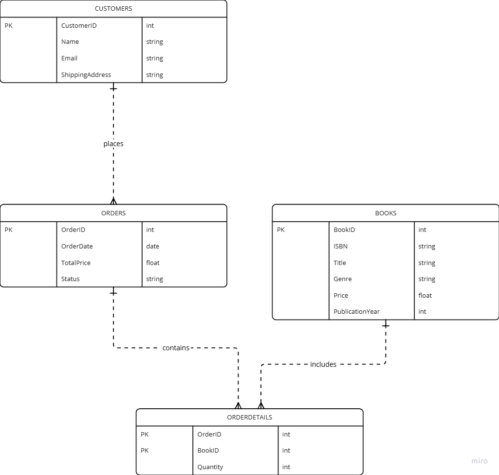
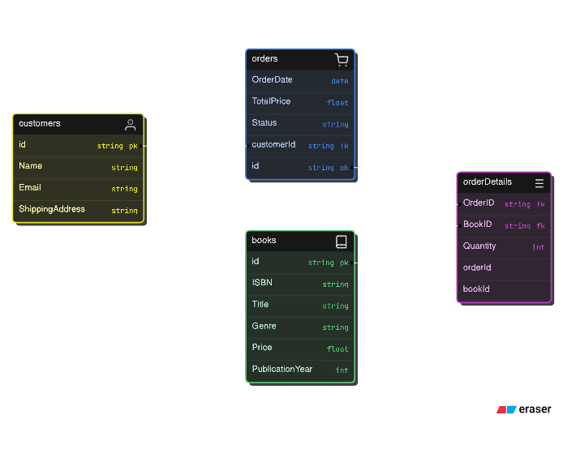
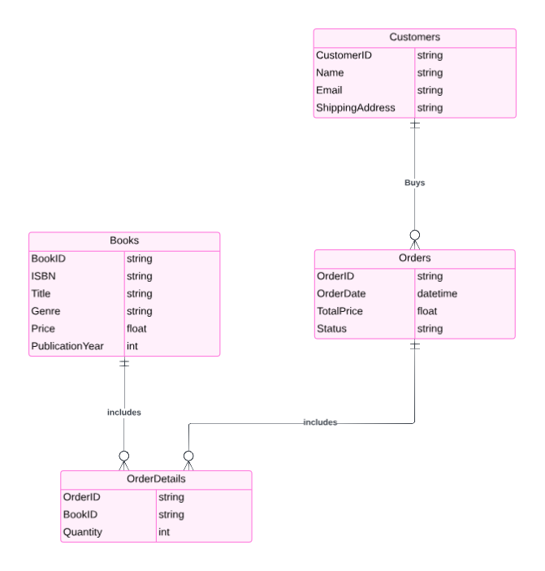

Here’s a brief overview of **DBMS Features** — **data organization, storage, retrieval, and security**, formatted for a GitHub Markdown file.

---

# DBMS Features: Data Organization, Storage, Retrieval, Security

A Database Management System (DBMS) provides essential features to organize, store, retrieve, and secure data, making it accessible and manageable for users and applications. Below are key DBMS features that support these functions.

---

## 1. Data Organization
DBMS organizes data into structured formats, such as tables, views, and indexes. By organizing data:
- Relationships between data elements can be established through keys and constraints.
- Complex data sets can be normalized, reducing redundancy and improving data integrity.

### Example
Data is stored in **tables** with rows (records) and columns (attributes), creating a structured framework that is easy to manage.

---

## 2. Storage
DBMS efficiently manages data storage on physical storage devices. It handles:
- **Data allocation**: Efficiently placing data on storage to optimize performance.
- **Backup and Recovery**: Ensuring data persistence through backups and supporting recovery in case of failure.

### Example
DBMS stores data on disk drives or SSDs, using indexing and partitioning to organize large volumes of data.

---

## 3. Retrieval
DBMS allows for easy and quick data retrieval through query languages like SQL. Features like indexing and caching enhance retrieval speed, making it possible to access data with minimal delay.

### Example
Using a **SELECT** query in SQL, users can retrieve specific data from large datasets quickly, thanks to indexing and optimized query processing.

---

## 4. Security
DBMS provides robust security features to protect data from unauthorized access or modification. Key security aspects include:
- **Authentication**: Verifies user identities.
- **Authorization**: Controls user permissions to access or modify data.
- **Encryption**: Protects data by encoding it, especially during transmission or storage.

### Example
A DBMS can enforce role-based access control (RBAC) where only authorized users can view, modify, or delete certain data.

---

## Summary Table

| Feature           | Description                                      | Example |
|-------------------|--------------------------------------------------|---------|
| **Data Organization** | Structures data for easy access and management | Organizing customer data in tables with primary keys |
| **Storage**       | Manages physical data storage and backup         | Saving data on SSDs with backup and restore options |
| **Retrieval**     | Allows efficient data retrieval through queries  | Using `SELECT` queries to retrieve specific records |
| **Security**      | Protects data via authentication and encryption  | Role-based access control for sensitive data |

---

## Conclusion
The **DBMS** provides essential features to organize, store, retrieve, and secure data, ensuring efficient data management and accessibility while maintaining data integrity and security.

---

Here’s a brief explanation of **Concurrency Control, Transaction Management, and Data Integrity** in DBMS, formatted for a GitHub Markdown file.

---

# Concurrency Control, Transaction Management, and Data Integrity

In a database environment, ensuring the consistency, reliability, and accuracy of data is critical. **Concurrency control**, **transaction management**, and **data integrity** are essential mechanisms that a DBMS uses to achieve these goals.

---

## 1. Concurrency Control

**Concurrency control** ensures that multiple transactions can execute simultaneously without causing conflicts or inconsistencies in the database. It allows concurrent access to data while preventing issues like **dirty reads**, **lost updates**, and **inconsistent retrievals**. Concurrency control uses techniques like **locking**, **timestamp ordering**, and **multiversion concurrency control (MVCC)** to manage simultaneous operations.

### Example
When two users try to update the same record at the same time, a **lock** can be placed on the record until one transaction completes, preventing conflicting changes.

---

## 2. Transaction Management

**Transaction management** involves coordinating the execution of database operations within transactions. A transaction is an **all-or-nothing** operation that must follow the **ACID properties**:
- **Atomicity**: Transactions are all-or-nothing, meaning either all operations succeed, or none do.
- **Consistency**: Transactions must leave the database in a valid state.
- **Isolation**: Transactions operate independently, unaffected by others in progress.
- **Durability**: Once committed, a transaction’s changes are permanent, even in case of system failure.

### Example
Consider a bank transfer where funds are withdrawn from one account and deposited into another. **Transaction management** ensures that either both operations succeed or both fail, preventing inconsistencies.

---

## 3. Data Integrity

**Data integrity** ensures that the data stored in a database remains accurate, consistent, and reliable. DBMS enforces integrity through **constraints** like **primary keys**, **foreign keys**, **unique constraints**, and **check constraints**. These rules prevent invalid data entry and maintain logical consistency across related tables.

### Example
A **foreign key** constraint in a sales database ensures that an order references a valid customer ID. If someone tries to enter an invalid customer ID, the DBMS rejects the operation, preserving data integrity.

---

## Summary Table

| Concept              | Description                                                  | Example |
|----------------------|--------------------------------------------------------------|---------|
| **Concurrency Control** | Manages simultaneous transactions to prevent conflicts     | Locking a record during an update |
| **Transaction Management** | Ensures transactions follow ACID properties for reliability | A bank transfer where funds are withdrawn and deposited atomically |
| **Data Integrity**   | Maintains data accuracy and consistency through constraints  | Foreign key constraint to link valid customer IDs to orders |

---

## Conclusion

**Concurrency control**, **transaction management**, and **data integrity** are foundational DBMS mechanisms that maintain consistency, reliability, and accuracy in a multi-user database environment. Together, they ensure secure and reliable data operations, preserving the integrity of the database.

---

Here’s a brief comparison of **DML vs. DDL** with examples, formatted for a GitHub Markdown file.

---

# DML vs. DDL

In SQL, commands are categorized into **Data Manipulation Language (DML)** and **Data Definition Language (DDL)**. Each serves a distinct purpose in managing data within a database.

---

## Data Manipulation Language (DML)

**DML** commands are used to interact with and manipulate data within the database tables. These commands allow users to **retrieve**, **insert**, **update**, and **delete** data.

### Key DML Commands
- **SELECT**: Retrieves data from one or more tables.
- **INSERT**: Adds new records to a table.
- **UPDATE**: Modifies existing records.
- **DELETE**: Removes records from a table.

### Example
```sql
-- Retrieve all data from the "Customers" table
SELECT * FROM Customers;

-- Insert a new customer into the "Customers" table
INSERT INTO Customers (CustomerID, Name, Email) 
VALUES (1, 'John Doe', 'john@example.com');

-- Update an existing customer's email
UPDATE Customers 
SET Email = 'john.doe@example.com' 
WHERE CustomerID = 1;

-- Delete a customer record
DELETE FROM Customers 
WHERE CustomerID = 1;
```

---

## Data Definition Language (DDL)

**DDL** commands are used to define, alter, and manage the structure of database objects like **tables**, **indexes**, and **schemas**. These commands affect the structure and organization of the data rather than the data itself.

### Key DDL Commands
- **CREATE**: Defines a new database object (e.g., table or database).
- **ALTER**: Modifies an existing database object.
- **DROP**: Deletes a database object.
- **TRUNCATE**: Removes all records from a table without logging individual row deletions.

### Example
```sql
-- Create a new table called "Customers"
CREATE TABLE Customers (
    CustomerID INT PRIMARY KEY,
    Name VARCHAR(50),
    Email VARCHAR(50)
);

-- Add a new column to the "Customers" table
ALTER TABLE Customers 
ADD PhoneNumber VARCHAR(20);

-- Delete the "Customers" table
DROP TABLE Customers;

-- Remove all records from the "Orders" table
TRUNCATE TABLE Orders;
```

---

## Summary Table

| Category | Description                                        | Examples        |
|----------|----------------------------------------------------|-----------------|
| **DML**  | Manipulates data within tables                     | SELECT, INSERT, UPDATE, DELETE |
| **DDL**  | Defines or alters the structure of database objects | CREATE, ALTER, DROP, TRUNCATE  |

---

## Conclusion

While **DML** commands modify the data within a database, **DDL** commands define and manage the database's structure. Both are essential for comprehensive database management and serve unique roles within a DBMS.

---

Here’s a concise overview of **Primary Keys, Foreign Keys, and Other Keys** with definitions and examples, formatted for a GitHub Markdown file.

---

# Primary, Foreign, and Other Keys in DBMS

Keys are essential in relational databases for uniquely identifying records, maintaining data integrity, and establishing relationships between tables. Below are explanations of **primary keys**, **foreign keys**, and other types of keys commonly used in database design.

---

## Primary Key

A **primary key** is a unique identifier for each record in a database table. Each table can have only one primary key, which ensures that no duplicate values or `NULL` values exist in the specified column(s).

### Characteristics
- Uniquely identifies each record in the table.
- Cannot contain `NULL` values.
- Ensures that each record is distinct.

### Example
```sql
CREATE TABLE Customers (
    CustomerID INT PRIMARY KEY,
    Name VARCHAR(50),
    Email VARCHAR(50)
);
```
In this example, `CustomerID` is the primary key for the `Customers` table. Each `CustomerID` must be unique, ensuring each customer is uniquely identified.

---

## Foreign Key

A **foreign key** is a field (or set of fields) in one table that uniquely identifies a row of another table, creating a relationship between the two tables. Foreign keys enforce **referential integrity**, ensuring that relationships between tables remain consistent.

### Characteristics
- Establishes a link between two tables.
- Must reference a primary key in another table.
- Can contain duplicate values and `NULL` (if allowed by the relationship).

### Example
```sql
CREATE TABLE Orders (
    OrderID INT PRIMARY KEY,
    CustomerID INT,
    OrderDate DATE,
    FOREIGN KEY (CustomerID) REFERENCES Customers(CustomerID)
);
```
Here, `CustomerID` in the `Orders` table is a foreign key that references `CustomerID` in the `Customers` table, linking each order to a specific customer.

---

## Other Types of Keys

### Candidate Key
A **candidate key** is a column or set of columns that could uniquely identify records within a table. Every table can have multiple candidate keys, but only one can be chosen as the primary key.

#### Example
If a `Students` table has `StudentID` and `Email` columns, both could serve as unique identifiers, making them candidate keys. However, only one will be selected as the primary key.

### Composite Key
A **composite key** is a primary key that consists of more than one column to uniquely identify records. Composite keys are useful when no single column uniquely identifies records.

#### Example
In an `Enrollment` table, where each student enrolls in multiple courses, the combination of `StudentID` and `CourseID` can serve as a composite primary key.

```sql
CREATE TABLE Enrollment (
    StudentID INT,
    CourseID INT,
    EnrollmentDate DATE,
    PRIMARY KEY (StudentID, CourseID)
);
```

### Unique Key
A **unique key** ensures all values in a column are unique but, unlike the primary key, it can contain one `NULL` value.

#### Example
```sql
CREATE TABLE Employees (
    EmployeeID INT PRIMARY KEY,
    Email VARCHAR(50) UNIQUE
);
```
In this example, the `Email` column is unique but not necessarily a primary key.

---

## Summary Table

| Key Type         | Description                                                | Example |
|------------------|------------------------------------------------------------|---------|
| **Primary Key**  | Uniquely identifies each record in a table                 | `CustomerID` in `Customers` table |
| **Foreign Key**  | Links records between two tables                           | `CustomerID` in `Orders` table referencing `Customers` table |
| **Candidate Key**| Potential unique identifiers for a table                   | `StudentID` and `Email` in `Students` table |
| **Composite Key**| Primary key consisting of multiple columns                 | Combination of `StudentID` and `CourseID` in `Enrollment` table |
| **Unique Key**   | Enforces uniqueness but allows a single `NULL` value       | `Email` column in `Employees` table |

---

## Conclusion

**Primary keys** and **foreign keys** are fundamental to establishing relationships and ensuring data integrity in relational databases. Understanding these keys, along with other types like **candidate**, **composite**, and **unique keys**, is crucial for effective database design.

---


Here’s a brief overview of **Entities, Entity Sets, Relationships, and Relationship Sets** with definitions and examples, formatted for a GitHub Markdown file.

---

# Entities and E-R Diagram Concepts

Entity-Relationship (E-R) diagrams are a visual way to represent the structure of a database. E-R diagrams include **entities**, **entity sets**, **relationships**, and **relationship sets** to depict how data elements interact and relate to each other.

---

## Definitions

### 1. Entity
An **entity** is an object, concept, or thing in the real world that can be uniquely identified. Entities represent real-world objects or concepts that have attributes.

#### Example
A **Student** in a university database is an entity with attributes such as `StudentID`, `Name`, and `DateOfBirth`.

### 2. Entity Set
An **entity set** is a collection of similar types of entities. All entities in an entity set share the same attributes.

#### Example
In a university database, the **Students** entity set would include all student entities, each with attributes like `StudentID`, `Name`, and `DateOfBirth`.

---

### 3. Relationship
A **relationship** is an association between two or more entities that establishes a connection between them.

#### Example
In a library database, a **Borrows** relationship could connect entities `Student` and `Book` to represent that a student has borrowed a book.

### 4. Relationship Set
A **relationship set** is a collection of similar relationships between entities. It represents all instances of a specific relationship within the database.

#### Example
The **Borrows** relationship set in a library database includes all borrowings between students and books, showing each instance where a student has borrowed a book.

---

## Example E-R Diagram Concepts

Consider a simplified **University Database** with the following entity sets and relationships:

- **Entities**:
  - **Student**: Attributes include `StudentID` (Primary Key), `Name`, and `DateOfBirth`.
  - **Course**: Attributes include `CourseID` (Primary Key) and `CourseName`.
  - **Professor**: Attributes include `ProfessorID` (Primary Key), `Name`, and `Department`.

- **Relationships**:
  - **EnrolledIn**: A relationship between `Student` and `Course`, indicating which courses each student is enrolled in.
  - **Teaches**: A relationship between `Professor` and `Course`, indicating which professor teaches each course.

### Example E-R Diagram Elements
The E-R diagram for this university database would include:
- **Student** and **Course** as entities, each with unique attributes.
- **EnrolledIn** as a relationship set connecting `Student` and `Course`.
- **Professor** and **Teaches** showing relationships between professors and courses.

---

## Summary Table

| Concept              | Definition                                                | Example |
|----------------------|-----------------------------------------------------------|---------|
| **Entity**           | A uniquely identifiable object or concept                 | `Student` in a university database |
| **Entity Set**       | Collection of similar entities                            | `Students` as a set of all student entities |
| **Relationship**     | Association between two or more entities                  | `Borrows` linking `Student` and `Book` |
| **Relationship Set** | Collection of similar relationships                       | `Borrows` showing all borrowing instances between students and books |

---

## Conclusion

Entities, entity sets, relationships, and relationship sets form the foundation of E-R diagrams, allowing us to model and visualize real-world data structures and their interconnections within a database.

--- 

Here’s a concise explanation of **Mapping Constraints in E-R Diagrams**, covering **One-to-One, One-to-Many, and Many-to-Many Relationships** with examples, formatted for a GitHub Markdown file.

---

# Mapping Constraints in E-R Diagrams

In E-R diagrams, **mapping constraints** define the type of relationships between entities based on the number of instances that can participate. Common mapping constraints include **one-to-one**, **one-to-many**, and **many-to-many** relationships.

---

## Types of Mapping Constraints

### 1. One-to-One (1:1) Relationship

A **one-to-one relationship** exists when one entity in an entity set is associated with only one entity in another entity set, and vice versa.

#### Example
In an employee database, each **Employee** may be assigned a **ParkingSpot**. Here, each employee has one unique parking spot, and each parking spot is assigned to only one employee.

- **Entities**: `Employee`, `ParkingSpot`
- **Relationship**: `AssignedTo`
  
### Representation in E-R Diagram
The `Employee` entity is connected to `ParkingSpot` through a 1:1 relationship, ensuring that each employee has only one parking spot.

---

### 2. One-to-Many (1:N) Relationship

A **one-to-many relationship** exists when one entity in an entity set is associated with multiple entities in another entity set, but each entity in the second set is associated with only one entity in the first set.

#### Example
In a school database, one **Teacher** can teach multiple **Students**, but each student has only one teacher for a particular class.

- **Entities**: `Teacher`, `Student`
- **Relationship**: `Teaches`

### Representation in E-R Diagram
The `Teacher` entity connects to the `Student` entity with a 1:N relationship, showing that a teacher teaches multiple students, while each student is associated with only one teacher for the specific class.

---

### 3. Many-to-Many (M:N) Relationship

A **many-to-many relationship** exists when multiple entities in one entity set are associated with multiple entities in another entity set.

#### Example
In a library database, a **Student** can borrow multiple **Books**, and each book can be borrowed by multiple students over time.

- **Entities**: `Student`, `Book`
- **Relationship**: `Borrows`

### Representation in E-R Diagram
The `Student` entity connects to the `Book` entity with an M:N relationship, showing that students can borrow multiple books, and each book can be borrowed by multiple students.

---

## Summary Table

| Relationship Type | Description                                        | Example                                      |
|-------------------|----------------------------------------------------|----------------------------------------------|
| **One-to-One**    | Each entity in one set is related to one entity in another set | `Employee` to `ParkingSpot`                 |
| **One-to-Many**   | One entity in the first set is related to many entities in the second set, but not vice versa | `Teacher` to `Student`                    |
| **Many-to-Many**  | Many entities in the first set relate to many entities in the second set | `Student` to `Book`                       |

---

## Conclusion

Mapping constraints define the nature of relationships between entities in E-R diagrams, helping model the cardinality of associations in a database. **One-to-one**, **one-to-many**, and **many-to-many** relationships are fundamental concepts that influence how entities connect and interact.

---


Here’s a summary of **Transforming E-R Diagrams to Tables** by mapping entities and relationships to tables based on cardinality, formatted for a GitHub Markdown file.

---

# Transformation of E-R Diagram to Tables

Converting an E-R diagram into a relational database schema involves creating tables that represent **entities** and **relationships**. The process varies based on the **cardinality** of relationships in the E-R diagram, including **one-to-one**, **one-to-many**, and **many-to-many** mappings.

---

## Mapping Entities to Tables

Each **entity** in the E-R diagram is represented as a table in the database schema. Each table should include:
- **Primary Key** to uniquely identify records.
- **Attributes** of the entity as columns.

### Example
For an entity `Customer` with attributes `CustomerID`, `Name`, and `Email`, we create a `Customer` table with the same attributes.

```sql
CREATE TABLE Customer (
    CustomerID INT PRIMARY KEY,
    Name VARCHAR(50),
    Email VARCHAR(50)
);
```

---

## Mapping Relationships Based on Cardinality

### 1. One-to-One (1:1) Relationships

For a **one-to-one relationship**, add a foreign key to one of the tables, referencing the primary key of the related table. This approach links each record in one table to exactly one record in the other table.

#### Example
If an `Employee` has one `ParkingSpot`, we add `ParkingSpotID` as a foreign key in the `Employee` table.

```sql
CREATE TABLE Employee (
    EmployeeID INT PRIMARY KEY,
    Name VARCHAR(50),
    ParkingSpotID INT UNIQUE,
    FOREIGN KEY (ParkingSpotID) REFERENCES ParkingSpot(ParkingSpotID)
);
```

---

### 2. One-to-Many (1:N) Relationships

For a **one-to-many relationship**, add a foreign key in the **"many"** side table, referencing the primary key of the **"one"** side table. This foreign key ensures each record in the many-side table links to only one record in the one-side table.

#### Example
A `Teacher` can teach multiple `Students`, so we add `TeacherID` as a foreign key in the `Student` table.

```sql
CREATE TABLE Teacher (
    TeacherID INT PRIMARY KEY,
    Name VARCHAR(50)
);

CREATE TABLE Student (
    StudentID INT PRIMARY KEY,
    Name VARCHAR(50),
    TeacherID INT,
    FOREIGN KEY (TeacherID) REFERENCES Teacher(TeacherID)
);
```

---

### 3. Many-to-Many (M:N) Relationships

For a **many-to-many relationship**, create a **junction table** to link the two entities. This junction table includes foreign keys referencing the primary keys of the related tables and typically has a **composite primary key** formed by these foreign keys.

#### Example
A `Student` can enroll in multiple `Courses`, and each `Course` can have multiple students. We create an `Enrollment` table to manage this relationship.

```sql
CREATE TABLE Student (
    StudentID INT PRIMARY KEY,
    Name VARCHAR(50)
);

CREATE TABLE Course (
    CourseID INT PRIMARY KEY,
    CourseName VARCHAR(50)
);

CREATE TABLE Enrollment (
    StudentID INT,
    CourseID INT,
    EnrollmentDate DATE,
    PRIMARY KEY (StudentID, CourseID),
    FOREIGN KEY (StudentID) REFERENCES Student(StudentID),
    FOREIGN KEY (CourseID) REFERENCES Course(CourseID)
);
```

---

## Summary Table

| Relationship Type | Transformation in Tables                               | Example |
|-------------------|--------------------------------------------------------|---------|
| **One-to-One**    | Add a foreign key in one of the tables                 | `Employee` and `ParkingSpot` tables |
| **One-to-Many**   | Add a foreign key in the "many" side table             | `Teacher` and `Student` tables      |
| **Many-to-Many**  | Create a junction table with foreign keys from both tables | `Student`, `Course`, and `Enrollment` tables |

---

## Conclusion

Transforming an E-R diagram into tables requires understanding each relationship's cardinality. **One-to-one** and **one-to-many** relationships can be represented by foreign keys, while **many-to-many** relationships require a separate junction table, ensuring that all associations are represented accurately in the relational schema.

---

Here’s a guide on **SQL Commands for Table Operations**, including **table creation**, **record insertion**, **data retrieval with conditions**, and other relevant SQL queries, formatted for a GitHub Markdown file.

---

# SQL Commands for Table Operations

SQL (Structured Query Language) allows us to create, manage, and manipulate databases efficiently. Below are the basic SQL commands for **table creation**, **record insertion**, **data retrieval**, and other essential operations.

---

## 1. Basic SQL Query Format

SQL queries follow a general format of specifying an operation (`SELECT`, `INSERT`, etc.) followed by clauses that detail the specific actions.

### Example Format
```sql
OPERATION [column_names] FROM table_name WHERE condition;
```

For example, a basic **data retrieval** query could look like:
```sql
SELECT * FROM Customers WHERE Country = 'USA';
```

---

## 2. Table Creation

The `CREATE TABLE` statement is used to define a new table in a database, specifying column names and data types.

### Example
```sql
CREATE TABLE Customers (
    CustomerID INT PRIMARY KEY,
    Name VARCHAR(50),
    Email VARCHAR(50),
    Country VARCHAR(30)
);
```

This command creates a `Customers` table with four columns: `CustomerID`, `Name`, `Email`, and `Country`.

---

## 3. Record Insertion

The `INSERT INTO` statement is used to add new rows to a table. You can insert data into specific columns or all columns at once.

### Example: Inserting into All Columns
```sql
INSERT INTO Customers (CustomerID, Name, Email, Country)
VALUES (1, 'John Doe', 'johndoe@example.com', 'USA');
```

### Example: Inserting into Specific Columns
```sql
INSERT INTO Customers (CustomerID, Name)
VALUES (2, 'Jane Smith');
```

This example inserts a record with only `CustomerID` and `Name` specified; `Email` and `Country` will be set to `NULL` if allowed.

---

## 4. Data Retrieval with Conditions

The `SELECT` statement retrieves data from a table. Using the `WHERE` clause, you can filter data based on specific conditions.

### Example: Simple Retrieval
```sql
SELECT * FROM Customers;
```

### Example: Retrieval with Condition
```sql
SELECT Name, Email FROM Customers WHERE Country = 'USA';
```

### Example: Multiple Conditions (AND, OR)
```sql
SELECT * FROM Customers WHERE Country = 'USA' AND Email IS NOT NULL;
```

---

## 5. Updating Records

The `UPDATE` statement modifies existing records in a table. Use the `WHERE` clause to specify which records to update.

### Example
```sql
UPDATE Customers
SET Email = 'newemail@example.com'
WHERE CustomerID = 1;
```

This command updates the email of the customer with `CustomerID` 1.

---

## 6. Deleting Records

The `DELETE` statement removes records from a table. Use the `WHERE` clause to specify which records to delete; if omitted, all records will be deleted.

### Example
```sql
DELETE FROM Customers WHERE CustomerID = 2;
```

This deletes the customer with `CustomerID` 2.

---

## 7. Advanced Data Retrieval

SQL provides several ways to retrieve and manipulate data based on specific requirements.

### Sorting Results with `ORDER BY`
```sql
SELECT * FROM Customers ORDER BY Name ASC;
```

### Limiting Results with `LIMIT`
```sql
SELECT * FROM Customers LIMIT 5;
```

### Aggregating Data with Functions
```sql
SELECT Country, COUNT(*) AS NumCustomers FROM Customers GROUP BY Country;
```

### Using `JOIN` to Retrieve Data from Multiple Tables
Assuming we have another table `Orders` with `CustomerID` as a foreign key:
```sql
SELECT Customers.Name, Orders.OrderID
FROM Customers
JOIN Orders ON Customers.CustomerID = Orders.CustomerID;
```

---

## Summary Table

| Command             | Purpose                      | Example |
|---------------------|------------------------------|---------|
| **CREATE TABLE**    | Creates a new table          | `CREATE TABLE Customers (...)` |
| **INSERT INTO**     | Inserts new records          | `INSERT INTO Customers (...) VALUES (...)` |
| **SELECT**          | Retrieves data from table    | `SELECT * FROM Customers WHERE Country = 'USA'` |
| **UPDATE**          | Modifies existing records    | `UPDATE Customers SET Email = '...' WHERE ...` |
| **DELETE**          | Removes records from table   | `DELETE FROM Customers WHERE ...` |
| **ORDER BY**        | Sorts query results          | `SELECT * FROM Customers ORDER BY Name` |
| **GROUP BY**        | Groups data for aggregation  | `SELECT Country, COUNT(*) FROM Customers GROUP BY Country` |
| **JOIN**            | Combines data from tables    | `SELECT ... FROM Customers JOIN Orders ON ...` |

---

## Conclusion

These SQL commands form the core of database management and operations, allowing you to create, manipulate, and retrieve data efficiently. Understanding these basics is crucial for effectively using relational databases.

---

Here’s a description of an **E-R Diagram** for an **Online Bookstore** system, covering the **entities** (Books, Customers, Orders) and **relationships** (Buys, Contains), formatted for a GitHub Markdown file.

---

# E-R Diagram for Online Bookstore

This E-R diagram models an **Online Bookstore** system that includes **Books**, **Customers**, and **Orders** as key entities. Relationships include **Buys** (between Customers and Orders) and **Contains** (between Orders and Books).

---

## Entities and Attributes

1. **Books**
   - **Attributes**: `BookID` (Primary Key), `ISBN`, `Title`, `Genre`, `Price`, `PublicationYear`
   - **Description**: Represents individual books available in the bookstore, each with a unique `BookID`, an `ISBN`, and other details like `Title` and `Genre`.

2. **Customers**
   - **Attributes**: `CustomerID` (Primary Key), `Name`, `Email`, `ShippingAddress`
   - **Description**: Represents registered customers with a unique `CustomerID`. Other attributes like `Name` and `Email` store customer information.

3. **Orders**
   - **Attributes**: `OrderID` (Primary Key), `OrderDate`, `TotalPrice`, `Status`
   - **Description**: Represents individual orders placed by customers. Each order is uniquely identified by `OrderID` and has associated details like `OrderDate` and `TotalPrice`.

---

## Relationships

1. **Buys (1:N Relationship)** 
   - **Description**: A **Customer** can place multiple **Orders**, but each order is associated with only one customer.
   - **Cardinality**: One-to-Many (1:N)
   - **Representation**: `CustomerID` is added as a foreign key in the `Orders` table, linking each order to a specific customer.

2. **Contains (M:N Relationship)**
   - **Description**: An **Order** can contain multiple **Books**, and each book can be part of multiple orders.
   - **Cardinality**: Many-to-Many (M:N)
   - **Representation**: A **junction table** called `OrderDetails` (or similar) is created to handle this relationship, with `OrderID` and `BookID` as foreign keys, and any additional attributes like `Quantity` for the number of each book ordered.

---

## E-R Diagram Structure







In an E-R diagram:

- **Entities**: Drawn as rectangles with attributes inside or connected to the entity.
- **Relationships**: Represented as diamonds with the relationship name connecting two entities.

### Diagram Structure:
- **Books** ⟶ `OrderDetails` (junction table) ⟵ **Orders**
- **Customers** ⟶ **Orders** 

---

## E-R Diagram in SQL Table Structure

Based on the E-R structure above, the SQL table representation would look like:

```sql
CREATE TABLE Books (
    BookID INT PRIMARY KEY,
    ISBN VARCHAR(13),
    Title VARCHAR(100),
    Genre VARCHAR(50),
    Price DECIMAL(5, 2),
    PublicationYear INT
);

CREATE TABLE Customers (
    CustomerID INT PRIMARY KEY,
    Name VARCHAR(50),
    Email VARCHAR(50),
    ShippingAddress VARCHAR(100)
);

CREATE TABLE Orders (
    OrderID INT PRIMARY KEY,
    OrderDate DATE,
    TotalPrice DECIMAL(8, 2),
    Status VARCHAR(20),
    CustomerID INT,
    FOREIGN KEY (CustomerID) REFERENCES Customers(CustomerID)
);

CREATE TABLE OrderDetails (
    OrderID INT,
    BookID INT,
    Quantity INT,
    PRIMARY KEY (OrderID, BookID),
    FOREIGN KEY (OrderID) REFERENCES Orders(OrderID),
    FOREIGN KEY (BookID) REFERENCES Books(BookID)
);
```

---

## Summary Table of Entities and Relationships

| Entity      | Attributes                                              | Relationship                   |
|-------------|---------------------------------------------------------|--------------------------------|
| **Books**   | `BookID`, `ISBN`, `Title`, `Genre`, `Price`, `PublicationYear` | **Contains** (with Orders)    |
| **Customers** | `CustomerID`, `Name`, `Email`, `ShippingAddress`      | **Buys** (Orders)             |
| **Orders**  | `OrderID`, `OrderDate`, `TotalPrice`, `Status`          | **Contains** (with Books)     |

---

## Conclusion

This E-R diagram for an online bookstore provides a structure to manage books, customers, and orders efficiently. The **Buys** and **Contains** relationships help capture the interactions between customers, orders, and books, facilitating a comprehensive model for online sales.

---

# [Basics of Functional Dependencies and Normalization for Relational Databases](https://www.tutorialspoint.com/basics-of-functional-dependencies-and-normalization-for-relational-databases)

## Introduction
Functional dependencies and normalization are important concepts in relational database design. A functional dependency occurs when the value of one attribute determines the value of another attribute. Normalization is the process of organizing a database in a way that reduces redundancy and dependency. It is a crucial step in designing an efficient and effective database structure.

## What are functional dependencies?
Functional dependencies are relationships between attributes in a database. They describe how one attribute is dependent on another attribute. For example, consider a database of employee records. The employee's ID number might be functionally dependent on their name because the name determines the ID number. In this case, we would say that the ID number is functionally dependent on the name.

Functional dependencies can be used to design a database in a way that eliminates redundancy and ensures data integrity. For example, consider a database that stores employee records and the departments they work in. If we store the department name for each employee, we might end up with several copies of the same department name.

This would be redundant and would take up unnecessary space in the database. Instead, we can use functional dependencies to store the department name only once and use the employee's ID number to determine which department they work in. This reduces redundancy and makes the database more efficient.

Explore our latest online courses and learn new skills at your own pace. Enroll and become a certified expert to boost your career.

## Why is Normalization Important?
Normalization is the process of organizing a database to reduce redundancy and dependency. It is important because it helps to eliminate data inconsistencies and ensures that the data is stored in a logical and organized way.

For example, consider a database that stores customer information and the products they have purchased. If we store the product names with each customer record, we might end up with several copies of the same product name. This would be redundant and would take up unnecessary space in the database. Instead, we can use normalization to create a separate table for products and store the product names only once. This reduces redundancy and makes the database more efficient.

There are several normal forms that can be used to normalize a database. The most common normal forms are the first, second, and third normal forms.

## First normal form (1NF)
The first normal form (1NF) is a basic level of normalization. To be in 1NF, a table must meet the following criteria −

It must contain only atomic values. An atomic value is a single value that cannot be further broken down. For example, a name is an atomic value, but an address is not because it can be broken down into separate values for the street, city, state, and zip code.

It must not contain repeating groups. A repeating group is a set of values that are repeated within a single record. For example, if a table contains a field for phone numbers, it should not contain multiple phone numbers within the same field. Instead, there should be separate fields for each phone number.

## Second normal form (2NF)
The second normal form (2NF) is a higher level of normalization. To be in 2NF, a table must meet the following criteria −
>> 
> It must be in 1NF.
>
>It must not have any partial dependencies. A partial dependency occurs when a non-key attribute is dependent on only a part of the primary key. For example, consider a table with the following attributes: EmployeeID (primary key), EmployeeName, and DepartmentID. If the DepartmentID is dependent on the EmployeeID, but not on the EmployeeName, there is a partial dependency. To eliminate this dependency, we would create a separate table for departments and store the DepartmentID and DepartmentName in that table.

## Third normal form (3NF)
The third normal form (3NF) is a higher level of normalization. To be in 3NF, a table must meet the following criteria −
>>
> It must be in 2NF.
>
> It must not have any transitive dependencies. A transitive dependency occurs when an attribute is dependent on another attribute that is not the primary key. For example, consider a table with the following attributes: EmployeeID (primary key), EmployeeName, and ManagerID. If the ManagerID is dependent on the EmployeeID, which is the primary key, there is no transitive dependency. However, if the ManagerID is dependent on the EmployeeName, which is not the primary key, there is a transitive dependency. To eliminate this dependency, we would create a separate table for managers and store the ManagerID and ManagerName in that table.

### Real-life Examples
To better understand these concepts, let's look at some real-life examples of functional dependencies and normalization.

### Example 1
Consider a database of customer orders for an online store. The following table stores information about each order −


In this table, the OrderID is the primary key and the CustomerID and ProductID are foreign keys. The Quantity attribute is dependent on the OrderID, because it determines the quantity of each product in the order.

This table is in 1NF because it contains only atomic values and does not have any repeating groups. However, it is not in 2NF because the Quantity attribute is dependent on the OrderID, which is only a part of the primary key (OrderID, ProductID). To eliminate this partial dependency, we can create a separate table for order details and store the OrderID, ProductID, and Quantity in that table.


### Example 2
Consider a database of employee records for a company. The following table stores information about each employee −


In this table, the EmployeeID is the primary key and the ManagerID and DepartmentID are foreign keys. The ManagerID is dependent on the EmployeeID, because it determines the employee's manager. The DepartmentID is dependent on the ManagerID, because it determines the department the employee works in.

This table is in 2NF because it is in 1NF and does not have any partial dependencies. However, it is not in 3NF because the DepartmentID is dependent on the ManagerID, which is not the primary key. To eliminate this transitive dependency, we can create a separate table for departments and store the DepartmentID and DepartmentName in that table. We can then update the employees table to store the DepartmentID as a foreign key.


### Conclusion:
Functional dependencies and normalization are important concepts in relational database design. They help to eliminate redundancy and ensure data integrity by organizing the database in a logical and efficient way. By understanding these concepts and applying them to your database design, you can create a database that is efficient, effective, and easy to maintain.


Here's a version of the response formatted for a GitHub Markdown file:

---

## Relational Database Design Pitfalls and Solutions Through Normalization


When designing relational databases, certain pitfalls can lead to issues like data redundancy, anomalies, and inefficient performance. **Normalization** is a process used to structure a database to avoid these pitfalls by organizing data into logically related tables. Here are some common database design pitfalls and how normalization can address them.

---

## 1. Data Redundancy and Inconsistency

- **Pitfall**: Storing the same information in multiple places within a database leads to redundancy. For example, if customer details (e.g., name and address) are repeated in every order record, updating a customer's address requires updating it in multiple rows, which can lead to inconsistencies if one record is missed.
  
- **Solution**: **First Normal Form (1NF)** and **Second Normal Form (2NF)**
  - **1NF**: Ensures that each column contains atomic (indivisible) values and each row is unique. This removes duplicate columns and helps with organizing data into rows and columns.
  - **2NF**: Removes partial dependencies, meaning that non-key attributes should not depend on part of a composite primary key. By separating customer details into a different table and linking it with a unique customer ID, we reduce redundancy.
  
- **Example**: Separate `Customers` and `Orders` tables so that customer information is stored in one place, and orders reference customers via a foreign key.

---

## 2. Update Anomalies

- **Pitfall**: When the same information is stored in multiple rows, updates to data can become inconsistent. For instance, if an employee's department name is stored in multiple rows, updating the department name in one row and not others creates inconsistency.
  
- **Solution**: **Second Normal Form (2NF)**
  - Ensures that non-key attributes are fully dependent on the primary key. By organizing related information into separate tables, update anomalies are minimized.
  
- **Example**: Separate `Employees` and `Departments` tables, linking them by a foreign key. If a department name changes, it only needs to be updated in one place.

---

## 3. Insertion Anomalies

- **Pitfall**: Insertion anomalies occur when certain data cannot be added to the database without the presence of additional, possibly unnecessary data. For example, if a database requires both student and course information to create a record, a new student who hasn't enrolled in any course cannot be added to the database.

- **Solution**: **Third Normal Form (3NF)**
  - **3NF** removes transitive dependencies (non-key attributes depending on other non-key attributes). This reduces insertion anomalies by allowing independent entries without requiring unrelated information.
  
- **Example**: Separate `Students` and `Courses` tables so that students can be added without requiring course enrollment data, and vice versa.

---

## 4. Deletion Anomalies

- **Pitfall**: Deletion anomalies happen when deleting a record unintentionally removes additional data. For instance, if student course enrollment data is stored in a single table, deleting the last course enrollment for a student could also delete their personal information.

- **Solution**: **Third Normal Form (3NF)**
  - By creating separate tables for entities with distinct meanings, deleting a record does not result in the unintended loss of related information.
  
- **Example**: Use a separate `Enrollment` table to connect `Students` and `Courses`, allowing individual records to be deleted without impacting other data.

---

## 5. Dependency on Non-Key Attributes

- **Pitfall**: In a poorly structured table, non-key attributes may depend on each other rather than on the primary key, causing unnecessary dependencies and duplication. For instance, if a “Sales” table stores salesperson information along with each sale, it introduces dependency on non-key attributes.

- **Solution**: **Boyce-Codd Normal Form (BCNF)**
  - BCNF further refines 3NF by ensuring that every determinant is a candidate key, thereby removing dependencies between non-key attributes.
  
- **Example**: Separate `Sales` and `Salespersons` tables to prevent dependency on non-key attributes, allowing sales data to be stored independently of salesperson details.

---

## 6. Complex Relationships and Many-to-Many Relationships

- **Pitfall**: Many-to-many relationships can lead to data duplication and complex queries. For instance, storing both course and student data in a single table for a many-to-many relationship creates redundant information and difficult maintenance.

- **Solution**: **Junction Tables in Normalization**
  - Use a junction table to manage many-to-many relationships. This reduces duplication and simplifies data retrieval.
  
- **Example**: For a student-course relationship, create a `Student_Course` junction table with `Student ID` and `Course ID` as foreign keys, which helps in managing enrollments without redundant information.

---

## Summary of Normal Forms and Their Benefits

- **1NF (First Normal Form)**: Eliminates duplicate columns and ensures atomic values. Reduces redundancy and makes data easier to manage.
- **2NF (Second Normal Form)**: Eliminates partial dependencies and ensures full dependency on the primary key, reducing update and insertion anomalies.
- **3NF (Third Normal Form)**: Eliminates transitive dependencies, further reducing redundancy and ensuring logical data organization.
- **BCNF (Boyce-Codd Normal Form)**: Ensures every determinant is a candidate key, minimizing dependency issues.
  
Normalization, when applied correctly, creates a database design that minimizes redundancy, ensures data integrity, and optimizes storage and query performance.

---


Here's a comparison of **Ordered Indices**, **B+ Trees**, and **Hash Functions** in the context of database indexing and retrieval, formatted for a GitHub Markdown file.

---

# Comparison of Ordered Indices, B+ Trees, and Hash Functions

When designing a database, choosing the right indexing method is crucial for efficient data retrieval. Here’s a comparison of three commonly used indexing techniques: **Ordered Indices**, **B+ Trees**, and **Hash Functions**.

## 1. Ordered Indices

### Overview
Ordered indices store records in a sorted order based on the values of one or more columns. These indices allow for efficient range queries and ordered retrievals.

### Key Characteristics
- **Data Organization**: Sequential order based on key values.
- **Best Use Cases**: Range queries, ordered data retrieval.
- **Efficiency**: Supports `O(log n)` search time due to binary search possibilities in sorted data.
  
### Advantages
- **Range Queries**: Easily supports range queries (e.g., finding records within a specific range).
- **Ordered Retrieval**: Allows efficient retrieval of sorted data without additional sorting operations.
  
### Disadvantages
- **Insertion/Deletion Overhead**: Inserting or deleting records requires reorganizing the index to maintain order, which can be time-consuming.
- **Performance with Large Datasets**: May not scale as well with very large datasets due to frequent reordering.

### Example Use Case
- **Use Case**: Ordered indices are ideal for applications where range queries are frequent, such as finding all sales within a particular date range.

---

## 2. B+ Trees

### Overview
A B+ Tree is a balanced tree structure commonly used in databases and file systems. Each node in the tree contains multiple keys and pointers to child nodes, with all data values stored in leaf nodes that are linked sequentially.

### Key Characteristics
- **Data Organization**: Balanced tree structure with sequential leaf nodes.
- **Best Use Cases**: Range queries, large datasets, databases with frequent inserts, updates, and deletes.
- **Efficiency**: Provides `O(log n)` search, insertion, and deletion times due to balanced nature.
  
### Advantages
- **Efficient Range Queries**: Like ordered indices, B+ Trees support efficient range queries, as leaf nodes are linked sequentially.
- **Self-Balancing**: Maintains balanced structure, leading to consistent performance even as data grows.
- **Scalability**: Ideal for large datasets with frequent updates due to efficient insertion and deletion.
  
### Disadvantages
- **Overhead**: Requires more storage and management overhead compared to simpler index structures.
- **Complexity**: More complex to implement and manage compared to hash functions.

### Example Use Case
- **Use Case**: B+ Trees are widely used in databases, particularly in RDBMS systems, for indexes on large tables that require both range queries and frequent updates.

---

## 3. Hash Functions

### Overview
Hashing is a technique that uses a hash function to map keys to specific locations in a table (hash table). Hash indices are fast for exact-match queries but do not support range queries.

### Key Characteristics
- **Data Organization**: Key-value mapping using a hash function.
- **Best Use Cases**: Exact-match queries, situations where range queries are not needed.
- **Efficiency**: Provides average `O(1)` time complexity for search, insertion, and deletion in ideal conditions.
  
### Advantages
- **High Performance for Exact Matches**: Extremely fast for queries that require exact matches, such as looking up a record by a unique identifier.
- **Simple to Implement**: Easier to implement than tree-based structures.
  
### Disadvantages
- **No Range Queries**: Does not support range queries, as data is not stored in any particular order.
- **Collisions**: Hash collisions (two keys mapping to the same location) can degrade performance and require handling strategies (e.g., chaining, open addressing).
- **Limited Scalability**: Performance may degrade with very large datasets or high collision rates, depending on the hash function.

### Example Use Case
- **Use Case**: Hash functions are suitable for applications requiring fast exact lookups, like caching systems or indexing a primary key field in a database.

---

## Comparison Table

| Feature               | Ordered Indices                    | B+ Trees                           | Hash Functions                   |
|-----------------------|------------------------------------|------------------------------------|----------------------------------|
| **Structure**         | Sequential order                  | Balanced tree with linked leaf nodes | Key-value mapping (hash table)   |
| **Best for**          | Range queries, ordered retrievals | Range queries, large datasets, frequent updates | Exact-match queries              |
| **Efficiency**        | `O(log n)`                        | `O(log n)`                         | `O(1)` (average case)            |
| **Range Queries**     | Supported                         | Supported                          | Not supported                    |
| **Insert/Delete**     | Slow due to reordering            | Fast due to balanced structure     | Fast, but dependent on hash function |
| **Complexity**        | Moderate                          | High                               | Low                              |
| **Scalability**       | Moderate                          | High                               | Moderate                         |

---

## Summary

- **Ordered Indices** are best for applications needing ordered data retrieval and range queries, but may suffer from insertion and deletion overhead.
- **B+ Trees** provide an efficient, scalable solution for large datasets with both exact-match and range queries. They are widely used in databases due to their balance and linked structure.
- **Hash Functions** are ideal for fast exact-match lookups but are limited when it comes to range queries and scalability.

Each method has its strengths and limitations, and the choice of index should be based on the specific requirements of the application, such as the need for range queries, the frequency of updates, and performance considerations.

--- 


Here's an explanation of **Query Processing Stages** and the **Role of the Query Optimizer**, formatted for a GitHub Markdown file.

---

# Query Processing Stages and Role of Query Optimizer

In database management systems, query processing involves multiple stages that transform a high-level SQL query into an efficient execution plan. The query optimizer plays a crucial role in choosing the best plan for executing queries to minimize response time and resource usage.

---

## Query Processing Stages

1. ### Parsing and Translation
   - **Description**: The first stage in query processing involves parsing the SQL query to check its syntax and translate it into an internal representation.
   - **Details**:
     - The SQL query is parsed, and the syntax is checked for correctness.
     - The database system converts the query into a parse tree or an equivalent data structure.
     - Any references to tables, columns, or functions are verified against the database schema to ensure they exist and are accessible.

2. ### Optimization
   - **Description**: In this stage, the query optimizer takes the parsed query and generates a variety of possible query execution plans. The optimizer then selects the plan with the lowest estimated cost.
   - **Details**:
     - The optimizer considers various methods for executing the query, such as join orders, index usage, and different data retrieval strategies.
     - Cost-based optimization is used to evaluate the efficiency of different execution plans based on factors like CPU, I/O, and network usage.
     - The goal is to choose a plan that minimizes query execution time and system resource consumption.

3. ### Plan Generation
   - **Description**: Once an optimal plan is chosen, it is transformed into a sequence of low-level operations that the database engine can execute.
   - **Details**:
     - The chosen execution plan is converted into a series of physical operations, such as scans, joins, and filters, that can be directly executed by the DBMS.
     - These operations are represented in a format that is understood by the database engine, often as a series of executable steps.
   
4. ### Execution
   - **Description**: In this final stage, the database engine executes the query plan by carrying out each specified operation.
   - **Details**:
     - The DBMS retrieves, filters, and processes data based on the operations specified in the execution plan.
     - Results are generated and returned to the user or application that issued the query.
     - Throughout execution, the system may use temporary storage for intermediate results, especially for complex queries involving joins and aggregations.

---

## Role of the Query Optimizer

The **Query Optimizer** is a critical component of query processing, responsible for generating and selecting the most efficient query execution plan.

- **Goal**: The optimizer aims to minimize query execution time and resource consumption by evaluating multiple potential plans and choosing the best one.
  
- **Functions**:
  - **Cost Estimation**: The optimizer estimates the cost of each possible execution plan by considering factors such as CPU usage, I/O operations, and memory usage.
  - **Alternative Plans Generation**: It generates multiple execution strategies for each query, including different join methods (e.g., nested loop, hash join) and index usage.
  - **Selection of Optimal Plan**: Based on the cost estimates, the optimizer selects the plan with the lowest estimated cost.

- **Types of Optimizers**:
  - **Rule-Based Optimizers (RBO)**: These follow a fixed set of rules for plan selection, such as always choosing index scans over full table scans.
  - **Cost-Based Optimizers (CBO)**: CBOs generate and evaluate multiple plans based on estimated costs, which are calculated using table statistics, index information, and data distribution. CBOs are more flexible and typically result in better performance than rule-based optimizers.

---

## Summary

- **Query Processing Stages**:
  1. **Parsing and Translation**: Validates and translates the query into an internal representation.
  2. **Optimization**: The optimizer evaluates different plans to find the most cost-effective execution path.
  3. **Plan Generation**: Converts the optimal plan into executable operations.
  4. **Execution**: Executes the plan, retrieving and processing the required data.

- **Query Optimizer**:
  - Evaluates possible execution strategies and chooses the most efficient plan.
  - Uses either rule-based or cost-based approaches for plan selection.
  - Plays a key role in improving query performance by minimizing resource use and execution time.

The query optimizer is essential for ensuring that database queries are executed as efficiently as possible, especially as data size and query complexity grow.

---

Here's a breakdown of **Join Strategies in Databases**, formatted for a GitHub Markdown file.

---

# Join Strategies in Databases

When executing queries with joins, databases use different join strategies to combine rows from two or more tables. Each join strategy has its own performance implications, and the database query optimizer selects the most efficient strategy based on the query structure, indexes, and data distribution.

---

## Types of Join Strategies

1. ### Nested Loop Join
   - **Description**: A simple join strategy where each row in the outer table is compared with each row in the inner table to find matching records.
   - **How It Works**:
     - For each row in the outer table, it iterates over all rows in the inner table.
     - If a match is found based on the join condition, the rows are combined.
   - **Efficiency**:
     - **Cost**: `O(m * n)` where `m` and `n` are the number of rows in the outer and inner tables, respectively.
     - **Performance**: Can be very slow for large datasets, especially if neither table is indexed.
   - **Best Use Cases**:
     - Small datasets or cases where the inner table can be indexed.
     - Often used when other join methods are not feasible.

2. ### Block Nested Loop Join
   - **Description**: An optimization of the nested loop join that processes multiple rows at once by loading blocks of data from each table into memory.
   - **How It Works**:
     - Loads a block of rows from the outer table and compares them with all rows in the inner table.
     - Reduces the number of read operations by processing data in blocks.
   - **Efficiency**:
     - **Cost**: Lower than simple nested loop join due to reduced I/O operations.
     - **Performance**: Faster than a standard nested loop join, especially with larger data.
   - **Best Use Cases**:
     - Medium-sized tables where standard nested loop join would be too slow.
     - Situations where memory usage can be optimized to handle data blocks.

3. ### Hash Join
   - **Description**: A join strategy that uses a hash table to match rows, making it efficient for equi-joins (joins based on equality).
   - **How It Works**:
     - **Build Phase**: A hash table is created for the smaller of the two tables using the join attribute as the key.
     - **Probe Phase**: The larger table is scanned, and for each row, the hash table is checked for matching values.
   - **Efficiency**:
     - **Cost**: `O(m + n)` on average, where `m` is the size of the smaller table and `n` is the size of the larger table.
     - **Performance**: Very efficient for large tables, especially when tables fit into memory.
   - **Best Use Cases**:
     - Large tables and equality-based joins.
     - Situations where indexes are not available or effective.

4. ### Sort-Merge Join
   - **Description**: A join strategy that sorts both tables on the join column(s) and then merges the sorted lists.
   - **How It Works**:
     - **Sort Phase**: Both tables are sorted based on the join attributes.
     - **Merge Phase**: After sorting, rows with matching values are merged from each table in a single pass.
   - **Efficiency**:
     - **Cost**: `O(m log m + n log n)`, due to sorting, with an additional `O(m + n)` for merging.
     - **Performance**: Good for large tables with range queries, especially when data is already sorted.
   - **Best Use Cases**:
     - Join operations on sorted data or indexed tables.
     - Large tables where the join attribute is a range or inequality.

---

## Comparison Table of Join Strategies

| Join Strategy        | Cost                          | Best for                     | Limitations                   |
|----------------------|-------------------------------|------------------------------|-------------------------------|
| **Nested Loop Join** | `O(m * n)`                    | Small tables                 | Poor performance on large datasets |
| **Block Nested Loop**| Lower than simple nested loop | Medium-sized tables          | Still slower on very large datasets |
| **Hash Join**        | `O(m + n)` on average        | Large tables, equality joins | Requires sufficient memory, ineffective for non-equality joins |
| **Sort-Merge Join**  | `O(m log m + n log n)`       | Large, sorted datasets       | Higher cost due to sorting, may require additional disk I/O |

---

## Summary

Each join strategy has specific use cases where it performs best:

- **Nested Loop Join**: Simple but inefficient for large datasets; used mainly when tables are small or for preliminary stages.
- **Block Nested Loop Join**: Optimized for medium-sized datasets where block processing improves performance.
- **Hash Join**: Ideal for large tables with equality joins and requires sufficient memory.
- **Sort-Merge Join**: Best for large, pre-sorted datasets or when working with range-based joins.

The query optimizer in a DBMS will choose the most efficient join strategy based on the query and the available data, balancing performance with memory and I/O requirements.

--- 

Here’s an explanation of **Serializability in Concurrency Control** in the context of **Locking** and **Timestamping**, formatted for a GitHub Markdown file.

---

# Concurrency Control and Serializability: Locking and Timestamping

Concurrency control is essential in database systems to ensure that multiple transactions can run simultaneously without leading to inconsistencies. Serializability is a key criterion in concurrency control, ensuring that the outcome of executing multiple transactions concurrently is the same as if they were executed sequentially in some order. Two common methods for achieving serializability are **Locking** and **Timestamping**.

---

## Serializability in Concurrency Control

### Definition
**Serializability** ensures that the execution of transactions in a concurrent environment leads to the same results as if the transactions were executed serially, one after the other. There are two types of serializability:
- **Conflict Serializability**: Ensures that conflicting operations occur in the same order in all equivalent serial schedules.
- **View Serializability**: Ensures that even non-conflicting operations produce the same final state as some serial schedule.

Serializability is crucial to maintaining database integrity, as it prevents problems like lost updates, temporary inconsistency, and uncommitted data visibility.

---

## Locking

### Overview
**Locking** is a mechanism that controls access to database objects (like tables, rows, or even columns) by assigning locks to transactions, ensuring controlled access and avoiding conflicts.

### Types of Locks
1. **Shared Lock (S-Lock)**: Allows multiple transactions to read a data item simultaneously but prevents any modification.
2. **Exclusive Lock (X-Lock)**: Allows a transaction to read and modify a data item, but it blocks all other transactions from accessing the item until the lock is released.

### Locking Protocols
- **Two-Phase Locking (2PL)**: Ensures serializability by dividing the transaction's lock-acquisition process into two phases:
  1. **Growing Phase**: The transaction can acquire locks but cannot release any locks.
  2. **Shrinking Phase**: The transaction releases locks but cannot acquire new ones.

- **Strict Two-Phase Locking (Strict 2PL)**: A variation of 2PL where transactions hold all locks until they commit or abort. This provides additional safety by preventing cascading rollbacks.

### Advantages and Disadvantages
- **Advantages**:
  - Ensures serializability.
  - Reduces the risk of conflicts when accessing data.

- **Disadvantages**:
  - **Deadlocks**: When two transactions are waiting for each other to release locks, causing a standstill.
  - **Blocking**: Transactions may have to wait for other transactions to release locks, leading to delays.

### Example Scenario
Consider two transactions:
- **T1**: Withdraws money from an account.
- **T2**: Checks the account balance.

If **T1** acquires an exclusive lock on the balance, **T2** must wait, ensuring that **T2** does not read inconsistent data. This approach ensures data integrity.

---

## Timestamping

### Overview
**Timestamping** is a non-lock-based concurrency control mechanism that orders transactions based on timestamps to ensure serializability. Each transaction is assigned a unique timestamp when it starts, and the database uses these timestamps to control access.

### How It Works
- Each data item is associated with two timestamps:
  - **Read Timestamp (RTS)**: The timestamp of the last transaction that read the item.
  - **Write Timestamp (WTS)**: The timestamp of the last transaction that modified the item.
  
- When a transaction attempts to read or write a data item:
  - **Read Operation**: If the transaction's timestamp is earlier than the item’s write timestamp, it is aborted to avoid reading outdated data.
  - **Write Operation**: If the transaction’s timestamp is earlier than the item’s read or write timestamp, it is aborted to prevent overwriting updated data.

### Advantages and Disadvantages
- **Advantages**:
  - Avoids deadlocks, as there is no waiting for locks.
  - Ensures serializability by ordering operations through timestamps.

- **Disadvantages**:
  - **Starvation**: Older transactions can repeatedly restart if they conflict with newer transactions.
  - **Increased Overhead**: Timestamp management can increase processing overhead, especially in high-transaction environments.

### Example Scenario
Consider two transactions with timestamps:
- **T1** (timestamp 100): Reads a data item.
- **T2** (timestamp 200): Writes to the same data item.

Since **T2** has a higher timestamp, it can overwrite the data without conflicts. However, if **T1** attempts to write after **T2**, it will be aborted to prevent inconsistencies, as it would violate the serial order.

---

## Comparison Table of Locking and Timestamping

| Feature               | Locking                         | Timestamping                   |
|-----------------------|---------------------------------|--------------------------------|
| **Mechanism**         | Uses locks to control access    | Uses timestamps for ordering   |
| **Serializability**   | Achieved with 2PL               | Achieved by ordering transactions based on timestamps |
| **Deadlock Risk**     | Possible                        | Avoided                        |
| **Starvation Risk**   | Low (with proper deadlock handling) | High (older transactions may restart) |
| **Best for**          | Environments with low to moderate contention | High-concurrency environments without frequent data conflicts |
| **Performance**       | May lead to delays due to locking overhead | Faster in high-concurrency scenarios but requires more complex timestamp management |

---

## Summary

Both **Locking** and **Timestamping** ensure serializability, but they approach it differently:

- **Locking** (2PL) is widely used and ensures serializability through controlled access but may lead to deadlocks.
- **Timestamping** avoids locks and deadlocks by assigning an execution order to transactions, though it can result in starvation for older transactions.

The choice of concurrency control technique depends on the specific needs of the database environment. Systems with high concurrency requirements and minimal data contention may benefit from timestamping, while more general-purpose applications often use locking mechanisms.

--- 

Here’s an overview of **Data Mining Techniques in Data Warehouses**, focusing on **Classification**, **Clustering**, and **Association Rule Mining**, formatted for a GitHub Markdown file.

---

# Data Mining Techniques in Data Warehouses

Data mining techniques allow businesses to extract valuable insights from large datasets stored in data warehouses. Three widely-used techniques in data mining are **Classification**, **Clustering**, and **Association Rule Mining**. Each technique has unique capabilities that help discover patterns, trends, and relationships in data.

---

## 1. Classification

### Overview
**Classification** is a supervised learning technique that assigns items in a dataset to predefined categories or classes. It is widely used for predictive analysis, where the goal is to learn a mapping function from input data (features) to output classes.

### How It Works
- The model is trained on labeled data, where each data point has a known category.
- The model learns patterns and relationships between input features and their corresponding classes.
- Once trained, the model can classify new, unseen data into one of the predefined categories.

### Common Algorithms
- **Decision Trees**: Build a tree-like structure where each node represents a feature, branches represent decision rules, and leaves represent class labels.
- **Naive Bayes**: Uses probability theory to classify data based on Bayes' theorem, assuming independence between features.
- **Support Vector Machines (SVM)**: Finds the optimal boundary (or hyperplane) that best separates different classes.

### Applications
- **Customer Segmentation**: Assign customers to different categories (e.g., high-value, medium-value) based on purchasing behavior.
- **Spam Detection**: Classify emails as spam or non-spam based on text features.
- **Medical Diagnosis**: Predict diseases based on patient symptoms and medical history.

### Example Scenario
A retail company might use classification to categorize customers into "frequent buyers," "occasional buyers," and "one-time buyers" based on their shopping patterns. This enables targeted marketing strategies.

---

## 2. Clustering

### Overview
**Clustering** is an unsupervised learning technique that groups data points into clusters based on their similarity. Unlike classification, clustering does not rely on predefined labels; instead, it finds natural groupings within the data.

### How It Works
- The algorithm calculates the similarity between data points, typically using distance metrics like Euclidean distance.
- Data points that are more similar to each other are grouped into the same cluster.
- Clustering algorithms aim to maximize intra-cluster similarity (within clusters) and minimize inter-cluster similarity (between clusters).

### Common Algorithms
- **K-Means Clustering**: Partitions data into `k` clusters, where each data point belongs to the cluster with the nearest mean.
- **Hierarchical Clustering**: Builds a hierarchy of clusters by iteratively merging or splitting them based on similarity.
- **DBSCAN**: Identifies clusters based on the density of data points, useful for discovering arbitrarily shaped clusters.

### Applications
- **Market Segmentation**: Group customers based on similar buying behaviors for targeted marketing.
- **Document Clustering**: Organize large collections of documents into topics based on text similarity.
- **Image Segmentation**: Group pixels in an image to identify regions or objects.

### Example Scenario
In a data warehouse of sales transactions, clustering can help group products into categories based on sales trends. For example, seasonal items may naturally form clusters distinct from regularly sold items.

---

## 3. Association Rule Mining

### Overview
**Association Rule Mining** is a data mining technique used to discover interesting relationships, or associations, between items in large datasets. It is particularly useful in transactional databases, such as retail sales data.

### How It Works
- **Association rules** are of the form `X -> Y`, where `X` and `Y` are itemsets. The rule indicates that if `X` occurs, `Y` is likely to occur as well.
- Each rule has two metrics:
  - **Support**: The frequency with which the items in both `X` and `Y` appear together in the dataset.
  - **Confidence**: The likelihood that `Y` appears in transactions where `X` is also present.
- The goal is to find rules that meet minimum support and confidence thresholds.

### Common Algorithms
- **Apriori Algorithm**: Identifies frequent itemsets and then generates association rules from these itemsets.
- **FP-Growth (Frequent Pattern Growth)**: Builds a compressed tree structure to store frequent itemsets, making it faster than Apriori for large datasets.

### Applications
- **Market Basket Analysis**: Identify items that are frequently purchased together, enabling cross-selling and product bundling.
- **Recommendation Systems**: Suggest products based on items frequently bought together.
- **Fraud Detection**: Discover unusual patterns that may indicate fraudulent behavior.

### Example Scenario
In a supermarket, association rule mining might reveal that customers who purchase bread are also likely to buy butter. This insight can guide product placement strategies, such as placing bread and butter close to each other to encourage additional purchases.

---

## Summary

| Technique                | Type              | Purpose                                      | Common Algorithms          | Example Use Cases           |
|--------------------------|-------------------|----------------------------------------------|-----------------------------|-----------------------------|
| **Classification**       | Supervised        | Predict predefined classes for data points   | Decision Trees, SVM, Naive Bayes | Spam detection, medical diagnosis |
| **Clustering**           | Unsupervised      | Group similar data points without labels     | K-Means, Hierarchical, DBSCAN | Market segmentation, document clustering |
| **Association Rule Mining** | Association Analysis | Discover relationships between itemsets | Apriori, FP-Growth          | Market basket analysis, fraud detection |

---

Data mining techniques like classification, clustering, and association rule mining enable organizations to extract meaningful patterns from data warehouses, supporting strategic decisions and improving business outcomes. These techniques are crucial for understanding customer behavior, optimizing processes, and enhancing targeted marketing efforts.

---

Here's an overview of **Database Maintenance Tasks** focusing on **Backup/Recovery** and **Performance Tuning**, formatted for a GitHub Markdown file.

---

# Database Maintenance Tasks: Backup/Recovery and Performance Tuning

Database maintenance is essential for ensuring that a database system runs efficiently, remains secure, and continues to meet business requirements. Key maintenance tasks include **Backup and Recovery** and **Performance Tuning**. These activities help protect data integrity, enable data recovery in case of failures, and optimize system performance.

---

## 1. Backup and Recovery

### Overview
**Backup and Recovery** processes are fundamental to database maintenance, ensuring that data can be restored in the event of data loss due to hardware failures, software errors, or accidental deletions.

### Backup Types
1. **Full Backup**:
   - Copies the entire database, including all tables, indexes, and configurations.
   - Provides a complete snapshot of the database at a specific point in time.
   - **Use Case**: Typically scheduled periodically, such as weekly, due to larger storage and time requirements.

2. **Incremental Backup**:
   - Captures only the changes made since the last backup (either full or incremental).
   - Requires less storage and time compared to full backups.
   - **Use Case**: Often scheduled more frequently, like daily or even hourly, to minimize data loss risk.

3. **Differential Backup**:
   - Backs up changes since the last full backup, unlike incremental backups that back up changes since the last backup of any type.
   - Requires more space than incremental backups but offers faster recovery.
   - **Use Case**: A balance between full and incremental backups, often scheduled every few days.

### Recovery Strategies
1. **Point-in-Time Recovery**:
   - Allows recovery of the database to a specific moment, useful for undoing errors.
   - Relies on transaction logs that record all changes to the database.
   - **Use Case**: When immediate data recovery is required after a mistake or minor corruption.

2. **Disaster Recovery**:
   - Involves restoring from backup copies stored offsite or in cloud storage in case of major hardware failures or disasters.
   - Requires a solid **Disaster Recovery Plan (DRP)** to define procedures, roles, and resources.
   - **Use Case**: For severe incidents where the primary system is down and requires a complete rebuild.

### Best Practices
- **Automate Backups**: Schedule regular backups to ensure data is consistently protected without manual intervention.
- **Verify Backup Integrity**: Regularly test backups to confirm they are functional and data can be restored successfully.
- **Store Backups Securely**: Keep backups in a secure, offsite, or cloud location to protect against local disasters.

---

## 2. Performance Tuning

### Overview
**Performance Tuning** refers to optimizing database operations to ensure fast response times and efficient resource use. This is crucial as database systems grow in size and handle more users and transactions.

### Key Performance Tuning Techniques

1. **Index Optimization**:
   - **Description**: Indexes improve query performance by reducing the amount of data the database needs to scan.
   - **Best Practices**:
     - Create indexes on columns frequently used in WHERE clauses, JOIN conditions, or sorting.
     - Remove unused or redundant indexes that can degrade write performance.
   - **Example**: Adding an index to the `customer_id` column in an orders table can significantly speed up queries that filter by customer ID.

2. **Query Optimization**:
   - **Description**: Fine-tuning SQL queries to reduce execution time and resource usage.
   - **Best Practices**:
     - Use **EXPLAIN** or **EXPLAIN PLAN** to analyze query execution paths and identify inefficiencies.
     - Avoid **SELECT *** statements; select only the necessary columns.
     - Rewrite complex joins or subqueries, and consider breaking down large queries into smaller steps.
   - **Example**: Changing `SELECT *` to `SELECT name, email FROM customers WHERE id = ?` to reduce the amount of data retrieved.

3. **Memory Management**:
   - **Description**: Allocate sufficient memory for caching and processing queries to avoid disk I/O, which is slower.
   - **Best Practices**:
     - Adjust memory settings based on workload requirements, including buffer pools, cache sizes, and temporary memory allocation.
     - Monitor memory usage and tune cache configurations to reduce costly disk operations.
   - **Example**: Increasing buffer pool size in MySQL can help reduce disk reads by storing frequently accessed data in memory.

4. **Database Partitioning**:
   - **Description**: Divides large tables into smaller, more manageable pieces (partitions) based on defined criteria (e.g., range, list, hash).
   - **Best Practices**:
     - Partition large tables on frequently filtered columns to speed up queries and improve parallel processing.
     - Use partitioning to improve load balancing in distributed systems.
   - **Example**: A sales table partitioned by year can make it easier to retrieve data from specific years without scanning the entire table.

5. **Regular Statistics Update**:
   - **Description**: Statistics inform the query optimizer about data distribution, helping it choose the most efficient query plan.
   - **Best Practices**:
     - Regularly update database statistics, especially after bulk inserts or major data changes.
     - Enable automatic statistics collection if supported by the DBMS.
   - **Example**: In PostgreSQL, running `ANALYZE` updates statistics to help the optimizer create better execution plans.

---

## Summary Table

| Maintenance Task     | Purpose                         | Techniques                | Best Practices                        |
|----------------------|---------------------------------|---------------------------|---------------------------------------|
| **Backup/Recovery**  | Protects data and enables recovery in case of failure | Full, Incremental, Differential Backups; Point-in-Time and Disaster Recovery | Automate, verify integrity, store securely |
| **Performance Tuning** | Enhances database speed and efficiency | Index Optimization, Query Optimization, Memory Management, Partitioning, Statistics Update | Regularly monitor, analyze, and adjust based on workload |

---

## Conclusion

Effective **Backup and Recovery** processes protect the database from data loss, while **Performance Tuning** ensures it operates efficiently. Both tasks are essential for maintaining data integrity, ensuring availability, and optimizing performance in any database environment.

---

Here’s an explanation of **ACID Properties of Transactions** — **Atomicity**, **Consistency**, **Isolation**, and **Durability** — with examples, formatted for a GitHub Markdown file.

---

# ACID Properties of Transactions

The **ACID** properties are a set of principles that ensure database transactions are processed reliably. They are essential for maintaining data integrity, especially in environments where multiple transactions might occur simultaneously. Each ACID property — **Atomicity**, **Consistency**, **Isolation**, and **Durability** — plays a unique role in achieving transaction reliability.

---

## 1. Atomicity

### Overview
**Atomicity** ensures that each transaction is treated as a single, indivisible unit. This means that either all the operations within the transaction are executed successfully, or none of them are. If any operation within the transaction fails, the entire transaction is rolled back, leaving the database in its original state.

### Example
Consider a bank transfer where $100 is transferred from Account A to Account B:
1. Debit $100 from Account A.
2. Credit $100 to Account B.

If an error occurs after debiting Account A but before crediting Account B, atomicity will roll back the transaction, restoring Account A’s balance, ensuring that no partial transaction occurs.

---

## 2. Consistency

### Overview
**Consistency** ensures that a transaction brings the database from one valid state to another, adhering to all defined rules (constraints, cascades, triggers). Transactions cannot violate integrity constraints, such as primary keys or foreign keys, ensuring data remains correct and valid.

### Example
Assume a database has a constraint where each order must be linked to an existing customer. If an application tries to create an order without a valid customer ID, consistency will prevent the transaction from completing, ensuring that all orders are associated with valid customers.

---

## 3. Isolation

### Overview
**Isolation** ensures that transactions occur independently, without interference from other concurrent transactions. The results of a transaction are invisible to other transactions until it is complete, preventing issues like dirty reads, non-repeatable reads, and phantom reads.

### Isolation Levels
1. **Read Uncommitted**: Transactions can read data from uncommitted transactions (allows dirty reads).
2. **Read Committed**: Transactions can only read committed data.
3. **Repeatable Read**: Ensures consistent reads of data for the duration of the transaction.
4. **Serializable**: The highest isolation level, where transactions are fully isolated and appear to run sequentially.

### Example
Consider two transactions:
- **Transaction 1**: Reads the balance of Account A and transfers $50 to Account B.
- **Transaction 2**: Reads the balance of Account A to apply interest.

If Transaction 1 is processing, isolation prevents Transaction 2 from reading the intermediate balance of Account A, avoiding potential inconsistencies in calculating interest.

---

## 4. Durability

### Overview
**Durability** ensures that once a transaction is committed, its changes are permanently saved in the database, even in the event of a system crash. This is achieved by writing the transaction data to non-volatile storage.

### Example
After a successful bank transfer from Account A to Account B, durability guarantees that the debited and credited amounts are permanently recorded. Even if the database server crashes afterward, the transaction data will persist and be restored upon system recovery.

---

## Summary Table

| ACID Property | Description | Example |
|---------------|-------------|---------|
| **Atomicity** | Ensures all-or-nothing execution | A bank transfer transaction either completes fully or is rolled back. |
| **Consistency** | Maintains data validity according to constraints | Prevents orders from being created without a valid customer ID. |
| **Isolation** | Keeps transactions independent from each other | Prevents simultaneous transactions from interfering with each other, such as reading uncommitted data. |
| **Durability** | Ensures committed changes are permanent | Ensures a completed bank transfer is saved permanently, even after a crash. |

---

## Conclusion

The ACID properties are foundational to database transaction management. **Atomicity**, **Consistency**, **Isolation**, and **Durability** work together to ensure that transactions are processed reliably and data integrity is maintained, even in complex, concurrent environments.

---

Here’s an explanation of **Conflict Serializability in Concurrent Scheduling** and how **Reordering Operations for Serial Equivalence** works, formatted for a GitHub Markdown file.

---

# Conflict Serializability in Concurrent Scheduling

In database management, **conflict serializability** is a crucial concept in concurrency control that ensures transactions can be executed concurrently without leading to inconsistent data states. Conflict serializability is achieved by reordering operations in concurrent transactions to achieve a **serially equivalent** schedule, meaning the outcome is the same as if the transactions had been executed in some sequential (serial) order.

---

## What is Conflict Serializability?

### Definition
**Conflict serializability** states that a schedule (sequence of operations from multiple transactions) is conflict-serializable if it can be transformed into a serial schedule by swapping non-conflicting operations. A serial schedule is one where transactions are executed sequentially, with no interleaving. Conflict serializability guarantees that even when transactions are interleaved, the outcome is consistent with some serial order.

### Conflicting Operations
Two operations conflict if:
1. They belong to different transactions.
2. They operate on the same data item.
3. At least one of them is a **write** operation.

### Examples of Conflicting Operations
- **Write-Write Conflict**: Two transactions try to write to the same data item.
- **Read-Write Conflict**: One transaction reads a data item while another writes to it.
- **Write-Read Conflict**: One transaction writes to a data item while another reads it.

### Non-Conflicting Operations
If two operations are from different transactions and do not access the same data item (or both operations are reads), they do not conflict and can be reordered.

---

## Achieving Conflict Serializability by Reordering Operations

To ensure a schedule is conflict-serializable, we can reorder non-conflicting operations to create an equivalent serial schedule without altering the final outcome of the transactions.

### Steps to Check for Conflict Serializability
1. **Create a Precedence Graph (Dependency Graph)**:
   - Each transaction is a node in the graph.
   - A directed edge from Transaction T1 to Transaction T2 is added if T1’s operation precedes and conflicts with T2’s operation on the same data item.
   
2. **Check for Cycles**:
   - If the precedence graph has a cycle, the schedule is **not conflict-serializable**.
   - If the precedence graph is acyclic, the schedule is conflict-serializable, and a serial order can be determined from the graph.

### Example of Conflict Serializability

Consider two transactions **T1** and **T2** with the following operations on data item `X`:

- **T1**: `Read(X)`, `Write(X)`
- **T2**: `Write(X)`

#### Schedule
```
T1: Read(X) → T2: Write(X) → T1: Write(X)
```

#### Steps to Determine Conflict Serializability
1. **Identify Conflicts**:
   - `T1: Read(X)` and `T2: Write(X)` conflict (Read-Write conflict).
   - `T2: Write(X)` and `T1: Write(X)` conflict (Write-Write conflict).

2. **Build the Precedence Graph**:
   - Add an edge from **T1 to T2** (for `Read(X)` preceding `Write(X)` in T2).
   - Add an edge from **T2 to T1** (for `Write(X)` preceding `Write(X)` in T1).

3. **Check for Cycles**:
   - There is a cycle between T1 and T2, so this schedule is **not conflict-serializable**.

---

## Conclusion

**Conflict Serializability** is a method to ensure consistent outcomes in concurrent transactions by reordering non-conflicting operations to match a serial schedule. By using tools like precedence graphs, it is possible to analyze a schedule’s conflict serializability and determine if a serial equivalent order exists. Ensuring conflict serializability helps maintain data integrity and consistency in multi-transaction environments.

---

Here’s an explanation of **Partial Commit and System Failure Handling** in databases and the **DBMS Mechanisms to Ensure Data Consistency**, formatted for a GitHub Markdown file.

---

# Partial Commit and System Failure Handling in DBMS

In database systems, **partial commits** and **system failures** are crucial scenarios that must be managed to ensure data consistency and reliability. A **partial commit** occurs when some operations within a transaction are successfully completed, but the transaction as a whole is not fully committed due to system failure or another issue. DBMS provides mechanisms to handle such cases, ensuring the integrity of the database even when failures occur.

---

## Partial Commit

### Definition
A **partial commit** happens when a transaction successfully completes some of its operations, but the entire transaction has not yet been committed. A partial commit can result from either:
- A temporary system issue (e.g., power failure) interrupting the transaction.
- A logical failure within the transaction itself (e.g., failed conditions or validation checks).

### Importance of Handling Partial Commits
Partial commits can leave the database in an inconsistent state, as only part of the transaction’s operations have been applied. To prevent this, the database must ensure that the incomplete transaction is either fully completed or fully rolled back to maintain a consistent state.

---

## System Failure Handling

**System failures** can interrupt transactions and affect the overall consistency of the database. Failures can occur due to hardware issues, software bugs, or unexpected shutdowns. DBMS mechanisms are designed to manage these failures, ensuring that transactions maintain ACID properties and that the database can recover to a consistent state.

### Types of Failures
1. **Transaction Failure**: Occurs when a transaction cannot complete due to logical errors, deadlocks, or validation checks.
2. **System Crash**: Happens when the DBMS software or hardware fails, interrupting all ongoing transactions.
3. **Media Failure**: Refers to storage device issues, such as disk crashes, that may lead to data corruption.

---

## DBMS Mechanisms to Ensure Data Consistency

### 1. Transaction Logging (Write-Ahead Logging - WAL)
**Write-Ahead Logging (WAL)** is a technique where the database logs all modifications before applying them to the database. This ensures that:
- In case of a failure, the database can use the log to undo incomplete transactions or redo committed ones.
- **WAL** ensures that no changes are applied permanently until they are safely logged.

#### Example
If Transaction T1 modifies a record, it first writes this change to the log. In case of a system crash, the log helps restore the data, either by completing (redoing) T1 if it was committed or undoing it if not.

### 2. Checkpoints
**Checkpoints** periodically save the current state of the database to stable storage. During recovery, the system can use the latest checkpoint as a starting point, reducing the number of operations it needs to replay from logs.

#### Example
The DBMS takes a checkpoint every 10 minutes. In case of a failure, the system only needs to apply or roll back transactions from that checkpoint onward, making recovery faster and more efficient.

### 3. Shadow Paging
**Shadow Paging** uses a copy of the database page to implement atomicity. Any changes are applied to a shadow page rather than the actual page. Only when the transaction is fully committed is the shadow page swapped with the original, ensuring that no partial updates are applied.

#### Example
If a transaction is modifying a page, it first creates a shadow copy. Once the transaction commits, the shadow page becomes the active page. If there’s a crash before committing, the original page remains unchanged, preserving data integrity.

### 4. Deferred and Immediate Update Protocols
   - **Deferred Update**: Delays any modifications to the database until the transaction reaches the commit point. If a failure occurs before the commit, no changes are made, ensuring atomicity.
   - **Immediate Update**: Applies changes to the database immediately but uses logs to undo or redo changes in case of failure.

#### Example
In a deferred update scenario, a transaction modifies multiple records, but changes are held back until a successful commit. If the transaction fails, no updates occur, leaving the database consistent.

---

## Summary Table

| Mechanism            | Purpose                                      | Description |
|----------------------|----------------------------------------------|-------------|
| **Write-Ahead Logging (WAL)**  | Ensures all changes are logged before applied | Logs each operation to enable rollback or redo during recovery |
| **Checkpoints**      | Saves current state periodically             | Reduces recovery time by using the latest checkpoint during restart |
| **Shadow Paging**    | Maintains atomicity through page copies      | Uses shadow pages to ensure original data remains intact if transaction fails |
| **Deferred/Immediate Update** | Controls when updates are applied    | Uses different timings for applying changes to ensure consistency |

---

## Conclusion

Handling **partial commits** and **system failures** is vital for maintaining database consistency. Mechanisms like **Write-Ahead Logging**, **Checkpoints**, **Shadow Paging**, and **Deferred/Immediate Update Protocols** help databases recover from failures and maintain reliable data states. By implementing these techniques, a DBMS ensures data integrity and reliability, even under unexpected conditions.

---