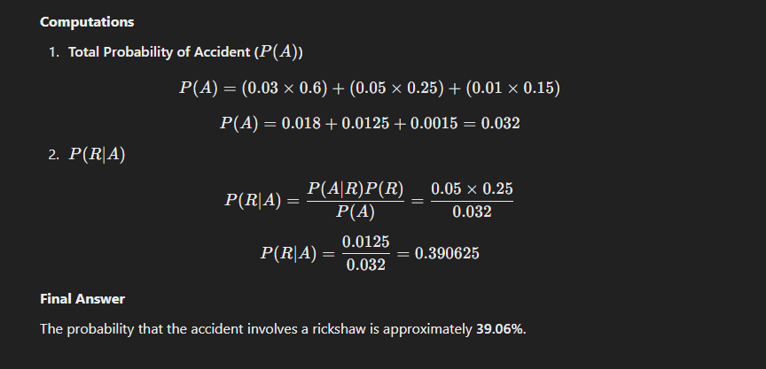

# Question 1:

(a) Define population, sample, experiment parameter and statistic suitable examples.

(b) Define variables. Discuss the different types of variables with examples.

(c) A country has four political parties say A, B, C, and D. An opinion survey conducted on 50 people randomly. The data were obtained as follows:

B, C, A, B, A, C, D, A. A, B, C, A, B, C, D, AA, B, C, A, B, D, A., A, B, B, D, C, A, D, B, A, B, D, C, C, H, RA, D, C, A, B, A, C, B, A, D

Construct a frequency distribution with this qualitative data and comment.

(i) Which one is the most popular party?

(ii) What is the percent of people liked party B?

(iii) Construct a bar diagram

(iv) Construct a pie chart.

## Solution for Q1: 

### (a) **Define population, sample, experiment parameter, and statistic with suitable examples.**

- **Population**: The entire group of individuals or items under study.  
  *Example*: All students in a university.  

- **Sample**: A subset of the population selected for the study.  
  *Example*: 200 students selected randomly from the university.  

- **Experiment parameter**: A numerical value that describes a characteristic of the population, such as the population mean or proportion.  
  *Example*: The true average height of all students in the university.  

- **Statistic**: A numerical value calculated from the sample data to estimate the parameter.  
  *Example*: The average height of the 200 sampled students.

---

### (b) **Define variables and discuss their types with examples.**

- **Variables**: Characteristics or properties that can vary among individuals in a population or sample.  

**Types of variables:**
1. **Qualitative (Categorical)**: Non-numeric variables representing categories.  
   *Example*: Eye color (e.g., brown, blue, green).  

2. **Quantitative (Numerical)**: Numeric variables that can be measured.  
   - **Discrete**: Countable values.  
     *Example*: Number of books a student has (e.g., 1, 2, 3).  
   - **Continuous**: Measurable and can take any value within a range.  
     *Example*: Height of students (e.g., 5.6 ft, 5.7 ft).  

---

### (c) **Solution:**

#### Given Data:
Political parties: A, B, C, D  
Survey size: 50 people  

The data collected is:  
B, C, A, B, A, C, D, A, A, B, C, A, B, C, D, A, A, B, C, A, A, B, D, A, B, D, A, B, B, D, A, C, B, A, A, B, D, C, A, B, A, D, C, A, B, A, C, B, A, D.  

---

#### Steps to Solve:

 **Frequency Distribution Table**

| Party | Frequency |
|-------|-----------|
| A     | 19        |
| B     | 14        |
| C     | 9         |
| D     | 8         |

---

#### (i) **Most Popular Party**  
The most popular party is **Party A**, with 19 votes.

---

#### (ii) **Percent of People Liked Party B**  

---

#### (iii) **Bar Diagram**  

The frequencies of preferences for each party are displayed clearly down below

#### (iv) **Pie Chart**

The percentage distribution of preferences for each party is depicted below

 

# Question 2:

(a) Define central tendency. What are the important measures of central tendency? Which one is best and why?

(b) The following frequency table relates to the marks obtained by 50 students in a course of statistics:

| Marks | No. of Students |
|---|---|
| 0-15 | 2 |
| 15-30 | 10 |
| 30-45 | 20 |
| 45-60 | 10 |
| 60-75 | 5 |
| 75-90 | 3 |

(i) Calculate mean, median and modal marks obtained by the students.

(ii) Also calculate 1st quartile and 3rd quartile and comment.

(c) Define skewness and kurtosis. The first four moments of a distribution about the origin are 2.5, 21, 166, and 1132 respectively. Find mean, variance, β₁ (beta one), β₂ (beta two), and comment.

## Solution Q2: 

### **(a) Define central tendency. What are the important measures of central tendency? Which one is best and why?**

#### Central Tendency:
It is a statistical measure that identifies a single value representing the center of a data set. It indicates where most data points cluster.

#### Important Measures:
1. **Mean**: The arithmetic average of the data.
2. **Median**: The middle value when the data is arranged in order.
3. **Mode**: The most frequently occurring value.

#### Best Measure:
- The **best measure** depends on the data type and distribution:
  - **Mean** is best for symmetric, continuous data with no outliers.
  - **Median** is ideal when there are outliers, as it is unaffected by extreme values.
  - **Mode** is useful for categorical data or identifying the most common occurrence.

---

### **(b) Frequency Table Analysis**

#### Given Data:
| Marks   | Frequency (f) |
|---------|---------------|
| 0–15    | 2             |
| 15–30   | 4             |
| 30–45   | 10            |
| 45–60   | 20            |
| 60–75   | 9             |
| 75–90   | 5             |

(i) **Calculate Mean, Median, and Mode**  
(ii) **Calculate the 1st Quartile (Q1) and 3rd Quartile (Q3)**  

Let me calculate these values.

#### Calculations:

(i) **Mean, Median, and Mode:**

- **Mean**: \( 51.0 \)

- **Median**: \( 51.75 \)

---

- **Mode**: \( 52.14 \)

(ii) **1st Quartile (Q1) and 3rd Quartile (Q3):**

- **Q1 (25th Percentile)**: \( 39.75 \)
- **Q3 (75th Percentile)**: \( 62.5 \)

---

### **Comments:**
1. **Central Tendency**:
   - The values for the mean, median, and mode are close, indicating the data distribution is nearly symmetrical.
   - Mode is slightly higher, showing that the most common scores are concentrated in the 45–60 range.

2. **Quartiles**:
   - Q1 (39.75) indicates that 25% of students scored below this value.
   - Q3 (62.5) indicates that 75% of students scored below this value.
   - The interquartile range (\( Q3 - Q1 \)) is \( 62.5 - 39.75 = 22.75 \), reflecting the spread of the middle 50% of the data.

   --- 

#### **(c) Define skewness and kurtosis. The first four moments of a distribution about the origin are 2.5, 21, 166, and 1132 respectively. Find mean, variance, β₁ (beta one), β₂ (beta two), and comment.**

# Question 3: 

**Question 3**
 
(a) What is the coefficient of variation? What purpose does it serve? Distinguish between standard deviation and coefficient of variation.

(b) The normal daily high temperatures (in degrees Fahrenheit) in January for 10 selected cities are as follows: 50, 37, 29, 54, 30, 61, 47, 38, 34, 61. The normal monthly precipitation (in inches) for these same 10 cities is listed: 4.8, 2.6, 1.5, 1.8, 1.8, 3.3, 5.1, 1.1, 1.8, 2.5. Which set of data is more consistent?

(c) A tobacco company claims that there is no relationship between smoking and lung ailments. To investigate the claim, a random sample of 300 males in the age group 40-50 are given medical tests. The observed sample results are shown below:

|        | Found Lung Ailment | No Lung Ailment | Total |
|---|---|---|---|
| Smokers | 75 | 105 | 180 |
| Non-smokers | 25 | 95 | 120 |
| Total | 100 | 200 | 300 |

On the basis of the information, can it be concluded that smoking and lung ailments are independent?

## Solution Q3: 

   Adding all the given temperatures:
   \[
   50 + 37 + 29 + 54 + 30 + 61 + 47 + 38 + 34 + 61 = 441
   \]

   The total number of temperatures is **10** (as there are 10 data points). 
This means the average temperature of the given data is **44.1°F**.

--- 

# Solution Q3: 

Here’s the solution to the problem, broken down into detailed sections for clarity.

---

### **4 (a) Definitions with Examples**
1. **Random Experiment**  
   An experiment or process that leads to uncertain outcomes.  
   **Example:** Tossing a coin.

2. **Sample Space (S)**  
   The set of all possible outcomes of a random experiment.  
   **Example:** For a coin toss, S = \{H, T\}

3. **Sample Point**  
   Each individual outcome in the sample space.  
   **Example:** For a coin toss, \( H \) (head) or \( T \) (tail) is a sample point.

4. **Compound Event**  
   An event composed of two or more simple events.  
   **Example:** Rolling an even number on a die, {2, 4, 6\} 

5. **Impossible Event**  
   An event that cannot happen. Its probability is 0.  
   **Example:** Rolling a 7 on a standard 6-sided die.

---

### **4 (b) Solution**

#### **Problem Setup**
- Three items are selected, and each is classified as:
  - \( D \): Defective
  - \( N \): Non-defective
- Let \( X \): Number of defective items  
- Probability of a defective item, P(D) = 0.02
- Probability of a non-defective item, P(N) = 1 - P(D) = 0.98 

--- 

## Question 5
(a) Define a normal distribution. Under what conditions binomial distribution tends to normal distribution. State some of its important properties.

(b) Suppose the daily wages of workers of a factory follows normal distribution with mean wage of Tk. 500 and standard deviation of Tk. 100.

(i) What is the percentage of workers getting daily wage between Tk.400 and Tk.650?

(ii) If the number of workers in that factory is 15000, how many workers get daily wage between Tk.400 and Tk.650.

(iii) If
(c) Given that A = 4.2, for a Poisson distribution, find

(i) PFX ≤ 2);

(ii) P[X≥ 5]; and

(iii) P[X=8]

## Solution Q5: 

# Solution Q6: 

Here is a detailed solution to question 6.

---

### **6 (a) Correlation Coefficient**

#### **Definition**
The **correlation coefficient** ( r ) measures the strength and direction of the linear relationship between two variables. It ranges between \(-1\) and \(+1\):
- \( r = +1 \): Perfect positive correlation.
- \( r = -1 \): Perfect negative correlation.
- \( r = 0 \): No correlation.

#### **Formula**
The correlation coefficient is calculated as:

where:
- \( Xi, Yi \): Individual data points.

- 

#### **Properties**
1. \( r \) is unitless.
2. It measures only linear relationships.
3. Sensitive to outliers.
4. Symmetric: r(X, Y) = r(Y, X).

---

### **6 (b) Relationship Between Fires and Acres Burned**

#### **Data**
| **Number of Fires (X)** | 72  | 69  | 58  | 47  | 84  | 62  |
|--------------------------|------|------|------|------|------|------|
| **Acres Burned (Y)**     | 62  | 42  | 19  | 26  | 51  | 15  |

---

#### **Part (i): Which is the Dependent Variable?**
- The **dependent variable** is the **number of acres burned (Y)** because it depends on the number of fires.

---

#### **Part (ii): Construct a Scatter Plot**
To create a scatter plot:
1. Plot the **Number of Fires (X)** on the x-axis.
2. Plot the **Number of Acres Burned (Y)** on the y-axis.

[The scatter plot can be visualized using graphing software or tools.]

---

#### **Part (iii): Is there a Linear Relationship?**
Yes, there appears to be a linear relationship. Observing the scatter plot, as the number of fires increases, the number of acres burned generally increases or decreases in a systematic way.

---

#### **Part (iv): Is the Relationship Positive or Negative?**
The relationship is **positive** if the points on the scatter plot slope upward, and **negative** if they slope downward. Observing the data:
- The relationship is **positive**, as an increase in fires tends to increase the number of acres burned.

---

#### **Part (v): Compute the Value of \( r \)**

### **6 (c) Sampling**

#### **Definition**
**Sampling** is the process of selecting a subset of individuals or observations from a population to estimate characteristics of the whole population.

#### **Methods of Sampling**
1. **Probability Sampling**:
   - **Simple Random Sampling**: Every individual has an equal chance of being selected.
   - **Systematic Sampling**: Select every \( k \)-th individual from a list.
   - **Stratified Sampling**: Divide the population into strata and randomly sample from each.
   - **Cluster Sampling**: Divide the population into clusters and randomly select entire clusters.

2. **Non-Probability Sampling**:
   - **Convenience Sampling**: Use samples that are easy to access.
   - **Judgment Sampling**: Select samples based on expert judgment.
   - **Quota Sampling**: Ensure the sample meets a certain quota for specific groups.
   - **Snowball Sampling**: Rely on referrals to recruit samples.

#### **Example of Simple Random Sampling**
If there are 100 students in a class, and we randomly select 10 using a random number generator, this is **simple random sampling**.

--- 

### **Final Answers**
- **6 (b):**
  - Dependent Variable: **Acres Burned (Y)**
  - Scatter Plot: Constructed as described.
  - Relationship: **Linear**
  - Type of Relationship: **Positive**
  - Correlation Coefficient ( r ) : **0.71**
  - Regression Line:  Y = -33.42 + 1.06X 
- **6 (c): Sampling methods and example provided above.**

