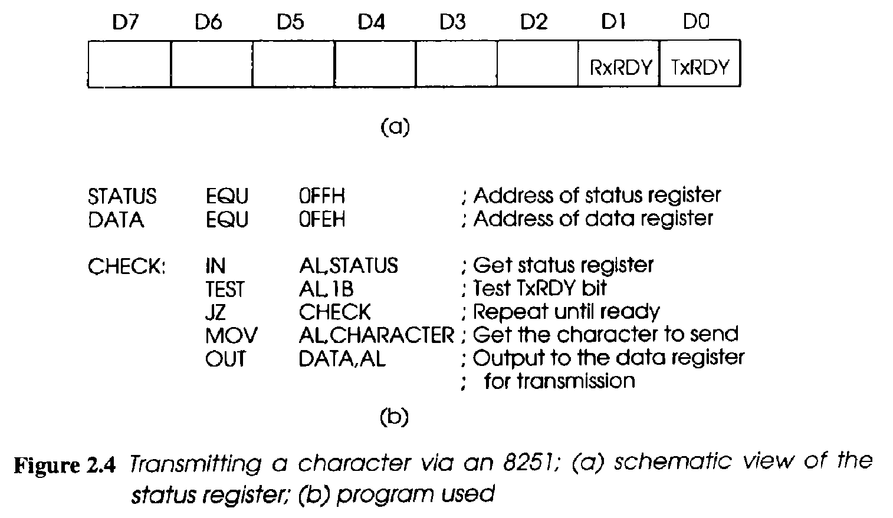
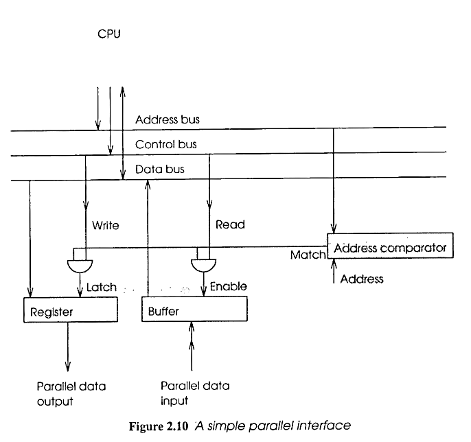

# Computer Peripheral Interface (Definition)

A **Computer Peripheral Interface** is the connection system (hardware or software) that allows a computer to communicate with **external devices** such as printers, keyboards, or storage drives.


### Key Points:
- Acts as a **bridge** between CPU and peripherals.
- Can be **hardware-based** (e.g., USB, HDMI, SATA) or **software-based** (e.g., device drivers, I/O protocols).
- Enables **data exchange** and **control signals**.

### Examples:
- **USB** – For mouse, keyboard, flash drives.
- **HDMI** – For monitors.
- **SATA** – For internal/external hard drives.
- **Bluetooth / Wi-Fi** – For wireless devices.

---

## **Computer interfacing** :
 Computer interfacing refers to the process of connecting a computer to other
devices or systems to exchange data and perform tasks, enabling them to work together.

# 🖥️ Peripheral Interface

A **Peripheral Interface** is a way for a computer or microcontroller to communicate with external devices like sensors, displays, or communication modules.

## 🔌 Common Types of Peripheral Interfaces:

- **USB (Universal Serial Bus)**  
  Used to connect devices like **keyboards**, **mice**, **printers**, and **USB storage**.

- **HDMI (High-Definition Multimedia Interface)**  
  Transfers **audio and video** signals to displays such as **monitors** and **TVs**.

- **Ethernet**  
  Connects computers to a **Local Area Network (LAN)** or the **internet**.

- **Bluetooth**  
  Enables **wireless communication** with devices like **headphones**, **keyboards**, and **speakers**.

- **VGA (Video Graphics Array)**  
  An older interface used to connect **monitors** or **projectors** to a computer.

- **Thunderbolt**  
  Provides **high-speed data transfer** and is used for **external displays** or **storage devices**.

- **I2C (Inter-Integrated Circuit)**  
  Used for communication between **microcontrollers** and devices like **sensors** and **EEPROMs**.

- **SPI (Serial Peripheral Interface)**  
  Communicates with devices such as **SD cards**, **displays**, and **sensors**.

---


# 8255 Programmable Peripheral Interface Block Diagram

 

## 🧩 8255 Programmable Peripheral Interface (PPI) – Block Diagram Explanation

### 🔷 Key Components:

### 1. **Data Bus Buffer**
- Interfaces the **system data bus** with the internal data bus of 8255.
- Transfers data **between microprocessor and 8255**.
- 8-bit bidirectional.

### 2. **Read/Write Control Logic**
- Controls all the internal read and write operations.
- Receives signals from the microprocessor like:
  - **RD (Read)**: Reads data from a selected port.
  - **WR (Write)**: Writes data to a selected port.
  - **CS (Chip Select)**: Activates the 8255 chip.
  - **A0, A1 (Address lines)**: Selects the port or control register.

### 3. **Control Register**
- Holds the **control word** that configures the ports:
  - Input or output mode.
  - Mode 0, 1, or 2 (for advanced handshaking).

### 4. **Group A and Group B Control**
- The 8255 is divided into two groups:
  - **Group A**: Port A and upper 4 bits of Port C (PC4–PC7).
  - **Group B**: Port B and lower 4 bits of Port C (PC0–PC3).
- Each group can be **configured separately**.

### 5. **Ports A, B, and C**
- **Port A (PA0–PA7)**: 8-bit port used for input/output.
- **Port B (PB0–PB7)**: 8-bit port used for input/output.
- **Port C (PC0–PC7)**: Can be used as two 4-bit ports (C upper and lower).
  - Also used for **handshaking and control signals**.

---

### 📌 Summary:
The 8255 PPI is used to **interface peripheral devices** with a microprocessor.
It provides **flexible I/O port configurations** and supports **both simple and complex communication** modes.


## 🔌 Why We Need Peripheral Adapters

### ✅ Definition:
A **Peripheral Adapter** is a device or circuit used to **connect peripheral devices** (like keyboard, printer, display, etc.) to a computer when their interface types are **not directly compatible**.


---

### 🧠 Why Peripheral Adapters Are Needed:

1. **Interface Compatibility**
   - Adapters help match **different data formats or signals**.
   - Example: Connecting a USB device to a serial port using a USB-to-Serial adapter.

2. **Legacy Device Support**
   - Allows older devices (e.g., PS/2 keyboards, parallel printers) to work with **modern systems**.

3. **Port Conversion**
   - Converts one port type into another.
   - Example: HDMI to VGA, USB-C to Ethernet.

4. **Protocol Translation**
   - Translates communication protocols between device and computer.
   - Example: Bluetooth adapter for wireless devices.

5. **Device Expansion**
   - Provides additional ports to connect **multiple peripherals**.
   - Example: USB hubs, docking stations.

---

### 📌 Summary:
Peripheral adapters are essential for ensuring **flexibility**, **backward compatibility**, and **efficient connectivity** between a computer and a wide variety of external devices.


## 🧩 Software Port vs Hardware Port – Brief Explanation

---

### 💻 Software Port (Logical Port)

#### ✅ Definition:
A **software port** is a **logical communication endpoint** used by software applications to exchange data over a network or between system processes.

#### 🔹 Key Points:
- Identified by **port numbers** (e.g., 80 for HTTP, 443 for HTTPS).
- Used in **TCP/IP networking**.
- Managed by the **operating system**.
- Allows multiple applications to use the same network connection.

#### 🔍 Example:
- **Port 21** → FTP
- **Port 25** → SMTP (email)
- **Port 8080** → Web servers (alternative to 80)

---

### 🔌 Hardware Port (Physical Port)

#### ✅ Definition:
A **hardware port** is a **physical interface** on a computer where peripheral devices are connected.

#### 🔹 Key Points:
- Found on the computer **motherboard or casing**.
- Used for **data transfer** and **device communication**.
- Can be serial or parallel.

#### 🔍 Examples:
- **USB Port** → For mouse, keyboard, flash drive.
- **HDMI Port** → For connecting displays.
- **Ethernet Port** → For wired network connection.
- **Audio Jack** → For sound input/output.

---

### 🆚 Difference at a Glance:

| Feature            | Software Port              | Hardware Port              |
|--------------------|-----------------------------|-----------------------------|
| Type               | Logical (virtual)           | Physical (real)             |
| Use Case           | Network communication       | Device connection           |
| Examples           | Port 80, 443, 21 (TCP/UDP)  | USB, HDMI, VGA              |
| Managed By         | Operating System            | Hardware & BIOS             |

---

### 📌 Summary:
- **Software ports** handle **virtual communication** in networks.
- **Hardware ports** handle **physical connections** with peripherals.


## 🔗 USB Protocol – Definition & Explanation

### ✅ Definition:
**USB (Universal Serial Bus)** is a **standard communication protocol** that allows computers to connect and communicate with external devices such as keyboards, mice, storage drives, cameras, and more.

---

### 🔹 Key Features:
- **Plug and Play**: Devices are automatically detected and configured.
- **Hot Swappable**: Devices can be connected/disconnected without restarting the system.
- **Universal Standard**: Replaces older interfaces like serial and parallel ports.
- **Power Supply**: Provides both data communication and electrical power.

---

### 🔄 Data Transfer Modes:
1. **Control Transfer** – For command/status communication (e.g., setup).
2. **Bulk Transfer** – For large data (e.g., file transfer via USB flash drive).
3. **Interrupt Transfer** – For timely data (e.g., keyboard/mouse).
4. **Isochronous Transfer** – For time-sensitive data (e.g., audio/video streams).

---

### ⚙️ USB Versions:

| Version  | Speed           | Type                 |
|----------|------------------|----------------------|
| USB 1.1  | 12 Mbps          | Low/Full speed       |
| USB 2.0  | 480 Mbps         | High speed           |
| USB 3.0  | 5 Gbps           | Super speed          |
| USB 3.1  | 10 Gbps          | SuperSpeed+          |
| USB 3.2 & 4 | Up to 40 Gbps | With Type-C support  |

---

### 📌 Summary:
The **USB protocol** standardizes how devices **communicate and transfer data** with computers, offering **speed, flexibility, power delivery**, and support for a wide range of peripherals.


## 🧠 Microprocessor – Definition, Advantages, and Disadvantages

---

### ✅ Definition:
A **microprocessor** is an integrated circuit (IC) that contains the **central processing unit (CPU)** of a computer system. It performs **arithmetic, logic, control, and input/output (I/O) operations** based on instructions from a program.


It is often called the **"brain of the computer"** and is used in devices like computers, smartphones, calculators, and embedded systems.

---

### 🟢 Advantages of Microprocessors:

1. **Compact Size**  
   - Combines all CPU functions in a small chip, saving space.

2. **High Speed**  
   - Executes millions of instructions per second (MIPS).

3. **Low Power Consumption**  
   - Efficient compared to older transistor-based CPUs.

4. **Cost Effective**  
   - Mass production reduces cost.

5. **General Purpose Use**  
   - Can be programmed to perform a wide variety of tasks.

6. **Versatility**  
   - Used in computers, washing machines, robots, etc.

---

### 🔴 Disadvantages of Microprocessors:

1. **Limited Processing Power**  
   - Not as powerful as full-scale CPUs or GPUs for complex tasks.

2. **Lacks Inbuilt Memory**  
   - Requires external memory and peripherals to operate.

3. **Dependence on Program**  
   - Works only according to the instructions provided.

4. **Heat Generation**  
   - High-speed processors can generate significant heat.

5. **No Parallel Processing** (in basic models)  
   - Most microprocessors operate sequentially (older types).

---

### 📌 Summary:
A **microprocessor** is a programmable electronic component crucial for modern electronics. It offers compact, low-cost, and high-speed solutions but requires supporting components and has limitations in high-end computing.

## 🎛️ Microcontroller – Definition, Advantages, and Disadvantages

---

### ✅ Definition:
A **microcontroller** is a **compact integrated circuit** designed to perform a specific task in an embedded system. It contains a **processor (CPU), memory (RAM, ROM), and I/O ports** on a single chip.


Used widely in **automated systems** such as home appliances, vehicles, medical devices, and IoT gadgets.

---

### 🟢 Advantages of Microcontrollers:

1. **All-in-One Chip**
   - Includes CPU, memory, timers, and I/O ports — no external components needed for basic tasks.

2. **Low Cost**
   - Cheaper for embedded applications than using separate components.

3. **Low Power Consumption**
   - Designed for energy-efficient performance in battery-powered devices.

4. **Compact Size**
   - Ideal for small, space-constrained applications.

5. **Fast Response Time**
   - Great for real-time control tasks like sensing and reacting to inputs.

---

### 🔴 Disadvantages of Microcontrollers:

1. **Limited Processing Power**
   - Not suitable for complex computing tasks or multitasking.

2. **Limited Memory**
   - RAM and ROM sizes are small compared to microprocessors.

3. **Application-Specific**
   - Designed for specific control tasks — not general-purpose computing.

4. **Slower Speed**
   - Clock speed is usually lower than a general-purpose microprocessor.

5. **Difficult to Upgrade**
   - Hardware and software are tightly integrated for specific tasks.

---

### 🆚 Microcontroller vs Microprocessor (Quick Glance)

| Feature             | Microcontroller            | Microprocessor              |
|---------------------|----------------------------|-----------------------------|
| Components          | CPU + RAM + ROM + I/O      | Only CPU                    |
| Application         | Specific (embedded systems)| General-purpose computing   |
| Power Consumption   | Low                        | High                        |
| Cost                | Low                        | Moderate to High            |
| Performance         | Moderate                   | High                        |

---

### 📌 Summary:
A **microcontroller** is a low-cost, power-efficient chip used in **embedded systems** for performing dedicated control tasks. It is not suited for high-performance computing but is perfect for smart, automated applications.

# Embedded Systems Overview

## What is an Embedded System?
An **embedded system** is a dedicated computer designed to perform specific tasks or functions within a larger system. Unlike general-purpose computers, embedded systems have a fixed function and are typically optimized for performance, reliability, and cost-efficiency.

### Characteristics:
- **Dedicated Functionality:** Performs specific tasks without the need for user intervention.
- **Real-time Operation:** Often operates in real-time systems with constraints like response time and processing speed.
- **Limited Resources:** Has limited processing power, memory, and storage.
- **Embedded in Larger Systems:** Typically forms a part of a larger system (e.g., washing machines, cars, medical devices).
  
## Components of an Embedded System:
1. **Microcontroller (MCU):** The brain of the embedded system, responsible for executing the program.
2. **Memory:** Used for storing data and program code, including RAM, ROM, and Flash.
3. **Input/Output Devices:** Sensors (e.g., temperature sensors), actuators (e.g., motors), and user interfaces (e.g., buttons or displays).
4. **Communication Interfaces:** Protocols like UART, SPI, I2C, or CAN for communication between the embedded system and external devices.

## Types of Embedded Systems:
1. **Standalone Embedded Systems:** Operate independently (e.g., digital watches, microwave ovens).
2. **Networked Embedded Systems:** Communicate over networks (e.g., smart home devices, IoT systems).
3. **Real-Time Embedded Systems:** Need to meet strict timing requirements (e.g., airbags in cars, industrial control systems).
4. **Mobile Embedded Systems:** Embedded systems in mobile devices (e.g., smartphones, tablets).

## Development Tools:
- **Programming Languages:** C, C++, Python (depending on the hardware), Assembly.
- **Development Boards:** Arduino, Raspberry Pi, ESP32, STM32.
- **Software Tools:** IDEs (e.g., Keil, MPLAB), debuggers, and simulators.
- **RTOS (Real-Time Operating Systems):** Used for complex systems requiring multitasking (e.g., FreeRTOS, VxWorks).

## Applications of Embedded Systems:
1. **Consumer Electronics:** Smartphones, home appliances, wearables.
2. **Automotive Systems:** Engine control, infotainment, safety systems.
3. **Industrial Automation:** Robotics, PLCs, process control systems.
4. **Healthcare Devices:** Medical instruments, diagnostic equipment.
5. **IoT (Internet of Things):** Smart devices like thermostats, security cameras, and smart meters.

## Key Concepts to Focus On:
- **Microcontrollers and Microprocessors** (e.g., ARM, AVR, PIC).
- **Embedded Programming** and real-time constraints.
- **Interfacing with Sensors and Actuators.**
- **Communication Protocols (I2C, SPI, UART).**
- **Power Management** and optimizing energy consumption.
  
## Common Challenges:
- **Limited resources** (memory, processing power).
- **Real-time constraints** (timing, deadlines).
- **Security concerns** in IoT-based embedded systems.
- **Debugging and testing** complex systems with hardware dependencies.


--- 

# 🧠 Programmed I/O (Input/Output) Process

## 🔍 What is Programmed I/O?

**Programmed I/O** is a method where the **CPU is in full control** of data transfer between I/O devices and memory.

The CPU sends commands to the I/O device and **waits (polls)** for the operation to complete. It does **not perform other tasks** during this time.

---

## ⚙️ How It Works:

1. **CPU issues a command** to the I/O device.
2. **CPU continuously checks (polls)** the device status to see if it's ready.
3. Once ready, **CPU reads/writes** data to or from the device.
4. **Repeats** the process for every data byte or word.

---

## 📌 Key Features:

- Involves **continuous CPU checking (busy-waiting)**.
- **Simple** to implement.
- CPU is **fully occupied** during I/O operation.

---

## ✅ Advantages:

- Easy to implement and understand.
- No need for complex hardware support.
- Good for **simple or low-speed devices**.

---

## ❌ Disadvantages:

- **CPU is blocked** and can’t do other tasks.
- **Inefficient** for large data transfers.
- **Wastes processing power** during waiting time.

---

## 📚 Example:

Imagine reading a key from a keyboard:
- CPU checks the keyboard repeatedly until a key is pressed.
- Once pressed, CPU reads the key and continues.




---

# 🔔 Interrupts in I/O

## 📌 What is an Interrupt?

An **interrupt** is a way to handle I/O **more efficiently** than programmed I/O.  
Instead of the CPU waiting idly, it **continues other tasks** until a device signals that it’s ready.

---


## ⚙️ How Interrupts Work:

When a peripheral (like a keyboard or printer) is ready to transfer data:

1. ✅ **Peripheral sets a "ready" flag** in its status register.
2. 🚨 It sends an **Interrupt Request (IREQ)** signal to the CPU.
3. 🧠 The CPU:
   - Finishes its current instruction.
   - **Pauses** the running program.
   - **Saves** its current state (like memory values and registers).
4. ⚙️ The CPU runs a special function called an **Interrupt Service Routine (ISR)** to handle the device.
5. 🔁 Once done, the CPU **restores** the saved information and **resumes** the interrupted program.

---

## 💡 Key Benefit:

- The program **doesn't know** it was interrupted.
- The CPU can **do useful work** while waiting for I/O.
- **Improves overall efficiency.**

---

# 🔌 How Peripherals Are Detected and Serviced

Peripherals like keyboards, printers, and USB devices are essential to a computer. The **CPU detects and handles them efficiently using interrupts**, especially with **Interrupt Acknowledge (IACK)** and **priority systems** like **Daisy Chaining**.

---

## 1. 🛎️ Peripheral Detection

- When a peripheral **needs service**, it sends an **Interrupt Request (IREQ)** to the CPU.
- All devices share a common interrupt line (combined using **"wired OR"** logic).
- This lets the CPU know that **at least one device** needs attention.

---

## 2. 🧾 Interrupt Acknowledge (IACK)

- The CPU sends back an **IACK signal** to confirm it’s ready to service a device.
- The device with the **highest priority** responds first and clears its request.
- This allows **other devices to wait** without interfering.

---

## 3. 🔗 Daisy Chain Priority Method

The **IACK signal** is passed from device to device in a **chain**, starting with the highest priority.

### 🔁 How It Works:

1. **CPU sends IACK** down the chain.
2. Each device checks:
   - **Did I request an interrupt?**
     - ✅ Yes → It **stops the signal** and gets serviced.
     - ❌ No → It **passes the IACK** to the next device.

This ensures the **highest priority device gets serviced first**.

---

### 💡 Real Example:

Imagine 3 devices are connected in a Daisy Chain:


- **Device A and Device C** both request service at the same time.
- CPU sends **IACK**.
- It reaches **Device A first**.
  - ✅ A requested the interrupt → A stops the IACK and gets serviced.
  - 🕓 Device C must wait until A is finished.

---

## 4. ⚙️ Service Routine (ISR)

- Once the right device is selected, the CPU runs an **Interrupt Service Routine (ISR)**.
- The ISR:
  - Handles the device’s task (e.g., send/receive data).
  - Clears the device’s **status register**.

---

## 5. 🔄 Resume Operation

- After servicing the peripheral, the CPU:
  - **Restores its previous state**.
  - **Continues** the program it was running before the interrupt.

---

## ✅ Summary

| Step                | Action Taken                               |
|---------------------|---------------------------------------------|
| Peripheral Detection | Device sends IREQ                          |
| CPU Acknowledgement | CPU sends IACK                             |
| Priority Handling   | Daisy Chain: Highest-priority device first |
| Service Routine     | ISR handles the request                    |
| Resume Program      | CPU resumes normal operation               |


---

# 🧲 Parallel Interface

A **parallel interface** allows a computer or microcontroller to communicate with external devices by **extending the internal bus** using additional **buffers and registers**.



---

## 🔧 How It Works

- An **address comparator** checks whether the parallel interface is being accessed by the CPU.
- If there's a **match**, it uses:
  - A **read signal** to control the **buffer** (for input).
  - A **write signal** to control the **register** (for output).
- **Registers** hold output data, ensuring it remains stable even after the CPU instruction completes.
- **Buffers** ensure input data is correctly transferred to the internal data bus.

---

## 🧮 Data Transfer Size

- The number of bits transferred depends on the computer’s internal data bus:
  - **8-bit**
  - **16-bit**
  - **32-bit**
  - **64-bit**

This makes the design **flexible** and compatible with different architectures.

---

## 🏭 Usage

- This **simple parallel interface** design is commonly used in **industrial controllers** and other embedded systems.

---

## ➕ Additional Features

- **Output signaling**: A signal can be sent when new data is written to inform the connected device of a change.
- **Input capturing**: A special register can store short-duration signals to ensure **temporary data isn't lost**.

---

# 🖨️ Centronics Interface

The **Centronics interface** is primarily used to connect **printers** to computers and can transfer data at speeds of up to **70,000 bytes per second**.


- It sends **all 8 bits of a character in parallel** using **twisted pair lines**.
- It also uses **control signals** to coordinate the data transfer process.

---

## 🤝 Handshaking Process

Handshaking ensures proper timing and coordination between the computer and the printer.

### 🔄 Steps in Handshaking:

1. **Wait for the Printer**:
   - Ensure the printer (or other peripheral) is **not busy**.

2. **Send Data**:
   - Place data on the data lines.
   - Wait **at least 500 ns** for signals to settle.

3. **Signal New Data**:
   - Pull the **strobe line low** for at least **500 ns**.
   - This tells the printer that **new data is available**.
   - The printer now enters the **busy state**.

4. **Acknowledge Receipt**:
   - After processing the data, the printer pulls the **Acknowledge (Acknlg)** line **low**.
   - It also clears the **busy** state.
   - The interface is now ready for the **next data transfer**.

---

## 📌 Summary Table

| Signal/Step       | Description                                                             |
|-------------------|-------------------------------------------------------------------------|
| Data Lines         | Carry 8 bits of character data in parallel                              |
| Twisted Pair Lines | Used for noise reduction and reliable transmission                      |
| Strobe Line        | Pulled low to notify printer of new data                                |
| Busy Signal        | Indicates printer is processing and not ready for new data              |
| Acknowledge (Acknlg)| Pulled low by printer after processing to indicate readiness           |
| Transfer Speed     | Up to **70,000 bytes/second**                                           |

---

## 🛠️ Use Case

The Centronics interface was the **standard for parallel printer connections**, especially in early computers and dot matrix/laser printers.


---

## 🔁 Summary Table

| Component        | Function                                                                 |
|------------------|--------------------------------------------------------------------------|
| Address Comparator | Detects access to the parallel interface                              |
| Registers         | Hold output data                                                        |
| Buffers           | Send input data to the bus during reads                                 |
| Read/Write Signals| Control data flow during communication                                  |
| Data Bus Width    | Determines transfer size (8/16/32/64 bits)                             |
| Input Register    | Captures short signals                                                  |
| Output Signal     | Notifies device when data is written                                    |


---

# 🔄 How Serial Communication Works

Inside a computer, data is processed **in parallel**. But for transmission over a **single wire**, this data must be converted to **serial form**.

This is achieved through:
- A **Parallel-to-Serial Converter** on the **sender’s side**
- A **Serial-to-Parallel Converter** on the **receiver’s side**

---

## 🚀 1. Transmission Process (Parallel to Serial Conversion)

The sender uses a **shift register** to convert data from parallel to serial.


### 🛠 Steps:

1. **Load Parallel Data**  
   - A complete data word (e.g., 8 bits) is loaded into the shift register.

2. **Shift Bits One by One**  
   - Each clock pulse shifts the bits **left**, sending the **leftmost bit** through the serial line.

3. **Send All Bits**  
   - This continues for **n clock pulses** (where `n = number of bits`).  
   - After n pulses, the full data word has been sent **bit by bit**.

---

## 📥 2. Reception Process (Serial to Parallel Conversion)

The receiver uses another **shift register** to convert the incoming serial data back to parallel form.


### 🛠 Steps:

1. **Receive Serial Data**  
   - Bits are received **one at a time** and fed into the shift register.

2. **Shift the Bits Along**  
   - Each clock pulse shifts the bits **right** within the register.  
   - The **first bit received** eventually reaches the last position.

3. **Reconstruct Parallel Data**  
   - After **n clock pulses**, the full word is reassembled in parallel.  
   - The data is now ready for further processing.

---

## 🔧 Summary Diagram (Conceptual)


---
# Peripheral Devices, Input Devices, and Output Devices

## 1. Peripheral Devices
Peripheral devices are external devices that are connected to a computer or microcontroller to extend its functionality. They can be classified into **input** and **output** devices, based on the direction of data flow.

### Types of Peripheral Devices:
- **Input Devices:** Devices that send data to the computer or microcontroller.
- **Output Devices:** Devices that receive data from the computer or microcontroller.
- **Storage Devices:** Devices used for data storage (e.g., hard drives, USB flash drives).
- **Communication Devices:** Devices used to enable communication between systems (e.g., network adapters).

## 2. Input Devices
Input devices allow the user or an external system to send data to a computer or microcontroller. They convert physical data into digital signals that can be processed.

### Examples of Input Devices:
1. **Keyboard:** Allows the user to input text and commands.
2. **Mouse:** Provides input through movement and button presses.
3. **Touchscreen:** Users can interact with the system by touching the display.
4. **Microphone:** Captures audio signals and converts them to digital form.
5. **Camera:** Captures images and videos, converting them into digital data.
6. **Sensors:** Devices like temperature sensors, motion sensors, etc., that send environmental data to a system.
7. **Barcode Scanner:** Scans barcodes and sends the data to a system.

### Features:
- **User Interaction:** Allows direct user input (e.g., via keyboard or touchscreen).
- **Signal Conversion:** Converts analog signals (like sound or light) into digital form.
- **Communication Protocols:** Input devices communicate using protocols like USB, I2C, SPI, etc.

## 3. Output Devices
Output devices receive data from the computer or microcontroller and convert it into a human-readable form or a form that can be processed by other devices.

### Examples of Output Devices:
1. **Monitor/Display:** Displays visual output, such as text, images, or videos.
2. **Printer:** Produces physical copies of digital documents (e.g., inkjet, laser printers).
3. **Speakers/Headphones:** Converts digital audio data into sound.
4. **LEDs:** Provide visual feedback by emitting light in response to signals.
5. **Actuators:** Devices like motors that convert electrical signals into mechanical movement (e.g., robotic arms, servos).
6. **Vibration Motors:** Provide tactile feedback, often used in mobile devices or gaming controllers.

### Features:
- **Data Presentation:** Output devices present processed data from the system in a usable form.
- **Human Interaction:** Used for user notifications, alerts, or feedback (e.g., visual, auditory).
- **Signal Processing:** Converts digital data into analog signals (e.g., sound or light).

## Key Differences:
- **Direction of Data Flow:** 
  - Input devices send data to the system.
  - Output devices receive data from the system and present it.
- **User Interaction:** 
  - Input devices allow users to interact with the system.
  - Output devices allow the system to interact with the user or other systems.

## Examples of Common Peripheral Devices:
1. **USB Devices:** Flash drives, external hard drives, printers.
2. **Wireless Devices:** Bluetooth headsets, Wi-Fi adapters.
3. **Camera & Microphone:** Used for capturing audio and video input.
4. **External Storage:** Hard drives, SSDs, and optical drives for data storage.

## Conclusion:
- **Peripheral devices** expand the functionality of a system and play a crucial role in user interaction, data processing, and system communication.
- **Input devices** capture data and send it to the system, while **output devices** present the processed data back to the user or other systems.


--- 

# Pipelining Overview

## What is Pipelining?
Pipelining is a technique used in computer architecture where multiple instruction stages are processed simultaneously. It allows for overlapping the execution of multiple instructions to improve throughput and overall performance.

### Definition:
Pipelining is the process of executing multiple instructions in parallel, breaking the instruction execution cycle into discrete stages, each handling a part of the task. Each stage operates independently on different instructions.

## How Pipelining Works
In a pipelined processor, the execution of an instruction is divided into several stages. These stages typically include:

1. **Fetch:** Retrieving the instruction from memory.
2. **Decode:** Decoding the instruction to understand its operation.
3. **Execute:** Performing the required operation (e.g., arithmetic, logical).
4. **Memory Access:** Reading from or writing to memory.
5. **Write-back:** Writing the result back to the register or memory.

### Key Stages of Pipelining:
1. **Instruction Fetch (IF):** Fetch the instruction from memory.
2. **Instruction Decode (ID):** Decode the instruction to determine what actions are needed.
3. **Execution (EX):** Perform the actual operation or computation.
4. **Memory Access (MEM):** Access memory if needed (read or write).
5. **Write-back (WB):** Write the result back to the register.

Each of these stages is performed concurrently for different instructions, so while one instruction is being decoded, another can be fetched, and yet another can be executed.

## Types of Pipelining
1. **Instruction Pipeline:** The most common form, where each instruction goes through the stages of fetch, decode, execute, etc., in a sequence.
2. **Data Pipeline:** Used in parallel processing of data, such as in digital signal processing or vector processing.
3. **Superscalar Pipeline:** A more advanced form where multiple instructions are executed in parallel at each stage.

## Benefits of Pipelining
- **Increased Throughput:** By executing multiple instructions at once, the system can process more instructions in a given period.
- **Better CPU Utilization:** Reduces idle time, as different stages of multiple instructions can be executed in parallel.
- **Faster Execution:** Instructions are processed more quickly, improving overall system performance.

## Challenges and Issues in Pipelining
1. **Pipeline Hazards:** These occur when the next instruction cannot be processed due to dependencies or resource conflicts.
   - **Data Hazard:** When an instruction depends on the result of a previous instruction that hasn’t completed.
   - **Control Hazard:** When branching or jumping causes uncertainty in the instruction flow.
   - **Structural Hazard:** When hardware resources are insufficient to handle the number of instructions in the pipeline.

2. **Stall Cycles:** Sometimes, the pipeline may need to wait or "stall" due to dependencies or hazards, reducing the benefits of pipelining.

3. **Pipeline Interlocks:** Mechanisms to handle hazards, where the processor stalls or delays instructions until data becomes available.

## Techniques to Improve Pipelining
1. **Forwarding (Data Forwarding):** Passing the result of an instruction to the next instruction without waiting for it to be written back.
2. **Branch Prediction:** Predicting the outcome of branch instructions to avoid control hazards.
3. **Out-of-Order Execution:** Reordering instructions to minimize pipeline stalls.
4. **Superscalar Execution:** Using multiple pipelines to execute multiple instructions in parallel.

## Real-world Examples of Pipelining:
- **CPU Architecture:** Modern processors like Intel and ARM use pipelining to improve execution speed by allowing concurrent processing of multiple instructions.
- **Graphics Processing Units (GPU):** Pipelining is extensively used to render graphics, where each stage (vertex processing, shading, etc.) is pipelined to handle large datasets efficiently.

## Limitations of Pipelining
- **Diminishing Returns:** While pipelining improves performance, it cannot continue to scale indefinitely. Eventually, other factors like memory access time become bottlenecks.
- **Complexity:** The more stages added to the pipeline, the more complex the control logic and hazard management become.
- **Dependence on Instruction Type:** Some instructions (e.g., branches) may not benefit much from pipelining.

## Conclusion
Pipelining is a powerful technique in modern processors to enhance the throughput and efficiency of executing instructions. By breaking down the execution of instructions into discrete stages and processing multiple instructions simultaneously, it allows for faster and more efficient use of the CPU. However, it introduces challenges like hazards, stalling, and complexity, which require sophisticated techniques to manage effectively.


--- 

# Memory-Mapped I/O (MMIO) Overview

## What is Memory-Mapped I/O?
Memory-Mapped I/O (MMIO) is a technique used to enable communication between the CPU and peripheral devices by mapping device registers or memory locations to specific addresses in the system's address space. This allows the CPU to interact with hardware devices as if they were regular memory locations.

### Definition:
In Memory-Mapped I/O, the peripheral devices' control and status registers are mapped to specific addresses within the processor's memory space. The CPU can read or write data to these addresses, and the system treats these addresses like regular memory locations.

## How Memory-Mapped I/O Works
- **CPU-to-Device Communication:** The CPU can read from or write to specific addresses that correspond to peripheral device registers (e.g., for controlling a device or reading its status).
- **Address Space:** A portion of the memory address space is reserved for I/O devices. These addresses are mapped to control registers of devices (e.g., timers, UART, ADC, etc.).
- **No Separate I/O Instructions:** Unlike Port-Mapped I/O (PMIO), where special instructions (like `IN` and `OUT`) are used for communication, MMIO uses standard memory read/write operations to interact with I/O devices.

### Example:
- The CPU writes data to a memory-mapped address corresponding to the device's control register to instruct it to perform an action.
- It can also read from the address that holds the device’s status register to check if the device is ready or if an error occurred.

## Key Features of Memory-Mapped I/O:
1. **Unified Addressing:** Devices are accessed using the same address space as memory, making it simpler for the CPU.
2. **Standard Memory Operations:** The CPU can use regular memory instructions (e.g., `LOAD`, `STORE`) to interact with devices.
3. **Efficient Communication:** Accessing devices through memory operations is often faster compared to other forms of I/O communication.
4. **Direct Access to Device Registers:** Devices like timers, network controllers, and graphic cards have control and status registers that the CPU can access directly.

## Advantages of Memory-Mapped I/O:
- **Simpler Hardware Design:** No need for special I/O instructions, as memory instructions are used for both memory and I/O devices.
- **Faster Data Transfer:** It allows faster communication between the CPU and peripherals due to the use of regular memory operations.
- **Efficient Use of Address Space:** Can combine memory and I/O device access in a single unified address space, making it easier to manage the system.
- **Flexible Device Access:** MMIO allows easy interaction with a wide range of peripheral devices using memory addresses.

## Disadvantages of Memory-Mapped I/O:
- **Address Space Limitation:** Since MMIO shares the same address space as the system’s RAM, the available address space for RAM may be reduced, limiting the amount of memory that can be accessed.
- **Performance Impact:** If too many devices are mapped to the memory space, accessing these I/O devices can cause performance bottlenecks, especially in systems with limited memory bandwidth.
- **Device Address Conflict:** Care must be taken to avoid conflicts between the addresses assigned to memory and those assigned to devices.

## Memory-Mapped I/O vs Port-Mapped I/O:
- **Memory-Mapped I/O (MMIO):** Uses the standard memory addressing mechanism (i.e., memory read and write operations) to interact with peripherals.
- **Port-Mapped I/O (PMIO):** Uses special instructions (`IN`/`OUT`) to communicate with peripheral devices, and has a separate address space for I/O operations.

## Common Applications of MMIO:
1. **Microcontrollers:** MMIO is commonly used in embedded systems to interface with peripherals such as ADCs, timers, and communication interfaces (UART, SPI).
2. **CPUs:** In modern processors, MMIO is used to interact with various system devices, such as graphics cards, network interfaces, and storage controllers.
3. **I/O Controllers:** Systems use MMIO for interaction with I/O controllers that manage device operations (e.g., hard disk controllers, USB controllers).

## Example of Memory-Mapped I/O in Embedded Systems:
In a microcontroller-based system, suppose an external peripheral device like a UART is memory-mapped to a specific address. The CPU can read the status of the UART from a particular memory address, and write data to another memory address that controls the UART data transmission.

For example, 
- Writing to `0x4000_1000` may start a UART transmission.
- Reading from `0x4000_1004` may give the status of the UART (e.g., whether data is ready to be read).

## Conclusion:
Memory-Mapped I/O is a crucial concept in modern computer systems, allowing efficient and simplified communication between the CPU and peripheral devices using standard memory operations. While it offers significant advantages in terms of simplicity and performance, careful address management is essential to avoid conflicts and bottlenecks.


--- 

## 🔔 Interrupts – Definition, Types, and Importance

---

### ✅ Definition:
An **interrupt** is a signal sent to the **CPU** that temporarily halts the current process so that a **priority task (interrupt service routine)** can be executed. Once the task is completed, the CPU resumes the previous activity.

Interrupts help in handling **real-time events** efficiently, without constantly checking for input/output (polling).

---

### 🔄 Working Principle:
1. CPU executes normal program instructions.
2. An **interrupt signal** is received from a device or software.
3. CPU **pauses** the current task and saves the state.
4. Executes the **Interrupt Service Routine (ISR)**.
5. After finishing, the CPU **resumes** the interrupted task.

---

### 🧩 Types of Interrupts:

| Type              | Description                                      | Example                     |
|-------------------|--------------------------------------------------|-----------------------------|
| **Hardware Interrupt** | Generated by hardware devices               | Keyboard press, timer       |
| **Software Interrupt** | Triggered by software instructions (INT)    | System calls, errors        |
| **Maskable Interrupt** | Can be ignored/disabled by the CPU          | Non-critical device alerts  |
| **Non-Maskable Interrupt (NMI)** | Cannot be disabled; very high priority | Power failure, system crash |
| **External Interrupt** | Comes from an external device                | USB device insertion        |
| **Internal Interrupt** | Triggered by internal system events         | Arithmetic overflow         |

---

### 📌 Importance of Interrupts:

- 🔄 **Efficient resource management** – CPU doesn't waste time checking every device.
- ⚡ **Fast response to real-time events** – Immediate reaction to critical changes.
- 🔋 **Power saving** – Devices can sleep until an interrupt wakes them up.
- 🧠 **Multitasking** – Helps manage multiple tasks or devices simultaneously.

---

### 💡 Example:
When you press a key on the keyboard:
- A hardware interrupt is sent to the CPU.
- CPU pauses current work, processes the key press, and then resumes.


---

## ⚙️ Types of Interrupt Handling Methods – With Examples

Interrupt handling methods define **how the system prioritizes and responds** to multiple interrupt signals. There are several methods used in microprocessors and microcontrollers to manage these signals.

---

### 🧩 1. **Vectored Interrupt**

**Definition**:  
In vectored interrupts, each interrupt source is **assigned a fixed memory address** where the Interrupt Service Routine (ISR) is stored.

**Example**:  
In Intel 8085, **RST 7.5**, **RST 6.5**, etc., have fixed memory locations like 003C, 0034, etc.

**Advantage**:  
- Fast as the address is predefined  
**Disadvantage**:  
- Limited number of fixed vectors

---

### 🔁 2. **Non-Vectored Interrupt**

**Definition**:  
Interrupts that do **not have fixed ISR addresses**. The interrupting device must **provide the ISR address** to the processor.

**Example**:  
In 8085, the **INTR** pin requires external hardware to supply the ISR address.

**Advantage**:  
- Flexible ISR address  
**Disadvantage**:  
- Slightly slower and needs external circuitry

---

### 🔄 3. **Polling**

**Definition**:  
The processor **checks each device** in a sequence to identify which one requested the interrupt.

**Example**:  
Used when multiple devices share one interrupt line, e.g., **simple embedded systems**.

**Advantage**:  
- Simple implementation  
**Disadvantage**:  
- Slower response, high CPU usage

---

### 🌐 4. **Daisy Chaining (Serial Priority)**

**Definition**:  
Devices are connected in a **serial chain**, and priority is determined by their **position** in the chain (closer = higher priority).

**Example**:  
Used in **8085 systems with multiple 8259 PICs** (Programmable Interrupt Controllers).

**Advantage**:  
- Priority handling built-in  
**Disadvantage**:  
- Lower priority devices may starve

---

### 🎯 5. **Priority Interrupt System**

**Definition**:  
Each interrupt source is assigned a **priority level**, and higher priority interrupts are serviced before lower ones.

**Example**:  
Intel **8259 PIC** supports priority-based interrupt handling.

**Advantage**:  
- Handles critical tasks first  
**Disadvantage**:  
- Complex logic required

---

### 📌 Summary Table:

| Method              | ISR Address | Priority Handling | Example        |
|---------------------|-------------|-------------------|----------------|
| Vectored Interrupt  | Fixed       | Basic             | RST 7.5 (8085) |
| Non-Vectored        | External    | Basic             | INTR (8085)    |
| Polling             | Dynamic     | Manual            | Embedded Sys.  |
| Daisy Chaining      | Dynamic     | Positional        | 8259 + 8085    |
| Priority Interrupt  | Dynamic     | Predefined        | 8259 PIC       |


---

## 🔄 Serial to Parallel Conversion – Definition, Need, and Working

---

### ✅ Definition:
**Serial to Parallel Conversion** is the process of **converting data** sent **one bit at a time (serial form)** into **multiple bits simultaneously (parallel form)** so that it can be processed or stored efficiently by devices like **microprocessors or memory units**.

---

### 💡 Why It's Needed:
- **Serial data** is used for communication (e.g., USB, UART) because it needs fewer wires and is cost-efficient.
- **Parallel data** is used inside processors for **faster data access** and **processing**.
- Hence, a conversion is needed between communication and processing systems.

---

### ⚙️ How It Works:
1. A **serial input line** receives one bit at a time (e.g., from a sensor or communication port).
2. A **shift register** stores each incoming bit.
3. After all bits of a word (e.g., 8 bits) are received, they are **output together in parallel form**.

---

### 📦 Example:
- A microcontroller receives data from a UART module (serial form).
- It uses a **Serial-In Parallel-Out (SIPO) shift register** like **74HC595** to convert the data into parallel for internal processing.

---

### 🔧 Components Involved:
- **Clock signal** – Synchronizes the bit input.
- **Shift register** – Stores serial bits and releases them as parallel output.
- **Latch** – Holds the data for further use.

---

### 🖼️ Diagram:

---

## 🔁 Parallel to Serial Conversion – Definition, Importance, and Working

---

### ✅ Definition:
**Parallel to Serial Conversion** is the process of **transmitting multiple data bits simultaneously (parallel data)** as a **single bit stream (serial form)**, typically used for communication over long distances or through serial ports.

---

### 💡 Why It's Needed:
- **Microprocessors and memory** handle data in **parallel**.
- Communication interfaces like **USB, UART, SPI** often transmit data **serially** to reduce wire usage and cost.
- Therefore, data must be **converted to serial form** before transmission.

---

### ⚙️ How It Works:
1. A set of **parallel data bits** (e.g., 8 bits from a register) is loaded into a **Parallel-In Serial-Out (PISO)** shift register.
2. The data is **shifted out one bit at a time** with each clock pulse.
3. The output is a continuous serial bit stream sent over a communication line.

---

### 📦 Example:
- A microcontroller wants to send 8-bit data over UART.
- It loads data into a **PISO shift register**, which converts it into a **serial stream** for transmission.

---

### 🔧 Components Involved:
- **Clock signal** – Controls bit-by-bit output.
- **Shift register (PISO)** – Loads parallel data, shifts it serially.
- **Data line** – Carries the serial data to the receiver.

---

### 🖼️ Diagram:


## 🖨️ Centronics Interface and Data Transfer Process

---

### ✅ What is Centronics?
**Centronics** is a standard **parallel interface** developed in the 1970s for connecting **printers** to computers. It became widely known as the **IEEE 1284 standard** and is primarily used for **parallel communication** between a computer and a printer.

---

### 🔌 Key Features:
- **8-bit parallel data transfer**
- **One-way communication** (original Centronics; IEEE 1284 added bidirectional support)
- Faster than early serial interfaces (at that time)
- Uses a **25-pin connector** (DB-25)

---

### 🧩 Centronics Interface Pins:
| Pin | Function         |
|-----|------------------|
| 1   | Strobe           |
| 2-9 | Data Bits (D0–D7)|
| 10  | Acknowledge      |
| 11  | Busy             |
| 12  | Paper End        |
| 13  | Select           |
| 14  | Auto Linefeed    |
| 16  | Initialize       |
| 17  | Select In        |
| 18-25 | Ground         |

---

### 🔄 Data Transfer Process in Centronics:
1. **Data Setup**:  
   The computer places **8-bit parallel data** on the data lines (D0–D7).

2. **Strobe Signal**:  
   The **strobe line** (Pin 1) is pulled **low** by the computer to signal data is ready.

3. **Data Read**:  
   The printer reads the data once the **strobe signal** is received.

4. **Acknowledge Signal**:  
   After accepting the data, the printer sends an **ACK signal** (Pin 10) back to the computer.

5. **Busy Signal**:  
   The **busy line** (Pin 11) goes high while the printer is processing the data and goes low when it's ready for more.

6. **Ready for Next Byte**:  
   The computer waits for the busy line to go low, then sends the next byte.

---

### 📊 Data Flow Diagram:

```text
Computer
  │
  ├──► Data Lines (D0–D7)
  │
  ├──► STROBE ↓
  │
  │        Printer
  │        ├── Reads data
  │        ├── Sends ACK ↑
  │        ├── BUSY ↑ while printing
  │
  ◄──◄ ACK
  ◄──◄ BUSY ↓ (Ready)


```

---

## 💾 SCSI (Small Computer System Interface)

---

### ✅ What is SCSI?
**SCSI** stands for **Small Computer System Interface**. It is a set of **standards for connecting and transferring data** between computers and **peripheral devices** such as hard drives, scanners, CD-ROMs, and printers.


---

### 📌 Key Features:
- **Parallel data transfer standard** (initially; later evolved to serial SCSI like SAS)
- Supports **multiple devices** (up to 8 or 16 on one bus)
- High data transfer rate (initial versions: 5 MB/s, later up to several hundred MB/s)
- Devices are connected in a **daisy-chain** fashion

---

### 🧩 SCSI Components:
| Component        | Description                                      |
|------------------|--------------------------------------------------|
| **Host Adapter** | Interface card in the computer that manages the SCSI bus |
| **SCSI Bus**     | Set of cables and connectors used for communication |
| **Target Device**| Peripherals (e.g., HDDs, printers) that receive/process data |
| **Initiator**    | Usually the computer that sends commands         |

---

### 🔄 Data Transfer Process in SCSI:
1. **Initiation**:  
   The **initiator (computer)** selects a target device and sends a command.

2. **Command Phase**:  
   The command is sent from the initiator to the selected device.

3. **Data Phase**:  
   Data is either sent from the initiator to the target (write) or from the target to the initiator (read).

4. **Status Phase**:  
   The target sends status information (success/failure).

5. **Message Phase**:  
   Optional messages are exchanged (e.g., command complete).

---

### 🔌 SCSI ID:
- Each device on a SCSI bus is assigned a **unique ID** (0–7 or 0–15).
- ID **7** is usually reserved for the **host adapter** (highest priority).

---

### 🖼️ Basic Diagram:


```text
[Computer]
   │
[Host Adapter (ID 7)]
   │───┬────────┬────────┬────────┐
[HDD] [Scanner] [CD-ROM] [Printer]
(ID 0) (ID 2)   (ID 3)   (ID 4)

```


---

## ✅ SCSI – Advantages, Disadvantages & Applications

---

### ✔️ Advantages of SCSI:
1. **Multiple Device Support**: Up to 8 or 16 devices can be connected using one SCSI bus.
2. **High-Speed Transfer**: Faster than early alternatives like IDE or parallel ports.
3. **Device Variety**: Can connect hard drives, scanners, CD-ROMs, printers, and more.
4. **Reliable and Durable**: Built for continuous operation in enterprise environments.
5. **Efficient Data Handling**: SCSI supports command queuing and multi-tasking.
6. **Daisy-Chaining**: Devices can be connected in a chain without needing multiple ports on the host.

---

### ❌ Disadvantages of SCSI:
1. **Costly**: More expensive compared to IDE, SATA, and USB interfaces.
2. **Complex Configuration**: Requires manual setting of device IDs and proper termination.
3. **Bulky Cables**: SCSI cables are thicker and less flexible.
4. **Obsolete for Consumer Use**: Superseded by SATA, USB, and NVMe in most modern systems.

---

### 💡 Applications of SCSI:
- **Servers and Datacenters**: Used for high-speed, reliable storage systems.
- **RAID Storage Arrays**: Often used in enterprise-grade RAID controllers.
- **Workstations**: High-performance machines requiring multiple fast storage devices.
- **Industrial and Scientific Equipment**: Used where durable and fast device communication is necessary.
- **Legacy Systems**: Older computers and printers still use SCSI interfaces.

---
---


# 🔌 USB Protocol : 

## 📌 What is USB?

**USB (Universal Serial Bus)** is a very popular interface because it's:
- ✅ Easy to use
- ⚡ Fast
- 🔁 Used for **both data transfer and power delivery**

Examples:
- You can **transfer files** (data)
- And **charge your phone** (power) — all using the same cable and port!

---

## 📦 USB Packet Structure

USB communication works through **packets**. Each packet contains important parts (called *fields*) that help devices talk to each other.

### 🧩 Common Fields in USB Packets:

| Field  | Description |
|--------|-------------|
| **Sync** | Helps match the sender and receiver’s timing. (8 bits for low/full speed, 32 bits for high speed) |
| **PID**  | Packet type (e.g., Data, Token, Handshake). 4 bits repeated for error checking |
| **ADDR**| Address of the device (7-bit, max 127 devices). Address 0 = not yet assigned |
| **ENDP**| Endpoint number inside the device (up to 16 per device) |
| **CRC** | Error checking: 5 bits for control packets, 16 bits for data packets |
| **EOP** | End of packet marker (special bit pattern) |

---

## 🔄 Types of USB Packets

There are **4 main types** of packets in USB communication:

---

### 1️⃣ Token Packets

- 🔸 **What it does**: Tells the device what kind of action (read/write) is coming next.
- 🔸 **Who sends it**: Always sent by the **host** (like a computer).
- 🔸 **Types**:
  - **IN**: Host wants to **read** data from device
  - **OUT**: Host wants to **send** data to device
  - **SETUP**: For starting control transfers
- 🧩 Fields: `Sync + PID + ADDR + ENDP + CRC5 + EOP`

---

### 2️⃣ Data Packets

- 🔸 **What it does**: Carries the **actual data** (up to 1024 bytes)
- 🔸 **Types**:
  - **DATA0**, **DATA1** (alternating to avoid duplicates)
  - **DATA2**, **MDATA** (used in high-speed)
- 🧩 Fields: `Sync + PID + Data + CRC16 + EOP`
- 📏 Size Limits:
  - Low speed: 8 bytes
  - Full speed: Up to 1023 bytes
  - High speed: Up to 1024 bytes

---

### 3️⃣ Handshake Packets

- 🔸 **What it does**: Confirms or rejects data transfer
- 🔸 **Types**:
  - **ACK**: Data received successfully
  - **NAK**: Device not ready or no data
  - **STALL**: Something is wrong; needs host help
- 🧩 Fields: `Sync + PID + EOP`

---

### 4️⃣ Start of Frame (SOF) Packets

- 🔸 **What it does**: Marks the **start of a new time frame**
- 🔸 Sent regularly by the host:
  - Every **1 ms** (full speed)
  - Every **125 μs** (high speed)
- 🧩 Fields: `Sync + PID + Frame Number + CRC5 + EOP`

---

## 📝 Summary Table

| Packet Type    | Function                          | Key Info                         |
|----------------|-----------------------------------|----------------------------------|
| Token          | Tells device what's coming        | IN, OUT, SETUP                   |
| Data           | Carries real data                 | DATA0, DATA1, DATA2, MDATA       |
| Handshake      | Acknowledges or rejects transfer  | ACK, NAK, STALL                  |
| Start of Frame | Sync signal for time alignment    | Sent by host at fixed intervals  |

---

# 📺 CRT (Cathode Ray Tube) & Display Concepts

## 🧲 Cathode and Anode Materials
- **Cathode**: A heated metal inside the electron gun that releases electrons when heated by a filament.
- **Anode**: A positively charged metal cylinder that pulls and focuses the electrons toward the screen.

## ⚙️ How CRT Works
1. **Electron Gun**: Releases and controls the electron beam using the cathode and control grid.
2. **Focusing System**: Keeps the beam sharp using electric or magnetic fields.
3. **Deflection System**: Directs the beam to correct positions on the screen.
   - Magnetic: Uses coils.
   - Electrostatic: Uses plates.
4. **Phosphor Screen**: Glows when hit by the electron beam, showing images.

## 🌈 Phosphors
- Emit **red**, **green**, or **blue** light (used in color CRTs).
- **Beam Penetration Method**: Two layers (green inner, red outer) to show multiple colors.
- Phosphors differ by **color** and **how long they glow** (persistence).

## ⏳ Persistence
- Time phosphor light takes to fade to 10% of its brightness.
- Lower persistence → needs faster refresh to avoid flicker.

## 👀 Flicker
- Happens if the screen fades before the next refresh.
- **Interlacing** helps reduce flicker by refreshing alternate lines in two passes.

## 🔁 Refresh Rate
- **Raster Scan**: 60–80 times per second.
- **Random Scan**: 30–60 times per second, slower for smaller drawings.
- **Interlaced Display**: Refreshes in two passes (e.g., 30 Hz becomes ~60 Hz).

## 🖼️ Resolution
- Number of visible points (pixels) on screen.
- Example: 1280×1024.
- Affected by beam size, intensity, and screen quality.

## 🎯 Spot Size
- Size of the dot where the beam hits the screen.
- Smaller = sharper image.
- Controlled by focusing (magnetic > electrostatic for sharpness).

## 🔲 Aspect Ratio
- Ratio of screen's **width to height**.
- Example: 4:3 (horizontal:vertical) = standard screen ratio.

## 📡 Raster Scan Display
- Beam sweeps **line by line** from top-left to bottom-right.
- After each row → horizontal retrace.
- After whole screen → vertical retrace.

## 💾 Frame Buffer (Refresh Buffer)
- Stores pixel values to show the image.
- **Bitmap**: 1-bit per pixel (B/W).
- **Pixmap**: Multi-bit (e.g., 24-bit color).
- Example: 1024×1024 at 24-bit = 3MB memory.

## 🔘 Pixel (Pel)
- Smallest visible dot on screen.
- Stores brightness/color info.

## 🧠 Bitmap vs Pixmap
- **Bitmap**: 1-bit B/W image.
- **Pixmap**: Multi-bit color image.

## 🔁 Retrace
- **Horizontal**: Beam moves to start of next row.
- **Vertical**: Beam moves to start of next frame.

## ✏️ Random Scan (Vector Display)
- Draws only the required lines (not full screen).
- Stores drawing commands in a display file.
- Used for line drawings (like oscilloscopes).
- High-quality lines, no colors/shading.

## 🆚 Raster Scan vs Random Scan

| Feature         | Raster Scan                          | Random Scan                           |
|-----------------|--------------------------------------|----------------------------------------|
| Beam Path       | Row by row                          | Line by line (vector)                  |
| Image Type      | Pixel-based                         | Line-based                             |
| Refresh Rate    | 60–80 FPS                           | 30–60 FPS                              |
| Image Quality   | Jagged edges                        | Smooth lines                           |
| Usage           | General display (color/image)       | Line drawings (CAD, graphs)            |
| Resolution      | Lower (pixel-based)                 | Higher (line-focused)                  |


