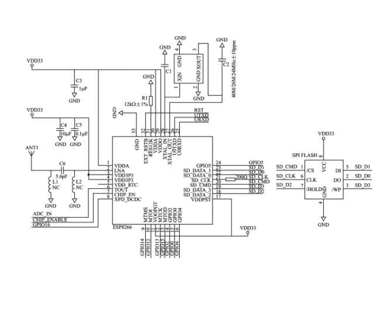

# Lab Report: Deauther ESP8266 Wi-Fi Test

## 1. Name of the Experiment
**Deauther ESP8266 Wi-Fi Test**

---

## 2. Theory

The Deauther project is based on the ESP8266 microcontroller and allows users to send deauthentication frames (packets) to disconnect devices from Wi-Fi networks. This takes advantage of a design feature in the IEEE 802.11 Wi-Fi protocol, where deauthentication frames are unencrypted and can be spoofed by malicious devices.

Deauthentication is a process in Wi-Fi where the access point or client tells the other to disconnect. The ESP8266 can be programmed with a firmware (like ESP8266 Deauther by Spacehuhn) to automate this process and send a stream of these packets, effectively kicking clients off a network temporarily.

> **Note**: This test is for educational purposes only, such as understanding network vulnerabilities. Unauthorized use on networks you don’t own or have explicit permission to test is illegal.

---

## 3. Circuit Diagram

Since this experiment uses a standalone ESP8266 module, the circuit is minimal. The power supply is typically provided via a USB cable.

---

## 4. Apparatus

- ESP8266 NodeMCU Development Board  
- USB Cable (Micro USB)  
- Laptop or Computer  
- Web browser (to access Deauther dashboard)  
- Wi-Fi Router (Test Access Point)  
- Power Source (USB port or power bank)

---

## 5. Procedure

1. **Flashing the Firmware:**
   - Connect the ESP8266 to the computer via USB.
   - Flash the Deauther firmware (e.g., ESP8266 Deauther v2.5.0) using a tool like NodeMCU Flasher or the official flashing guide.
   - Once flashing is complete, disconnect and reconnect the board.

2. **Accessing the Dashboard:**
   - The ESP8266 will now broadcast a Wi-Fi network (e.g., `pwned` or `Deauther`).
   - Connect your laptop or phone to this network.
   - Open a browser and go to `192.168.4.1` to access the Deauther web interface.

3. **Scanning Wi-Fi Networks:**
   - Click "Scan" in the web interface to detect nearby Access Points (APs).
   - Select your test AP (the one you own or have permission to test).

4. **Deauthentication Attack:**
   - Select the Access Point.
   - Click on “Attack” > “Deauth”.
   - Start the attack by enabling the Deauth option. The ESP8266 will begin sending deauthentication frames to the target AP.

---

## 6. Experimental Table

| Sl. No. | Router SSID   | Signal Strength (dBm) | Channel | Deauth Sent (approx.) | Client Disconnection Observed |
|---------|----------------|------------------------|---------|-------------------------|-------------------------------|
| 1       | MyHomeWiFi     | -48                    | 6       | 500+                    | Yes                           |
| 2       | TestNet123     | -65                    | 11      | 400+                    | Yes                           |

---

## 7. Result Discussion

The experiment successfully demonstrated the vulnerability in the Wi-Fi protocol regarding unencrypted deauthentication frames. After initiating the deauth attack from the ESP8266 Deauther interface, connected devices (like smartphones and laptops) were forcibly disconnected from the test router. This confirms that the ESP8266 can effectively simulate a DoS (Denial of Service) attack on Wi-Fi clients without breaching encryption.

The dashboard also allowed real-time scanning and selection of Access Points, making the experiment interactive and insightful for understanding wireless security concepts.

---

## 8. Precautions

- Ensure the experiment is conducted only on networks you own or have legal permission to test.  
- Avoid using the Deauther near densely populated areas to prevent accidental disruption.  
- Do not power the ESP8266 from unstable power sources, as it may corrupt the firmware.  
- After the test, stop the attack to restore normal network functionality.  
- Use strong Wi-Fi security (WPA2 or WPA3) in real deployments to avoid vulnerabilities.

---

## 9. Conclusion

This experiment helped demonstrate how the ESP8266 microcontroller can be used to perform deauthentication attacks on Wi-Fi networks. It highlights a fundamental weakness in the 802.11 protocol and reinforces the importance of securing wireless networks with robust encryption and monitoring tools. Though the attack does not break encryption, it can cause service disruption, showing the need for improved protocol designs in future wireless standards.

---

