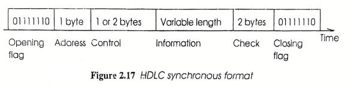
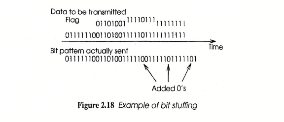
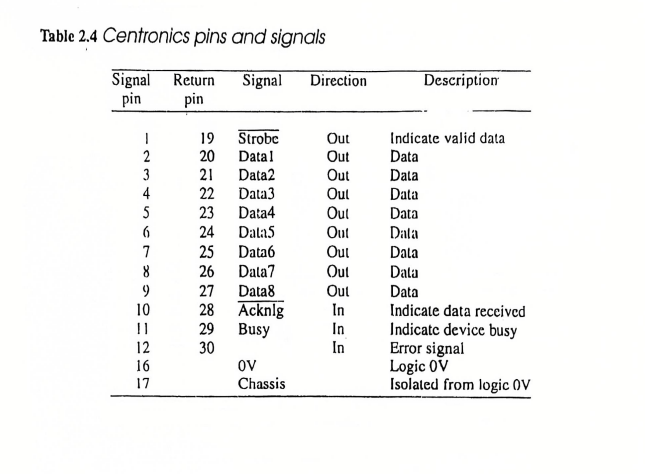
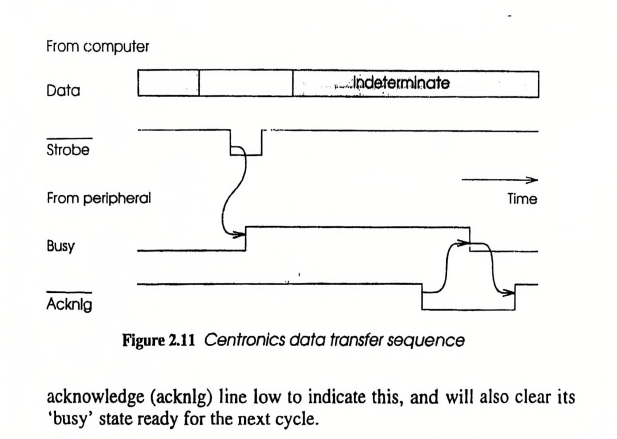

Let’s break down the content about **asynchronous transmission** and the diagram (Figure 2.16) step by step in simple terms:

---

### **1. Asynchronous Transmission Basics**  
- **What is asynchronous?**  
  Data is sent *one character at a time* (like typing letters on a keyboard), with **no fixed timing** between characters. The sender and receiver are *not synchronized* for the whole message, but they *temporarily sync* for each character.  

---

### **2. The Character Format (Figure 2.16)**  
Imagine sending a single character (e.g., the letter "A") over a wire. The data is structured like this:  

#### **A. Idle State (Mark = '1')**  
- When no data is sent, the line is in the **idle state** (like "silence").  
- This is represented by a constant high voltage (logical **'1'**).  

#### **B. Start Bit (Space = '0')**  
- To signal the start of a character, the sender sends a **start bit** (logical **'0'**).  
- Think of it like knocking on a door before entering.  
- This tells the receiver: *"Hey, a character is coming next!"*  

#### **C. Data Bits (5-8 Bits)**  
- After the start bit, **5–8 data bits** are sent.  
- These represent the actual character (e.g., "A" in binary).  
- **Least Significant Bit (LSB) first**: The smallest bit (rightmost in binary) is sent first.  

#### **D. Parity Bit (Optional)**  
- A **parity bit** may follow the data bits to check for errors.  
- Example: If even parity is used, the total number of 1’s in the data + parity bit must be even.  

#### **E. Stop Bits (1, 1.5, or 2)**  
- After the data/parity bits, the line returns to idle with **1, 1.5, or 2 stop bits** (logical **'1'**).  
- This gives the receiver time to "reset" before the next character.  

---

### **3. Key Features**  
- **No synchronization between characters**: The gap between characters can vary (e.g., you can send "A", wait 2 seconds, then send "B").  
- **Temporary sync at bit level**: The start bit ensures the receiver’s clock aligns with the sender’s *for one character*.  
- **Common bit rates**: 1200, 2400, 9600 bits/second (used in old devices like printers).  

---

### **4. Baud Rate vs. Bits Per Second (BPS)**  
- **Baud rate**: Number of *signal changes* per second (e.g., voltage shifts).  
- **Bits per second (BPS)**: Actual data transferred per second.  
  - Example: If 1 baud = 2 bits (e.g., 4 voltage levels represent 00, 01, 10, 11), then 1200 baud = 2400 BPS.  
- Modern modems use tricks like this to send more data over slow phone lines.  

---

### **5. Diagram Summary (Figure 2.16)**  
Visually, the format looks like this:  
```
Idle (1) → Start (0) → Data Bits (LSB first) → Parity (optional) → Stop Bits (1) → Idle again (1)
```  
- **Example**: Sending "A" (ASCII 65 = `01000001`) with 8 data bits, no parity, and 1 stop bit:  
  `1 (idle) → 0 (start) → 1 → 0 → 0 → 0 → 0 → 0 → 1 → 1 (stop)`  

---

### **Why Use Asynchronous?**  
- Simple and cheap (no need for complex sync hardware).  
- Good for devices that send data irregularly (like keyboards or old printers).  


Let’s break down **synchronous transmission** and the **HDLC protocol** using simple terms and examples:

---

### **1. Synchronous Transmission Basics**  
- **What is synchronous?**  
  Data is sent in a **continuous stream** (like a river flowing without breaks).  
  - A **clock signal** keeps the sender and receiver perfectly synchronized (like two dancers moving to the same beat).  
  - No start/stop bits are used between characters, making it faster and more efficient than asynchronous.  

---

### **2. Advantages Over Asynchronous**  
1. **No wasted time**: No start/stop bits → more data fits into the same time.  
2. **Higher speeds**: Less error risk → data can be sent faster (e.g., for networks or large file transfers).  

---



### **3. HDLC Protocol (Figure 2.17)**  
To organize the continuous data stream, HDLC uses **frames** (like envelopes for data). Each frame has:  

| **Part**          | **Example**      | **Purpose**                                                                 |  
|--------------------|------------------|-----------------------------------------------------------------------------|  
| **Opening Flag**   | `01111110`       | Signals the start of a frame ("Hey, data is coming!").                      |  
| **Address**        | 1-2 bytes        | Who the data is for (like a recipient’s name on an envelope).               |  
| **Control**        | 1 byte           | Manages flow/errors (e.g., "Is this urgent?").                             |  
| **Information**    | Variable length  | The actual data (e.g., text, numbers).                                     |  
| **Check**          | 2 bytes          | Error-checking (like a math check to ensure no bits were lost).            |  
| **Closing Flag**   | `01111110`       | Signals the end of the frame ("That’s all!").                              |  

---



### **4. Bit Stuffing (Figure 2.18)**  
- **Problem**: The flag `01111110` could accidentally appear in the data, confusing the receiver.  
- **Solution**: **Bit stuffing** → Insert a `0` after every **five 1s** in the data.  
  - **Example**:  
    - Original data: `11111` → Insert `0` → Sent as `111110`.  
    - At the receiver, the extra `0` is removed to restore the original data.  
  - This ensures the flag `01111110` never appears in the data stream.  

---

### **5. Diagram Summary**  
#### **Figure 2.17 (HDLC Frame)**  
```  
[Start Flag] → [Address] → [Control] → [Data] → [Check] → [End Flag]  
```  
- Think of it like a sandwich:  
  - Bread (flags) hold the filling (data, address, etc.) together.  

#### **Figure 2.18 (Bit Stuffing)**  
- **Before stuffing**: `11111` (five 1s).  
- **After stuffing**: `111110` (0 added).  
- **Receiver**: Removes the extra `0` → `11111`.  

---

### **Why Use Synchronous?**  
- **Efficiency**: Great for high-speed, continuous data (e.g., streaming video, internet traffic).  
- **Reliability**: Protocols like HDLC handle errors and ensure data arrives correctly.  

Here’s a simple breakdown of the differences between **synchronous** and **asynchronous** communication:

---

### **1. Basic Definitions**  
- **Asynchronous**:  
  - Data is sent **one character at a time** (e.g., typing a letter on a keyboard).  
  - Each character is wrapped in **start/stop bits** (like gift wrapping for individual bytes).  
  - No fixed timing between characters (irregular gaps).  

- **Synchronous**:  
  - Data is sent in a **continuous stream** (like a movie playing without pauses).  
  - Uses a shared **clock signal** or timing rules to keep sender/receiver perfectly synced.  
  - Organized into **blocks or frames** (e.g., HDLC protocol with flags).  

---

### **2. Key Differences**  

| **Feature**              | **Asynchronous**                          | **Synchronous**                          |  
|--------------------------|-------------------------------------------|------------------------------------------|  
| **Synchronization**       | Per-character (start/stop bits).          | Continuous (clock signal or embedded timing). |  
| **Data Format**           | Single characters with start/stop bits.   | Blocks/frames (e.g., flags, headers).    |  
| **Speed**                 | Slower (due to start/stop overhead).      | Faster (no wasted bits).                 |  
| **Use Cases**             | Keyboards, old printers, simple devices. | Networks, hard drives, modern high-speed systems. |  
| **Complexity**            | Simple and cheap.                         | Complex (requires clock sync and protocols). |  
| **Error Handling**        | Basic (parity bit).                       | Advanced (e.g., CRC checks in frames).   |  

---

### **3. Analogies**  
- **Asynchronous**: Like sending letters via mail—each letter is separate, with gaps between them.  
- **Synchronous**: Like streaming a live concert—data flows nonstop, perfectly timed.  

---

### **4. Example Scenarios**  
1. **Asynchronous**:  
   - Sending "HELLO" one letter at a time:  
     `[Start]H[Stop][Start]E[Stop][Start]L[Stop]...`  
   - The printer says "Busy!" after each letter.  

2. **Synchronous**:  
   - Sending "HELLO" in one block:  
     `[FLAG]HELLO[CHECKSUM][FLAG]`  
   - Sent continuously at high speed.  

---

### **5. Why It Matters**  
- **Asynchronous** is great for simple, low-speed devices (no need for perfect timing).  
- **Synchronous** is essential for efficiency in high-speed systems (e.g., internet, SSDs).  

--- 

Here’s a clear breakdown of the **merits (advantages)** and **demerits (disadvantages)** of **synchronous** and **asynchronous** communication:

---

### **1. Synchronous Communication**  
#### **Merits**:  
- **High Speed**: No start/stop bits → more data per second (e.g., 1 Gbps in networks).  
- **Efficiency**: Continuous data flow → ideal for large files (video streaming, databases).  
- **Advanced Error Handling**: Uses protocols like HDLC with **CRC checks** for reliable error detection.  
- **Synchronization**: Shared clock ensures precise timing → fewer errors during transmission.  

#### **Demerits**:  
- **Complexity**: Requires hardware/software for clock synchronization (e.g., dedicated clock line or encoding).  
- **Cost**: More expensive due to complex circuitry and protocols.  
- **Overhead for Framing**: Needs headers, flags, and checksums → extra bits added to data.  
- **Vulnerability**: Clock signal disruption → entire data block corrupted.  

**Example Use Cases**:  
- Internet data packets (TCP/IP).  
- Hard drives (SATA/SCSI interfaces).  
- Modern networks (Ethernet, fiber optics).  

---

### **2. Asynchronous Communication**  
#### **Merits**:  
- **Simplicity**: No clock signal needed → easy to implement (e.g., USB-to-serial adapters).  
- **Cheap**: Minimal hardware requirements → cost-effective for simple devices.  
- **Flexibility**: Characters can be sent at irregular intervals (e.g., typing on a keyboard).  
- **Error Tolerance**: Start/stop bits help resynchronize if minor timing errors occur.  

#### **Demerits**:  
- **Slower Speed**: Start/stop bits add overhead → reduces effective data rate (e.g., 9600 bps vs. 1 Gbps).  
- **Inefficient for Large Data**: Wastes bandwidth with repeated start/stop bits for each character.  
- **Basic Error Detection**: Relies on parity bits → can’t detect multi-bit errors.  
- **No Continuous Flow**: Gaps between characters → not ideal for real-time systems.  

**Example Use Cases**:  
- Old printers (Centronics*).  
- Keyboards/mice (PS/2, serial interfaces).  
- Basic sensors (temperature sensors).  

---

### **Comparison Table**  
| **Aspect**          | **Synchronous**                          | **Asynchronous**                        |  
|----------------------|------------------------------------------|-----------------------------------------|  
| **Speed**            | High (no wasted bits).                   | Lower (start/stop overhead).            |  
| **Complexity**       | Complex (needs clock sync).              | Simple (no clock).                      |  
| **Cost**             | Expensive.                               | Cheap.                                  |  
| **Error Handling**   | Advanced (CRC, framing).                 | Basic (parity bit).                     |  
| **Best For**         | Large data, real-time systems.           | Simple, low-speed devices.              |  

---

### **Key Takeaways**  
- **Choose Synchronous** for speed and reliability in modern systems (networks, SSDs).  
- **Choose Asynchronous** for simplicity and cost-effectiveness in basic devices (keyboards, legacy printers).  

*Note*: While Centronics uses parallel communication and handshaking, it’s often grouped with asynchronous due to its lack of continuous clock synchronization. Modern systems like USB and Ethernet have largely replaced both methods.  

Let me know if you need more examples! 😊

### **1. Understanding Centronics Interface**
Centronics is an interface mainly used to **connect printers to computers**. It enables **high-speed data transfer** of up to **70,000 bytes per second**. 

- It sends **8-bit data** in **parallel**, meaning all 8 bits are sent at once instead of one by one.
- The data is transmitted through **twisted pair lines**, along with **control signals** to manage communication.

#### **Handshaking Process (Data Transfer Steps)**
Handshaking ensures that data is transferred correctly between the computer and the printer (peripheral). The steps are:

1. **Wait until the printer (peripheral) is ready (not busy).**
2. **Send data** on the data lines and wait at least **500 nanoseconds** (ns) to stabilize.
3. **Trigger the "Strobe" signal (pull it low for at least 500 ns).** This tells the printer that new data is available.
4. The printer will process the data and **set the "Busy" signal to high**, meaning it is working on the data.
5. Once the printer finishes processing, it **sends an "Acknowledge" (Acknlg) signal** to tell the computer it is ready for the next data.

---


### **2. Pin Configuration of Centronics Interface** 



The **table lists all the signal pins** used in Centronics communication.

- **Pin 1 (Strobe)** → Outgoing signal from the computer that tells the printer that new data is available.
- **Pins 2-9 (Data1 - Data8)** → The actual **8-bit parallel data** sent from the computer to the printer.
- **Pin 10 (Acknlg - Acknowledge)** → The printer sends this signal **back to the computer** to confirm it received the data.
- **Pin 11 (Busy)** → The printer sets this signal **high** to indicate it is still processing the previous data.
- **Pin 12 (Error Signal)** → If there's an error, the printer sends this signal.
- **Pin 16 (0V) and Pin 17 (Chassis)** → Ground connections for electrical stability.

---

### **3. Centronics Data Transfer Timing Diagram** 



This diagram shows the **timing of signals** in the Centronics protocol.

- **Data Line** → The computer places the data on these lines.
- **Strobe Signal** → The computer pulls this signal low to tell the printer that data is ready.
- **Busy Signal** → The printer pulls this signal high when it is processing the data.
- **Acknowledge (Acknlg) Signal** → The printer sends this signal low when it has processed the data and is ready for more.

#### **How It Works in Simple Terms:**
1. The **computer** puts data on the **data lines**.
2. The **computer lowers the "Strobe" signal** to tell the printer to read the data.
3. The **printer raises the "Busy" signal** to indicate it is processing.
4. Once done, the **printer lowers "Busy" and sends an "Acknowledge" signal**.
5. The process repeats for the next data byte.

---

### **Final Summary**
- **Centronics interface** is used for printer communication.
- **Handshaking ensures smooth data transfer.**
- **Pins are used for data, control, and signals.**
- **The timing diagram explains how data is transferred step by step.**

Let me know if you need further clarification! 😊