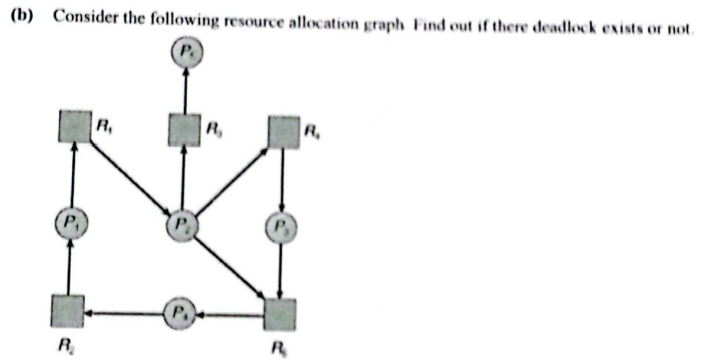
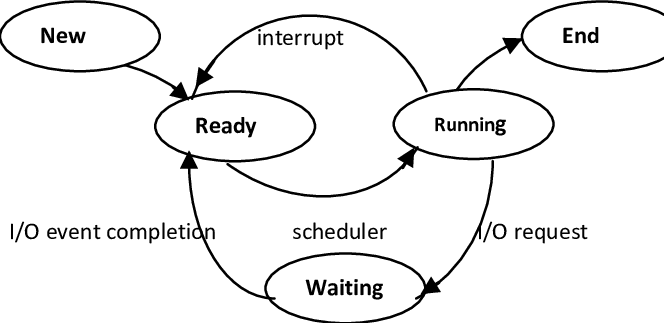

## 4th Batch Question Solution : 

### ✅ 1 (a) **"Operating system is a resource allocator" – Justification with Example**

---

### 🧠 **Explanation:**

An **Operating System (OS)** acts as a **resource allocator** because it manages and controls the hardware and software resources of a computer system. These resources include:

* **CPU time**
* **Memory space (RAM)**
* **Input/Output (I/O) devices**
* **Storage (disk, SSD)**
* **Network bandwidth**

Since many users and programs may compete for limited resources, the OS decides:

* **Who gets what resource**
* **For how long**
* **In what order**

The OS ensures **fairness**, **efficiency**, and **security** in this allocation.

---

### 💻 **Real-Life Example:**

Imagine a system running **three programs**:

* Program A: Needs CPU to do calculations.
* Program B: Needs to read a file from disk.
* Program C: Is downloading a file using the network.

Now consider the following roles of the OS:

| Resource     | OS Role as Allocator                                                                       |
| ------------ | ------------------------------------------------------------------------------------------ |
| **CPU**      | Schedules Program A to use the processor using a scheduling algorithm (e.g., Round Robin). |
| **Disk I/O** | Allocates disk access to Program B and queues I/O requests.                                |
| **Network**  | Manages bandwidth and socket access for Program C.                                         |
| **RAM**      | Allocates memory segments for each program so they don’t overwrite each other.             |

Without the OS coordinating this, multiple programs would **conflict** over hardware, potentially causing **crashes**, **corruption**, or **inefficiency**.

---

### 📌 Summary:

> The Operating System is called a **resource allocator** because it ensures optimal and fair distribution of limited system resources among competing tasks and users, enabling safe and efficient system operation.

---

### ✅ (2) (b) Dual-Mode Operation of Operating System

---

### 🧠 **What is Dual-Mode Operation?**

The **dual-mode operation** is a key feature of modern operating systems that helps **protect the system** from accidental or malicious damage by **separating user activities from system-level (privileged) operations**.

There are **two modes of operation**:

| Mode            | Description                                                                                                |
| --------------- | ---------------------------------------------------------------------------------------------------------- |
| **User Mode**   | Limited-access mode where user applications run. Cannot directly access hardware or critical OS functions. |
| **Kernel Mode** | Full-access mode where OS core functions (like memory management, I/O control, CPU scheduling) run.        |

---

### 🔁 **Transition Between User and Kernel Mode**

A **mode bit (1-bit flag)** in the hardware indicates the current mode:

* `0` → **Kernel mode**
* `1` → **User mode**

#### 📥 **Transition: User → Kernel Mode**

Occurs when the user program **requests a service** from the OS. This is done via a **system call**.

📌 **Example**:

```cpp
open("file.txt") → triggers a system call → OS switches to kernel mode
```

* Mode bit is set to 0
* Control is transferred to the OS via an **interrupt or system call handler**
* OS executes the requested service (like file access, memory allocation)

#### 📤 **Transition: Kernel → User Mode**

After completing the system call or handling an interrupt:

* OS sets mode bit back to 1 (user mode)
* Control returns to the user process at the next instruction

---

### 🔐 **Why Is Dual-Mode Important?**

* **Security**: Prevents users from executing harmful or critical instructions.
* **Stability**: Avoids corruption of memory or hardware misuse.
* **Controlled Access**: Only the OS can access hardware directly.

---

### 🧱 **Diagram:**

```text
+--------------------+        System Call / Interrupt         +--------------------+
|     User Mode      |  ------------------------------->      |    Kernel Mode     |
|  User Program Code |                                       |  OS Services/Drivers|
+--------------------+                                       +--------------------+
         ^                                                           |
         | <-------------------- Return to User Mode ---------------+
```

---

### 📌 Summary:

> Dual-mode operation divides execution into **user mode** (limited access) and **kernel mode** (full access). Transitions occur through **system calls** or **interrupts**, allowing the OS to safely manage system resources and protect hardware from unauthorized access.

---

To represent how each process flows through the system (CPU, I/O, Ready, etc.), we’ll draw **queuing diagrams** for each process.

Let’s first break down the behavior of each process as described:

---

### 📝 Process Characteristics Summary:

| Process    | Behavior                                                            |
| ---------- | ------------------------------------------------------------------- |
| **P1**     | Multiple I/O operations → frequently moves between CPU and I/O.     |
| **P2**     | No I/O but forks a child → includes fork system call.               |
| **P3**     | No I/O but interrupted → gets preempted due to an interrupt.        |
| **P4, P5** | Simple CPU-bound, no interruptions → completes in fixed time slice. |

---

### ✅ Queuing Diagrams:

We use the standard OS queues:

* **Ready Queue** (waiting for CPU)
* **CPU**
* **I/O Queue**
* **Blocked** (e.g., after fork or interrupt)

---

#### 🔷 **P1 – Frequent I/O Operations**

```
Ready → CPU → I/O → Ready → CPU → I/O → Ready → CPU → Terminate
```

* P1 uses CPU briefly, goes for I/O, then returns to ready queue. This repeats.

---

#### 🔷 **P2 – Forks a Child Process**

```
Ready → CPU (fork) → Blocked (child creation) → Ready → CPU → Terminate
```

* The process goes into a blocked state after fork, resumes later.

---

#### 🔷 **P3 – Interrupted During Execution**

```
Ready → CPU → Interrupted → Ready → CPU → Terminate
```

* Execution is paused due to an interrupt, goes back to ready queue, resumes later.

---

#### 🔷 **P4 – CPU-bound, No Interruptions**

```
Ready → CPU → Terminate
```

* Runs smoothly to completion within its time slice.

---

#### 🔷 **P5 – CPU-bound, No Interruptions**

```
Ready → CPU → Terminate
```

* Same as P4, no interruptions.

---

### 📊 Tabular View for Quick Comparison:

| Process | Ready → CPU | I/O | Interrupt | Fork/Blocked | Final Transition |
| ------- | ----------- | --- | --------- | ------------ | ---------------- |
| **P1**  | ✅ Repeats   | ✅   | ❌         | ❌            | CPU → Terminate  |
| **P2**  | ✅           | ❌   | ❌         | ✅ Fork       | CPU → Terminate  |
| **P3**  | ✅           | ❌   | ✅         | ❌            | CPU → Terminate  |
| **P4**  | ✅           | ❌   | ❌         | ❌            | CPU → Terminate  |
| **P5**  | ✅           | ❌   | ❌         | ❌            | CPU → Terminate  |

---

### ✅ (d) Communication Between Processes P1 and P2 in a Message Passing System

---

In a **message-passing system**, two processes like **P1** and **P2** communicate **without shared memory** by explicitly sending and receiving messages.

---

### 🔷 Ways P1 and P2 Can Communicate

There are **two major types** of message passing:

---

#### 1. **Direct Communication**

* **Processes must name each other explicitly.**

* **Example:**
  `send(P2, message)`
  `receive(P1, message)`

* **Types of communication:**

  * **Symmetric (both must name each other):**

    * `send(P2, msg)` by P1
    * `receive(P1, msg)` by P2
  * **Asymmetric (receiver doesn’t need to name sender):**

    * P1: `send(P2, msg)`
    * P2: `receive(msg)` (from anyone)

---

#### 2. **Indirect Communication (via Mailboxes/Ports)**

* **Processes communicate through a shared mailbox.**
* **Example:**

  * P1: `send(mailbox1, msg)`
  * P2: `receive(mailbox1, msg)`
* The mailbox is managed by the OS and acts as an intermediate buffer.

---

### 🔷 Message Passing Modes

1. **Synchronous (Blocking)**

   * **Sender** is blocked until the message is received.
   * **Receiver** is blocked until a message arrives.

2. **Asynchronous (Non-blocking)**

   * **Sender** continues immediately after sending.
   * **Receiver** may poll or wait later.

---

### 🔷 When Do We Get a **Rendezvous**?

A **rendezvous** occurs in **synchronous communication** when:

* **Both the sender and receiver are blocked** and **wait for each other** at the same time.
* Only when **both P1 and P2 are ready**, the message is passed, and both resume execution.

---

### ✅ Example of Rendezvous:

```text
P1                             P2
---                            ---
send(P2, msg)  <---BLOCKED     receive(P1, msg) <---BLOCKED
              ↘  rendezvous   ↙
          Message passed; both continue
```

> It ensures **tight synchronization** between the two processes.

---

### 🔚 Summary Table

| Mode       | Blocking?      | Intermediate Mailbox? | Example Use           |
| ---------- | -------------- | --------------------- | --------------------- |
| Direct     | May or may not | No                    | send/receive by name  |
| Indirect   | May or may not | Yes (Mailbox)         | send(mailbox)         |
| Rendezvous | Both blocking  | No or Yes             | Synchronous messaging |

---

### ✅ (e) Multiprogramming vs Multitasking + Process Information (with Explanation)

---

### 🔷 Multiprogramming vs Multitasking

| Feature               | **Multiprogramming**                                                                | **Multitasking**                                                                             |
| --------------------- | ----------------------------------------------------------------------------------- | -------------------------------------------------------------------------------------------- |
| **Definition**        | Allows **multiple programs** to reside in memory and **share CPU**.                 | Allows **multiple tasks (processes/threads)** to be executed **seemingly at the same time**. |
| **Focus**             | **Maximizing CPU utilization** by running another job while one is waiting for I/O. | **Providing responsiveness** and **user interactivity**.                                     |
| **Execution Type**    | Jobs take turns to use the CPU.                                                     | Context switching happens rapidly between tasks.                                             |
| **User Support**      | Usually **single-user systems**.                                                    | Usually **multi-user** and **interactive systems**.                                          |
| **Example**           | Batch processing (e.g., punch card jobs in early OS).                               | Modern OS (e.g., Windows, Linux) running browser, editor, and music player together.         |
| **Type of Switching** | Job switching (slower, based on I/O).                                               | Fast **context switching** between processes or threads.                                     |

---

### 🔷 Where Do You Get All the Information of a Process?

All process-related information is maintained by the **Operating System** in a special data structure called the **Process Control Block (PCB)**.

---

### 🔷 What is a PCB?

The **Process Control Block** is a **data structure in the OS kernel** that contains **all information about a particular process**.

---

### 🔷 Information Stored in the PCB

| Type of Information      | Description                                                                 |
| ------------------------ | --------------------------------------------------------------------------- |
| **Process ID (PID)**     | Unique identifier for the process.                                          |
| **Process State**        | Ready, Running, Waiting, etc.                                               |
| **Program Counter (PC)** | Address of the next instruction to execute.                                 |
| **CPU Registers**        | Contents of CPU registers when process is not running (for context switch). |
| **Memory Info**          | Base/limit registers, page tables, segment tables.                          |
| **Scheduling Info**      | Priority, scheduling queue pointers.                                        |
| **Accounting Info**      | CPU used, time limits, job/process number.                                  |
| **I/O Status Info**      | List of I/O devices allocated, open files, etc.                             |
| **Parent/Child Info**    | Relation to other processes (used in process trees).                        |

---

### 🔚 Summary:

* **Multiprogramming**: Multiple jobs in memory to keep the CPU busy.
* **Multitasking**: Multiple tasks running interactively and responsively.
* **PCB**: Holds **complete context and metadata** of a process (ID, state, CPU registers, memory, I/O, etc.).

---

### ✅ (2a) What is Deadlock?

A **deadlock** is a situation in an operating system where **a set of processes are blocked forever**, waiting for each other to release resources.

In simpler terms, **each process is holding a resource and waiting to acquire a resource held by another**, causing a **circular wait** and **none of them can proceed**.

---

### 🔒 Example of Deadlock:

Let’s say:

* Process **P1** holds **Resource R1** and waits for **R2**.
* Process **P2** holds **Resource R2** and waits for **R1**.
  Both processes keep waiting — **deadlock occurs**.

---

### 🔑 Necessary Conditions for Deadlock

There are **four Coffman conditions** that must all be true simultaneously for a deadlock to occur:

| No. | Condition            | Description                                                                                                    |
| --- | -------------------- | -------------------------------------------------------------------------------------------------------------- |
| 1️⃣ | **Mutual Exclusion** | At least one resource must be held in a **non-shareable mode**. Only one process can use it at a time.         |
| 2️⃣ | **Hold and Wait**    | A process is **holding at least one resource** and **waiting** to acquire additional resources held by others. |
| 3️⃣ | **No Preemption**    | Resources **cannot be forcibly removed** from the processes holding them.                                      |
| 4️⃣ | **Circular Wait**    | There exists a **circular chain** of processes, each waiting for a resource held by the next process.          |

---

### 🔁 Visual Summary:

```
P1 → R1 (held) — waiting for → R2 (held by P2)
P2 → R2 (held) — waiting for → R1 (held by P1)
```

This circular dependency, along with the above conditions, leads to **deadlock**.

---

(b) Consider the following snapshot of a system:

| Process | Allocation | Max | Available |
|---|---|---|---|
| | A B C D | A B C D | A B C D |
| P0 | 0 0 1 2 | 0 0 1 2 | 1 5 2 0 |
| P1 | 1 0 0 0 | 1 7 5 0 | |
| P2 | 1 3 5 4 | 2 3 5 6 | |
| P3 | 0 6 3 2 | 0 6 5 2 | |
| P4 | 0 0 1 4 | 0 6 5 6 | |

Answer the following questions using Banker's algorithm:
<br>
i) What is the content of "Need" matrix?
<br>
ii) Is the system in safe state?
If a request from process P1 arrives for (0, 4, 2, 0), can the request be granted immediately?

Sure! Here's a **complete and easy-to-understand** solution to your Banker's Algorithm question in **Markdown format**:

---

## 🏦 Banker's Algorithm Problem (Safe State & Request Check)

### Given:

| Process | Allocation | Max     |
| ------- | ---------- | ------- |
|         | A B C D    | A B C D |
| P0      | 0 0 1 2    | 0 0 1 2 |
| P1      | 1 0 0 0    | 1 7 5 0 |
| P2      | 1 3 5 4    | 2 3 5 6 |
| P3      | 0 6 3 2    | 0 6 5 2 |
| P4      | 0 0 1 4    | 0 6 5 6 |

### Available Resources:

```
A B C D
1 5 2 0
```

---

### ✅ i) **Need Matrix**

Formula:

```
Need = Max - Allocation  
```

| Process | Need (A B C D) |
| ------- | -------------- |
| P0      | 0 0 0 0        |
| P1      | 0 7 5 0        |
| P2      | 1 0 0 2        |
| P3      | 0 0 2 0        |
| P4      | 0 6 4 2        |

---

### ✅ ii) **Is the system in a safe state?**

We apply **Banker's Safety Algorithm**:

#### Initial Work = Available:

```
Work = [1, 5, 2, 0]  
Finish = [False, False, False, False, False]
```

---

#### 🟢 Step-by-step process:

✅ **P0** can finish (Need ≤ Work):

* Work = Work + Allocation of P0 = `[1+0, 5+0, 2+1, 0+2] = [1, 5, 3, 2]`
* Finish = `[✔, ✘, ✘, ✘, ✘]`

✅ **P2** can finish: Need `[1,0,0,2]` ≤ Work `[1,5,3,2]`

* Work = Work + Allocation of P2 = `[1+1, 5+3, 3+5, 2+4] = [2, 8, 8, 6]`
* Finish = `[✔, ✘, ✔, ✘, ✘]`

✅ **P1** can finish: Need `[0,7,5,0]` ≤ Work `[2,8,8,6]`

* Work = Work + Allocation of P1 = `[2+1, 8+0, 8+0, 6+0] = [3, 8, 8, 6]`
* Finish = `[✔, ✔, ✔, ✘, ✘]`

✅ **P3** can finish: Need `[0,0,2,0]` ≤ Work `[3,8,8,6]`

* Work = Work + Allocation of P3 = `[3+0, 8+6, 8+3, 6+2] = [3, 14, 11, 8]`
* Finish = `[✔, ✔, ✔, ✔, ✘]`

✅ **P4** can finish: Need `[0,6,4,2]` ≤ Work `[3,14,11,8]`

* Work = Work + Allocation of P4 = `[3+0, 14+0, 11+1, 8+4] = [3, 14, 12, 12]`
* Finish = `[✔, ✔, ✔, ✔, ✔]`

✅ All processes can finish → **Safe State**

---

### ✅ iii) **Can the request (0,4,2,0) from P1 be granted?**

#### Request by P1 = `[0, 4, 2, 0]`

#### Check 1: **Request ≤ Need of P1**

* So, **its Need** = Max − Allocation = `1 7 5 0 − 1 0 0 0` = `0 7 5 0`

Need of P1 = `[0, 7, 5, 0]` → ✅ Yes, request is within Need.

#### Check 2: **Request ≤ Available**

Available = `[1, 5, 2, 0]` →
Request = `[0, 4, 2, 0]` → ✅ Yes, request is within Available.

So the **request can be granted immediately**.

---

### ✅ Final Answers:

* **i) Need Matrix:** See table above.
* **ii) Safe State?** → ✅ **Yes**
* **iii) Can Request (0,4,2,0) be Granted to P1?** → ✅ **Yes**

Sure! Here's a clear explanation of **external and internal fragmentation**, along with how each can be removed, and easy examples for both.

---

## ✅ (c) How External and Internal Fragmentation Can Be Removed? With Examples

---

### 📦 What is Fragmentation?

When memory is allocated and deallocated, **free spaces get scattered**, which leads to **wasted memory**. This is called **fragmentation**, and it comes in two types:

---

## 🧩 1. Internal Fragmentation

### 🔹 What is it?

Occurs when a fixed-sized memory block is **allocated more than required**.

### 📘 Example:

Suppose we have memory blocks of **4 KB** each.

A process requests **2.5 KB** → it still gets a **4 KB block** →
➡️ **1.5 KB is wasted** inside the block.

This **unused space inside allocated memory** is called **internal fragmentation**.

### 🔧 How to Remove It?

| Method                                    | Description                                                                             |
| ----------------------------------------- | --------------------------------------------------------------------------------------- |
| ✅ Use **dynamic (variable) partitioning** | Allocate only the amount of memory that the process actually needs.                     |
| ✅ Use **paging or segmentation**          | Logical memory is divided into small chunks (pages), which helps reduce internal waste. |

---

## 🌐 2. External Fragmentation

### 🔹 What is it?

Happens when **enough total free memory exists**, but it's **not contiguous** (not side-by-side).

### 📘 Example:

Imagine this memory:

```
[2 KB Free] [3 KB Used] [4 KB Free] [5 KB Used] [2 KB Free]
```

A process needs **5 KB**, but we have:

* 2 KB + 4 KB + 2 KB = 8 KB total free memory
  ➡️ But **none of it is 5 KB in a single block**, so the process **cannot be allocated memory**.

This is called **external fragmentation** — the memory is scattered.

### 🔧 How to Remove It?

| Method                                     | Description                                                                                                                                            |
| ------------------------------------------ | ------------------------------------------------------------------------------------------------------------------------------------------------------ |
| ✅ **Compaction**                           | Move memory contents to make all free memory **contiguous** (side-by-side). <br> 🔁 Example: shift all used blocks to one side and combine free space. |
| ✅ Use **paging/segmentation**              | In paging, processes are divided into small fixed-size pages, so **no need for contiguous memory blocks**.                                             |
| ✅ Use **best-fit or worst-fit** strategies | Helps reduce leftover spaces during memory allocation.                                                                                                 |

---

## 📊 Quick Summary Table:

| Type                       | Cause                                    | Solution(s)                                            |
| -------------------------- | ---------------------------------------- | ------------------------------------------------------ |
| **Internal Fragmentation** | Fixed-size blocks waste memory inside    | Dynamic allocation, Paging, Segmentation               |
| **External Fragmentation** | Free memory is scattered, not continuous | Compaction, Paging/Segmentation, Allocation strategies |

---

### ✅ (d) What is PCB? Explain [2 Marks]

---

### 🧠 **PCB – Process Control Block**

A **Process Control Block (PCB)** is a **data structure** used by the **Operating System (OS)** to **store all information** about a **process**.

You can think of it as the **identity card or record file** for a process. Every time a process is created, the OS **creates a PCB** for it and uses it to **track and manage** the process.

---

### 🧾 **Contents of a PCB:**

| 🔢 Section                    | 📄 Description                                                                    |
| ----------------------------- | --------------------------------------------------------------------------------- |
| **1. Process ID (PID)**       | Unique ID to identify the process.                                                |
| **2. Process State**          | Current status of the process: Ready, Running, Waiting, etc.                      |
| **3. Program Counter**        | Holds the address of the **next instruction** to be executed.                     |
| **4. CPU Registers**          | Stores all CPU registers (like Accumulator, Stack Pointer) for context switching. |
| **5. Memory Management Info** | Info like page tables, memory limits, and segment tables.                         |
| **6. Accounting Info**        | Includes how much CPU time the process has used, process priority, etc.           |
| **7. I/O Status Info**        | List of I/O devices assigned to the process and files it has opened.              |

---

### 📘 **Why PCB is Important?**

* When the CPU switches from one process to another (**context switching**), it **saves the current process's PCB** and **loads the next process's PCB**.
* It helps the OS **keep track** of all running processes and manage their resources efficiently.

---

### 🧮 **Example (simplified):**

Let’s say Process P1 is paused, and Process P2 needs to run.
➡️ OS saves **P1’s current info** in its PCB.
➡️ Then loads **P2’s PCB** to continue its execution from where it left off.

---

### 📌 Summary:

> **PCB is like a folder** that stores all the important information about a process, allowing the operating system to control and manage the process properly.

---

Let's solve each scheduling algorithm step-by-step:

---

## ✅ Given:

| Process | Burst Time | Priority | Arrival Time |
| ------- | ---------- | -------- | ------------ |
| P1      | 10         | 3        | 0            |
| P2      | 1          | 1        | 1            |
| P3      | 2          | 3        | 2            |
| P4      | 1          | 4        | 3            |
| P5      | 5          | 2        | 4            |

---

# ✅ i) Gantt Charts for each scheduling algorithm

---

## 🔄 **Round Robin (Time Quantum = 3)**

### 💡 Arrival Time Considered

* RR picks from ready queue in **arrival order**.
* Each process gets **3 ms** time slice before rotating.

### ➕ Steps:

```
Time  | Action
------+-----------------------
0-3   | P1 (remaining = 7)
3-4   | P2 (done)
4-6   | P3 (done)
6-7   | P4 (done)
7-10  | P5 (remaining = 2)
10-13 | P1 (remaining = 4)
13-15 | P5 (done)
15-18 | P1 (remaining = 1)
18-19 | P1 (done)
```

### 📊 Gantt Chart:

```
| P1 | P2 | P3 | P4 | P5 | P1 | P5 | P1 | P1 |
0    3    4    6    7   10   13   15  18  19
```

---

## ⏩ **First-Come, First-Served (FCFS)**

### 🔠 Order: P1 → P2 → P3 → P4 → P5

Based on **arrival time**.

### 📊 Gantt Chart:

```
| P1 | P2 | P3 | P4 | P5 |
0   10   11   13   14   19
```

---

## 🔽 **Non-preemptive Priority** (Higher number = Higher priority)

### ✅ Order of Execution:

* Arrival based + priority:

  * P1 (3), P2 (1), P3 (3), P4 (4), P5 (2)
* At t = 0: P1
* At t = 1: P2 arrives (priority 1, lower than P1)
* At t = 2: P3 arrives (equal priority)
* At t = 3: P4 arrives (**highest**)
* At t = 4: P5 arrives

So:

* P1 starts at 0 and runs fully (non-preemptive)
* After P1 finishes (t=10), choose highest priority from ready queue → P4 (priority 4), then P3 (3), P5 (2), P2 (1)

### 📊 Gantt Chart:

```
| P1 | P4 | P3 | P5 | P2 |
0   10   11   13   18   19
```

---

# ✅ ii) Turnaround and Waiting Time Calculation

| Process | Arrival | Burst | Completion | Turnaround = C - A | Waiting = TAT - B |
| ------- | ------- | ----- | ---------- | ------------------ | ----------------- |

---

## 🔄 **Round Robin Results:**

| Process | Arrival | Burst | Completion | TAT | WT |
| ------- | ------- | ----- | ---------- | --- | -- |
| P1      | 0       | 10    | 19         | 19  | 9  |
| P2      | 1       | 1     | 4          | 3   | 2  |
| P3      | 2       | 2     | 6          | 4   | 2  |
| P4      | 3       | 1     | 7          | 4   | 3  |
| P5      | 4       | 5     | 15         | 11  | 6  |

👉 **Average TAT = (19+3+4+4+11)/5 = 8.2**
👉 **Average WT = (9+2+2+3+6)/5 = 4.4**

---

## ⏩ **FCFS Results:**

| Process | Arrival | Burst | Completion | TAT | WT |
| ------- | ------- | ----- | ---------- | --- | -- |
| P1      | 0       | 10    | 10         | 10  | 0  |
| P2      | 1       | 1     | 11         | 10  | 9  |
| P3      | 2       | 2     | 13         | 11  | 9  |
| P4      | 3       | 1     | 14         | 11  | 10 |
| P5      | 4       | 5     | 19         | 15  | 10 |

👉 **Average TAT = (10+10+11+11+15)/5 = 11.4**
👉 **Average WT = (0+9+9+10+10)/5 = 7.6**

---

## 🔽 **Non-preemptive Priority Results:**

| Process | Arrival | Burst | Completion | TAT | WT |
| ------- | ------- | ----- | ---------- | --- | -- |
| P1      | 0       | 10    | 10         | 10  | 0  |
| P4      | 3       | 1     | 11         | 8   | 7  |
| P3      | 2       | 2     | 13         | 11  | 9  |
| P5      | 4       | 5     | 18         | 14  | 9  |
| P2      | 1       | 1     | 19         | 18  | 17 |

👉 **Average TAT = (10+8+11+14+18)/5 = 12.2**
👉 **Average WT = (0+7+9+9+17)/5 = 8.4**

---

# 📌 Summary Table

| Algorithm               | Avg TAT | Avg WT |
| ----------------------- | ------- | ------ |
| Round Robin (Q=3)       | 8.2     | 4.4    |
| FCFS                    | 11.4    | 7.6    |
| Non-preemptive Priority | 12.2    | 8.4    |

---

Sure! Here's a simple and clear explanation for each part of your question:

---

## 🔄 **(b) Convoy Effect, Priority Scheduling, and Round Robin Limitation**

---

### 🛑 **Convoy Effect**

**Definition:**
The **convoy effect** occurs when a **long CPU-bound process** holds the CPU, and many **short I/O-bound processes** are stuck waiting. As a result, the overall system becomes inefficient — all other processes move slowly like a “convoy behind a slow truck.”

---

#### ✅ **Example of Convoy Effect:**

Let’s say we have 3 processes:

| Process | Type      | CPU Burst |
| ------- | --------- | --------- |
| P1      | CPU-bound | 10        |
| P2      | I/O-bound | 2         |
| P3      | I/O-bound | 2         |

In **FCFS (First Come First Serve)**:

* P1 arrives first and takes 10 units.
* P2 and P3 must **wait 10 units**, even though they only need 2 units each.

➡️ So, **short jobs get delayed**, and **CPU is underutilized** when I/O-bound processes finish fast but wait for CPU to be free.

---

### 🎯 **Solving the Convoy Effect in Priority Scheduling**

In **Priority Scheduling**, each process is given a priority. The CPU is given to the process with the **highest priority**.

#### 🔧 Problem with Priority Scheduling:

* **Starvation**: Low-priority processes might never get the CPU.

#### ✅ **Solution: Aging**

* **Aging** gradually **increases the priority** of waiting processes over time.
* This ensures **no process waits forever**.

📌 Example:

* If a low-priority process waits too long, we increase its priority.
* Eventually, it will reach a high enough priority to be scheduled.

---

### 🔄 **Does Round Robin Have Limitations?**

Yes, **Round Robin (RR)** has limitations.

#### 🔍 **Problem: Poor for Mixed Workloads**

Round Robin uses a **fixed time quantum** and switches between processes in order.

#### ❌ Limitation:

* If **quantum is too small**, too many context switches → overhead.
* If **quantum is too large**, it behaves like FCFS → longer waiting times for short jobs.

---

#### 🧪 **Example:**

| Process | Arrival | Burst |
| ------- | ------- | ----- |
| P1      | 0       | 20    |
| P2      | 1       | 3     |
| P3      | 2       | 3     |

With **Quantum = 4**:

* P1 runs for 4, then P2 for 3 (done), P3 for 3 (done), then back to P1.
* But P2 and P3 still **waited unnecessarily**.

✅ **Conclusion**:

* RR is **fair**, but not always **efficient** for real-time or short job-dominated systems.

---

### ✅ Summary

| Concept             | Problem                               | Solution                                   |
| ------------------- | ------------------------------------- | ------------------------------------------ |
| Convoy Effect       | Long process delays short ones        | Use better scheduling (e.g. SJF, Priority) |
| Priority Scheduling | Starvation of low-priority            | Use **aging**                              |
| Round Robin         | Context switch overhead or long waits | Carefully choose **time quantum**          |


---

## ✅ (d) **What is Deadlock?**

A **deadlock** is a situation in an operating system where **two or more processes are waiting for each other to release resources**, and **none of them can proceed**.

### 🔒 Example:

* **Process A** has a **printer** and wants a **scanner**.
* **Process B** has a **scanner** and wants a **printer**.
* Both are waiting for each other — and they’re **stuck forever**. That’s a **deadlock**!

---

## 🔁 **Four Conditions for Deadlock (Must Happen Together)**

| No. | Condition            | Explanation                                                                                     |
| --- | -------------------- | ----------------------------------------------------------------------------------------------- |
| 1️⃣ | **Mutual Exclusion** | Only one process can use a resource at a time.                                                  |
| 2️⃣ | **Hold and Wait**    | A process holds one resource and waits for another.                                             |
| 3️⃣ | **No Preemption**    | A resource can’t be taken back — it must be released voluntarily.                               |
| 4️⃣ | **Circular Wait**    | A group of processes are waiting in a circular chain (P1 waits for P2, P2 for P3, … Pn for P1). |

> ✅ **If even one of these conditions is broken**, deadlock can be **prevented**.

---

## 🛡️ **Deadlock Prevention (Breaking the Conditions)**

You can **prevent** deadlock by **not allowing one or more of the four conditions**:

| Method                         | How It Works                                                                                 |
| ------------------------------ | -------------------------------------------------------------------------------------------- |
| **Eliminate Mutual Exclusion** | Not possible for all resources (e.g., printers). So usually we allow this.                   |
| **Eliminate Hold and Wait**    | Make processes **request all resources at once**, and proceed only if all are available.     |
| **Allow Preemption**           | Take resources from processes forcefully (if safe to do so).                                 |
| **Avoid Circular Wait**        | Number the resources. Force processes to **request resources in a fixed order** (ascending). |

---

### ✅ (e) **What is a Resource Allocation Graph (RAG)?**

A **Resource Allocation Graph (RAG)** is a **visual tool** used in operating systems to represent the allocation of **resources to processes**. It helps in detecting the possibility of **deadlocks**.

---

### 📌 **Components of a Resource Allocation Graph:**

* **Processes**: Represented by **circles (e.g., P1, P2)**.
* **Resources**: Represented by **squares (e.g., R1, R2)**.
* **Edges**:

  * **Request edge** (→): From **process to resource** (means process is waiting for that resource).
  * **Assignment edge** (←): From **resource to process** (means resource is assigned to that process).

---

### 🧠 **How to Use It:**

* If the graph contains **no cycles**, there is **no deadlock**.
* If the graph **has a cycle**:

  * If **each resource has only one instance**, then **deadlock exists**.
  * If **resources have multiple instances**, a cycle **might** lead to a deadlock.

---

### 📊 **Example of Resource Allocation Graph:**

Imagine:

* **P1** is using **R1**
* **P2** is waiting for **R1**

```
   R1
  ↙   ↘
P1     P2
```

**Explanation**:

* R1 → P1 (assignment edge): R1 is assigned to P1
* P2 → R1 (request edge): P2 is requesting R1

➡️ In this case, there’s no cycle → **No deadlock**.

---

### 🪤 **Example with Deadlock (Cycle):**

* **P1** is holding **R1** and requesting **R2**
* **P2** is holding **R2** and requesting **R1**

```
P1 → R2 → P2 → R1 → P1
```

➡️ This is a **cycle** → **Deadlock exists**.

---


## ✅ Given:

* **Processes**: P0, P1, P2, P3, P4
* **Resources**: A = 10, B = 5, C = 7
* **Available**: A = 3, B = 3, C = 2

---

### 🔹 Step 1: **Construct the Allocation and Max Tables**

| Process | Allocation (A B C) | Max (A B C) | Need = Max - Allocation |
| ------- | ------------------ | ----------- | ----------------------- |
| P0      | 0 1 0              | 7 5 3       | 7 4 3                   |
| P1      | 2 0 0              | 3 2 2       | 1 2 2                   |
| P2      | 3 0 2              | 9 0 2       | 6 0 0                   |
| P3      | 2 1 1              | 2 2 2       | 0 1 1                   |
| P4      | 0 0 2              | 4 3 3       | 4 3 1                   |

---

## ✅ Part i) Is the system in **safe state**?

### 🔹 Step 2: **Available Resources**

* Initially: A = 3, B = 3, C = 2

We’ll check if all processes can finish one by one.

### 🔸 Try P1:

* **Need = (1 2 2)** ≤ Available (3 3 2) ✅
* → P1 can finish.
* Release its resources: (2 0 0)
* New Available: (3+2, 3+0, 2+0) = **(5 3 2)**

---

### 🔸 Try P3:

* Need = (0 1 1) ≤ (5 3 2) ✅
* → P3 can finish.
* Release: (2 1 1)
* Available = (5+2, 3+1, 2+1) = **(7 4 3)**

---

### 🔸 Try P0:

* Need = (7 4 3) ≤ (7 4 3) ✅
* → P0 can finish
* Release: (0 1 0)
* Available = (7, 5, 3)

---

### 🔸 Try P2:

* Need = (6 0 0) ≤ (7 5 3) ✅
* → P2 can finish
* Release: (3 0 2)
* Available = (10, 5, 5)

---

### 🔸 Try P4:

* Need = (4 3 1) ≤ (10 5 5) ✅
* → P4 can finish
* Release: (0 0 2)
* Available = (10, 5, 7)

---

### ✅ **Safe Sequence**:

```
P1 → P3 → P0 → P2 → P4
```

### ✔️ System is in a **Safe State**

---

## ✅ Part ii) Can **P0 request (0, 2, 0)**?

### P0’s current **Need** = (7 4 3)

So,

* Request (0, 2, 0) ≤ Need (7 4 3) ✅
* Request (0, 2, 0) ≤ Available (3, 3, 2) ✅

**Grant the request**:

* P0’s new Allocation: (0 1+2 0) → (0 3 0)
* P0’s new Need: (7 4-2 3) → (7 2 3)
* Available becomes: (3 3-2 2) → **(3 1 2)**

Now recheck **safe state** with updated state:

---

### New Available: (3 1 2)

### 🔸 Try P3:

* Need = (0 1 1) ≤ (3 1 2) ✅
* Finish → Release (2 1 1)
* New Available = (5 2 3)

---

### 🔸 Try P1:

* Need = (1 2 2) ≤ (5 2 3) ✅
* Finish → Release (2 0 0)
* New Available = (7 2 3)

---

### 🔸 Try P0:

* New Need = (7 2 3) ≤ (7 2 3) ✅
* Finish → Release (0 3 0)
* Available = (7 5 3)

---

### 🔸 Try P2:

* Need = (6 0 0) ≤ (7 5 3) ✅
* Finish → Release (3 0 2)
* Available = (10 5 5)

---

### 🔸 Try P4:

* Need = (4 3 1) ≤ (10 5 5) ✅
* Finish → Release (0 0 2)
* Final Available = (10 5 7)

---

✅ **Safe Sequence** after P0’s request:
**P3 → P1 → P0 → P2 → P4**

✔️ **Request by P0 for (0,2,0)** **can be granted.**

---

## ✅ Part iii) Can **P1 request (3,3,0)**?

* P1’s current **Need** = (1 2 2)
* Requested = (3,3,0) ❌

> This **exceeds its declared maximum**:

* Request (3 3 0) > Need (1 2 2) ❌

---

### ❌ **Request denied** — It **exceeds Max**.

---

## ✅ Final Answers:

| Question                 | Answer                                          |
| ------------------------ | ----------------------------------------------- |
| Is system in safe state? | ✅ Yes                                           |
| Safe Sequence            | `P1 → P3 → P0 → P2 → P4`                        |
| Can P0 request (0,2,0)?  | ✅ Yes — Safe sequence: `P3 → P1 → P0 → P2 → P4` |
| Can P1 request (3,3,0)?  | ❌ No — Request exceeds maximum                  |


---

 


---

### 🔍 **Legend:**

* **Processes**: Circles (`P1`, `P2`, ..., `P5`)
* **Resources**: Squares (`R1`, `R2`, ..., `R4`)
* **Edges**:

  * Arrow from **process → resource**: **Request**
  * Arrow from **resource → process**: **Allocation**

---

### 🧠 Step-by-step Analysis:

#### 🔸 **List of Dependencies** (follow arrows):

1. **P1 → R1**
   → P1 **is requesting R1**

2. **R1 → P4**
   → R1 **is allocated to P4**

3. **P4 → R2**
   → P4 **is requesting R2**

4. **R2 → P1**
   → R2 **is allocated to P1**

➡️ **Cycle detected**:

```
P1 → R1 → P4 → R2 → P1
```

✅ **This is a circular wait**, meaning **P1, P4** are involved in a **deadlock**.

---

#### 🔸 Continue Checking Other Parts:

5. **P2 → R3**
   → P2 is requesting R3

6. **R3 → P2**
   → R3 is allocated to P2
   ✅ No cycle here

7. **P3 → R4**
   → P3 is requesting R4

8. **R4 → P2**
   → R4 is allocated to P2
   ✅ No cycle here either (R4 → P2 already holding, but no cycle with P3 unless P2 requests something else, which it doesn’t)

---

### ✅ **Final Conclusion**:

Yes, **deadlock exists**, involving:

```
P1 ↔ P4 ↔ R1 ↔ R2
```

---

### 🔒 **Deadlocked Processes**:

* **P1**
* **P4**

---


### (E) 🔒 What is an **Unsafe State**?

An **unsafe state** in operating systems refers to a situation where the **system does not have enough available resources** to safely guarantee that **all processes can complete**, even if **no deadlock has happened yet**.

> ⚠️ **Unsafe ≠ Deadlock**, but unsafe **can lead** to deadlock if further resource requests occur.

---

### ✅ Key Idea:

* In a **safe state**, the system can find a **sequence** (called **safe sequence**) where **all processes can finish** without getting stuck.
* In an **unsafe state**, **no such sequence exists**, and if processes continue requesting resources, a **deadlock may occur**.

---

### 🧠 Example:

Assume:

* **3 processes**: P1, P2, P3
* **10 total resources**
* Allocation & Max needs:

| Process | Allocated | Max |
| ------- | --------- | --- |
| P1      | 3         | 7   |
| P2      | 2         | 4   |
| P3      | 3         | 6   |

* **Available = 2**

#### 🔍 Let's try to find a safe sequence:

1. Check if any process can finish with `Available = 2`:

   * P1 needs `7 - 3 = 4` → ❌ can't finish
   * P2 needs `4 - 2 = 2` → ✅ can finish

2. If P2 finishes, it frees 2 more → Available = 4
   Now:

   * P1 needs 4 → ✅
   * P3 needs 3 → ✅
     ⏱️ Safe Sequence: `P2 → P1 → P3` ✅

> So, in this case, the system is **safe**.

---

Now suppose **Available = 1**.

1. Check again:

   * P1 needs 4 → ❌
   * P2 needs 2 → ❌
   * P3 needs 3 → ❌

> 😨 No process can complete → **Unsafe State**

Still **no deadlock yet**, but the system is **at risk** of one occurring.

---

### ✅ Summary

| Safe State                             | Unsafe State                | Deadlock                          |
| -------------------------------------- | --------------------------- | --------------------------------- |
| All processes can finish in some order | No guaranteed safe sequence | Processes are permanently blocked |
| Deadlock is impossible                 | Deadlock **might** occur    | Deadlock **has already** occurred |

---

Sure! Here's a clear explanation of **space allocation techniques** used in operating systems along with their **limitations and examples**.

---

## 🧩 (a) Space Allocation Techniques

When a file is stored on disk, the OS must decide **how to allocate space** for it. There are 3 common techniques:

---

### 1️⃣ **Contiguous Allocation**

#### ✅ Description:

* Each file occupies a set of **contiguous (continuous) blocks** on the disk.
* Example: If a file needs 4 blocks, it is given block 10–13 (all in a row).

#### 📌 Advantages:

* **Simple to implement**
* **Fast access**: Random and sequential access is easy.

#### ❌ Limitations:

| Issue                      | Description                                                      |
| -------------------------- | ---------------------------------------------------------------- |
| **External Fragmentation** | Over time, free space gets scattered into small chunks.          |
| **Difficult to grow**      | If file size increases, there might not be space to expand.      |
| **Wasted space**           | You may reserve extra space just in case, which might go unused. |

#### 📦 Example:

* File F1 needs 3 blocks → assigned 10, 11, 12
* File grows to need 5 blocks, but block 13 is used by another file → problem!

---

### 2️⃣ **Linked Allocation**

#### ✅ Description:

* Each file is a **linked list** of disk blocks; blocks **don’t need to be adjacent**.
* Each block stores a **pointer to the next block**.

#### 📌 Advantages:

* **No external fragmentation**
* File can **grow easily**.

#### ❌ Limitations:

| Issue                  | Description                                         |
| ---------------------- | --------------------------------------------------- |
| **Slow random access** | Must follow pointers block by block.                |
| **Pointer overhead**   | Each block uses space for a pointer.                |
| **Corruption risk**    | A broken pointer can lose access to the whole file. |

#### 📦 Example:

* File F2 uses blocks 5 → 9 → 17 → 21 (linked by pointers)

---

### 3️⃣ **Indexed Allocation**

#### ✅ Description:

* An **index block** is created for each file. It contains **pointers to all blocks** of the file.

#### 📌 Advantages:

* **Supports random access** easily.
* No external fragmentation.
* Easier to grow files.

#### ❌ Limitations:

| Issue                       | Description                                                |
| --------------------------- | ---------------------------------------------------------- |
| **Overhead of index block** | Extra space used for index.                                |
| **Fixed size of index**     | If a file is too large, one index block may not be enough. |
| **Complex implementation**  | Needs more OS handling.                                    |

#### 📦 Example:

* File F3 has an index block pointing to data blocks 7, 25, 30, 31...

---

## 🧾 Summary Table:

| Technique      | Advantage                  | Limitation                          |
| -------------- | -------------------------- | ----------------------------------- |
| **Contiguous** | Fast access                | External fragmentation              |
| **Linked**     | Flexible, no fragmentation | Slow access, pointer overhead       |
| **Indexed**    | Fast random access         | Index block overhead, complex logic |

---

Sure! Here's a **rigorous yet simple justification** for the statement:

---

## 🔍 Statement:

### **"External fragmentation is better than internal fragmentation."**

---

## ✅ Definitions First:

| Type of Fragmentation      | Meaning                                                           |
| -------------------------- | ----------------------------------------------------------------- |
| **Internal Fragmentation** | Wasted **space inside** allocated memory blocks.                  |
| **External Fragmentation** | Wasted **space between** allocated blocks (too small to be used). |

---

## 📚 Justification:

### 1️⃣ **Recoverability**

* **External fragmentation** can **often be reduced** by **compaction** (i.e., moving processes around to merge free space).
* But **internal fragmentation** is **wasted forever** until the memory is deallocated.

**Example:**

* If 3 blocks of free memory (10KB + 5KB + 8KB) are scattered (external), they can be compacted to create 23KB.
* But if 10KB is allocated for a process that only uses 3KB (internal), the 7KB **cannot be used or reclaimed** until the process finishes.

---

### 2️⃣ **Control over allocation**

* **Internal fragmentation** is caused by **allocation policy** — the system rounds up requested size to fixed block sizes (e.g., 4KB, 8KB). You **have no control**.
* In **external fragmentation**, the memory is at least **usable for other allocations** if managed well.

---

### 3️⃣ **Waste Impact**

* In internal fragmentation, **every allocation wastes some memory** (especially with small files).
* In external fragmentation, **not every allocation** leads to waste — it only occurs **over time**, and only if allocations and deallocations are highly irregular.

---

### 4️⃣ **Size Adaptability**

* External fragmentation usually comes from **variable-size memory allocations** — which is **more efficient** in serving real-world varying memory needs.
* Internal fragmentation comes from **fixed-size blocks**, which can be very inefficient for **small processes**.

---

## 🧾 Conclusion:

| Point                                    | Verdict    |
| ---------------------------------------- | ---------- |
| **Can be reduced (compacted)**           | ✅ External |
| **Flexible for varying needs**           | ✅ External |
| **Wasted space is immediately unusable** | ❌ Internal |
| **More predictable but less efficient**  | ❌ Internal |

👉 **Therefore, external fragmentation is considered better than internal fragmentation because it is more manageable, flexible, and sometimes even reversible.**

---


---

## 🧠 What is Address Translation?

When a program is running, it uses **logical addresses** (also called **virtual addresses**) that need to be **translated** into **physical addresses** (real locations in RAM).

This translation is done using a combination of **hardware** (like the MMU – Memory Management Unit) and **operating system support**.

---

## 🔁 Logical vs Physical Address:

| Term                 | Meaning                              |
| -------------------- | ------------------------------------ |
| **Logical Address**  | The address used by the CPU/program. |
| **Physical Address** | The actual location in RAM.          |

---

## 🗂️ Components Involved:

1. **Base Register**: Holds the starting physical address of a process in memory.
2. **Limit Register**: Defines the size (limit) of the addressable memory space.
3. **MMU (Memory Management Unit)**: Handles the translation automatically.

---

## 📊 Address Translation Using Paging (Most Common Method):

```
+------------------+
|  Logical Address |
|------------------|
| Page Number (p)  |
| Offset (d)       |
+------------------+
          |
          ↓
+------------------+       +-------------------+
| Page Table       | <---> | Frame Number (f)  |
|------------------|       |                   |
| Maps p → f        |       +-------------------+
+------------------+                  ↓
                                  +-------------+
                                  | Physical    |
                                  | Address =   |
                                  | f * frame + |
                                  | offset (d)  |
                                  +-------------+
```

---

## 🧾 How Translation Works (Step-by-step):

1. **CPU generates a logical address**: Let's say `LA = (Page Number p, Offset d)`
2. **Page Table Lookup**: The page number `p` is used to find the corresponding **frame number** `f` in the page table.
3. **Calculate Physical Address**:

   ```
   Physical Address = (f × frame size) + d
   ```
4. **MMU performs this automatically** and accesses the correct location in physical memory.

---

## 🧠 Example:

* Page size = 1KB (1024 bytes)

* Logical Address = 2049
  → Page number = 2049 / 1024 = 2
  → Offset = 2049 % 1024 = 1

* If Page 2 maps to Frame 5 →
  Physical Address = (5 × 1024) + 1 = **5121**

---

## ✅ Summary:

* CPU uses **logical address**
* **MMU + Page Table** convert it to **physical address**
* Paging allows **efficient memory management**
* Hardware + OS manage it transparently for the user

---

## OPEN THE QUESTION TO FOR BETTER UNDERSTANDING 5(D)


---

### 📍 Given Memory Snapshot at time T₀

```
| 50KB (used) | 150KB (free) | 300KB (used) | 350KB (free) | 600KB (used) |
```

* **Free blocks**: 150KB, 350KB
* **Processes**:

  * P1 = 300KB
  * P2 = 35KB
  * P3 = 110KB
  * P4 = 60KB

---

## ✅ i) Variable Size Partitioning

---

### 1. 🔵 First Fit

**Allocates the first free block that fits.**

| Process    | Allocated Block               | Internal Fragmentation |
| ---------- | ----------------------------- | ---------------------- |
| P1 (300KB) | ❌ Can't fit in 150KB or 350KB |                        |
| P2 (35KB)  | 150KB → Allocated             | 115KB                  |
| P3 (110KB) | 350KB → Allocated             | 240KB                  |
| P4 (60KB)  | ❌ No free space left          |                        |

#### ➤ Total Internal Fragmentation = 115KB + 240KB = **355KB**

#### ➤ External Fragmentation = Block of 150KB becomes small enough that P4 (60KB) can’t be placed later → **0KB** (since it's already allocated to P2)

---

### 2. 🔵 Best Fit

**Chooses the smallest block that fits.**

| Process    | Allocated Block       | Internal Fragmentation |
| ---------- | --------------------- | ---------------------- |
| P1 (300KB) | ❌ Can't fit           |                        |
| P2 (35KB)  | 150KB → Best Fit      | 115KB                  |
| P3 (110KB) | 350KB → Next Best Fit | 240KB                  |
| P4 (60KB)  | ❌ No space left       |                        |

#### ➤ Total Internal Fragmentation = **355KB**

#### ➤ External Fragmentation = **0KB**

---

### 3. 🔵 Worst Fit

**Chooses the largest free block.**

| Process    | Allocated Block      | Internal Fragmentation |
| ---------- | -------------------- | ---------------------- |
| P1 (300KB) | ❌ Can't fit          |                        |
| P2 (35KB)  | 350KB → Largest      | 315KB                  |
| P3 (110KB) | 150KB → Next largest | 40KB                   |
| P4 (60KB)  | ❌ No block left      |                        |

#### ➤ Total Internal Fragmentation = 315KB + 40KB = **355KB**

#### ➤ External Fragmentation = **0KB**

---

## ✅ ii) Fixed Size Partitioning

Assume partitions are created to fit the **existing free blocks** exactly as they are:

* Partition 1: 150KB
* Partition 2: 350KB

Let’s allocate processes:

---

### ➤ For All Allocation Methods: (Same in fixed partitioning)

| Process    | Partition  | Fit? | Internal Fragmentation |
| ---------- | ---------- | ---- | ---------------------- |
| P1 (300KB) | 350KB      | ✅    | 50KB                   |
| P2 (35KB)  | 150KB      | ✅    | 115KB                  |
| P3 (110KB) | ❌ No space |      |                        |
| P4 (60KB)  | ❌ No space |      |                        |

#### ➤ Internal Fragmentation = 50KB + 115KB = **165KB**

#### ➤ External Fragmentation = No memory left outside partitions → **0KB**

---

## 🧾 Final Summary:

| Strategy                 | P1 | P2 | P3 | P4 | Internal Fragmentation | External Fragmentation |
| ------------------------ | -- | -- | -- | -- | ---------------------- | ---------------------- |
| **First Fit (Variable)** | ❌  | ✅  | ✅  | ❌  | 355KB                  | 0KB                    |
| **Best Fit (Variable)**  | ❌  | ✅  | ✅  | ❌  | 355KB                  | 0KB                    |
| **Worst Fit (Variable)** | ❌  | ✅  | ✅  | ❌  | 355KB                  | 0KB                    |
| **Any Fit (Fixed)**      | ✅  | ✅  | ❌  | ❌  | 165KB                  | 0KB                    |

---
To solve this, we need to calculate the **physical address** for each **logical address** using the **segment table**.

---

### 🧠 **Formula**:

**Physical Address** = **Base of Segment** + **Offset**
⚠️ But only **if** the `offset < segment length`. Otherwise → **Invalid address (Segmentation fault)**

---

### 📋 Given Segment Table:

| Segment | Base | Length |
| ------- | ---- | ------ |
| 0       | 219  | 600    |
| 1       | 2300 | 14     |
| 2       | 90   | 100    |
| 3       | 1327 | 580    |
| 4       | 1952 | 96     |

---

### ✅ Let's solve each logical address:

#### i) `430`

Assume: **Segment 0**, Offset = 430

* Segment 0: Base = 219, Length = 600
* Offset 430 < 600 ✅
  **→ Physical Address = 219 + 430 = 649**

✅ **Answer: 649**

---

#### ii) `110`

Assume: **Segment 1**, Offset = 110

* Segment 1: Base = 2300, Length = 14
* Offset 110 > 14 ❌
  **→ Invalid: Segmentation Fault**

❌ **Answer: Invalid**

---

#### iii) `2500`

Assume: **Segment 2**, Offset = 2500

* Segment 2: Base = 90, Length = 100
* Offset 2500 > 100 ❌
  **→ Invalid: Segmentation Fault**

❌ **Answer: Invalid**

---

#### iv) `3400`

Assume: **Segment 3**, Offset = 3400

* Segment 3: Base = 1327, Length = 580
* Offset 3400 > 580 ❌
  **→ Invalid: Segmentation Fault**

❌ **Answer: Invalid**

---

#### v) `4112`

Assume: **Segment 4**, Offset = 4112

* Segment 4: Base = 1952, Length = 96
* Offset 4112 > 96 ❌
  **→ Invalid: Segmentation Fault**

❌ **Answer: Invalid**

---

### ✅ Final Answers Summary:

| Logical Address | Segment | Offset | Valid? | Physical Address |
| --------------- | ------- | ------ | ------ | ---------------- |
| 430             | 0       | 430    | ✅      | **649**          |
| 110             | 1       | 110    | ❌      | Invalid          |
| 2500            | 2       | 2500   | ❌      | Invalid          |
| 3400            | 3       | 3400   | ❌      | Invalid          |
| 4112            | 4       | 4112   | ❌      | Invalid          |

---

Sure! Here's the answer in a clear and concise format:

---

## **(b) Difference between Process and Program**

| **Program**                                              | **Process**                                                      |
| -------------------------------------------------------- | ---------------------------------------------------------------- |
| A **passive entity** (just a file containing code).      | An **active entity** (program in execution).                     |
| Stored on disk (e.g., `.exe`, `.out`).                   | Loaded into memory and managed by the OS.                        |
| Does **not change state** on its own.                    | Has a **lifecycle and different states** (ready, running, etc.). |
| Multiple processes can be created from the same program. | A process is **one instance** of a program running.              |
| No resources are allocated.                              | Requires **CPU, memory, I/O, etc.**                              |

---

## **Process State Diagram for Multiprogramming**

In a system where **multiple processes run at the same time**, the OS uses **multiprogramming** and **CPU scheduling** to switch between processes.

Diagram: 

---

### 📌 **Process States Explained**:

* **New**: Process is being created.
* **Ready**: Process is waiting to be assigned to the CPU.
* **Running**: Process is being executed by the CPU.
* **Waiting (Blocked)**: Process is waiting for an I/O operation to complete.
* **End**: Process has finished execution or has been killed.

---

Here’s a simple and clear answer for your question:

---

### ✅ **Three Major Activities of an Operating System Regarding Secondary Storage Management**

The **Operating System (OS)** manages secondary storage (like hard drives, SSDs, etc.) to ensure that data is stored and retrieved efficiently. The **three major activities** are:

---

### 1. **Free Space Management**

* **Purpose:** To keep track of which parts of the disk are **free** and which are **used**.
* **Why important?** So that the OS knows **where to store new files**.
* **Techniques:**

  * Bitmaps (1 for used, 0 for free blocks)
  * Free lists
  * Grouping of free blocks

---

### 2. **Storage Allocation**

* **Purpose:** To decide **how and where** to store files on the disk.
* **Methods:**

  * **Contiguous Allocation:** Stores the whole file in one block of continuous space.
  * **Linked Allocation:** Each file block points to the next block.
  * **Indexed Allocation:** Uses an index block to keep track of all file blocks.
* **Why important?** Ensures **efficient disk usage** and reduces fragmentation.

---

### 3. **Disk Scheduling**

* **Purpose:** To **optimize the order** in which disk requests are handled.
* **Why important?** Improves speed and performance by minimizing the movement of the disk head.
* **Common Algorithms:**

  * FCFS (First Come First Serve)
  * SSTF (Shortest Seek Time First)
  * SCAN and LOOK

---

### 📌 Summary Table

| Activity              | Description                                                                |
| --------------------- | -------------------------------------------------------------------------- |
| Free Space Management | Tracks available/unavailable space on disk                                 |
| Storage Allocation    | Decides how files are stored (contiguous, linked, indexed)                 |
| Disk Scheduling       | Optimizes read/write requests for better speed and less disk head movement |

---

Here’s a clear and simple explanation of the differences between **short-term**, **medium-term**, and **long-term scheduling** in an operating system:

---

### ✅ **1. Short-Term Scheduling (CPU Scheduling)**

| Feature            | Description                                                                |
| ------------------ | -------------------------------------------------------------------------- |
| 📍 **Also called** | CPU Scheduler                                                              |
| ⚡ **Purpose**      | Selects **one process** from the **ready queue** to execute on the **CPU** |
| 🕒 **Frequency**   | Runs **very frequently** (milliseconds)                                    |
| 🎯 **Goal**        | Ensure fast response and maximum CPU utilization                           |
| 💡 **Example**     | Picking P1, P2, or P3 from ready queue to run next                         |

---

### ✅ **2. Medium-Term Scheduling**

| Feature            | Description                                                                   |
| ------------------ | ----------------------------------------------------------------------------- |
| 📍 **Also called** | Swapper                                                                       |
| ⚡ **Purpose**      | Moves processes **in and out of main memory** (RAM)                           |
| 🔁 **When used**   | To control the degree of **multiprogramming** (number of processes in memory) |
| 💾 **How**         | May **suspend** a process (move it to disk), and later **resume** it          |
| 🧠 **Example**     | If memory is full, swap out a waiting process to free space                   |

---

### ✅ **3. Long-Term Scheduling**

| Feature            | Description                                                                   |
| ------------------ | ----------------------------------------------------------------------------- |
| 📍 **Also called** | Job Scheduler                                                                 |
| ⚡ **Purpose**      | Decides **which jobs** (processes) should be **admitted** into the system     |
| 🕐 **Frequency**   | Runs **infrequently**                                                         |
| 🎯 **Goal**        | Controls **job mix** (CPU-bound vs I/O-bound) and **system load**             |
| 💡 **Example**     | When a user submits a job, OS decides whether to start it or keep it in queue |

---

### 🧠 Summary Table:

| Scheduler Type  | Function                       | Frequency     | Works on        |
| --------------- | ------------------------------ | ------------- | --------------- |
| **Short-Term**  | Pick next process for CPU      | Very Frequent | Ready Queue     |
| **Medium-Term** | Swap process in/out of memory  | Occasionally  | Suspended Queue |
| **Long-Term**   | Decide which job enters system | Rare          | Job Pool        |

---

---

## 6TH BATCH QUESTION SOLVE :

---

### ✅ What is an Operating System?

An **Operating System (OS)** is a system software that acts as a **bridge between the user and the computer hardware**. It manages hardware resources and provides services for computer programs.

It makes sure everything runs smoothly — like memory, CPU, files, and input/output devices.

---

### 🎯 Three Main Purposes of an Operating System:

| Purpose                           | Description                                                                                                                                                                                                                                                 |
| --------------------------------- | ----------------------------------------------------------------------------------------------------------------------------------------------------------------------------------------------------------------------------------------------------------- |
| 🔧 **1. Resource Manager**        | The OS **manages all hardware and software resources**, like CPU, memory, storage, and I/O devices. It makes sure each process gets what it needs without interfering with others. <br>*Example: Allocating memory to one process and CPU time to another.* |
| 🤖 **2. Control Program**         | It **controls and monitors the execution of programs** to prevent errors and improper use of the system. <br>*Example: Prevents two programs from writing to the same file at once.*                                                                        |
| 🧩 **3. User Interface Provider** | It **provides a user interface** (like GUI or command line) to make it easier for users to interact with the system. <br>*Example: Windows, Linux terminal, or Android touch interface.*                                                                    |

---

### 🧠 Summary:

> The OS makes the system **convenient to use**, **efficient**, and **fairly shares resources** among users and applications.

---

### ✅ What is the **Kernel**?

The **Kernel** is the **core part of the Operating System**.
It directly interacts with the **hardware** and manages all the **low-level operations** like:

* Process management
* Memory management
* File systems
* Device control
* System calls

The kernel stays in memory at all times and is the **bridge between applications and hardware**.

---

### 🛡️ Kernel Mode vs User Mode — Basic Protection

Modern CPUs work in **two modes**:

| Mode                | Description                                                                                                                                |
| ------------------- | ------------------------------------------------------------------------------------------------------------------------------------------ |
| 👤 **User Mode**    | Limited access — can’t directly talk to hardware or run critical OS code. Used for running normal **applications** (e.g., browser, games). |
| 🛠️ **Kernel Mode** | Full access to all hardware and OS instructions. Used by the **Operating System’s core functions** (like drivers, memory allocators).      |

---

### 🔐 Why This Distinction = Security

| Reason                           | Explanation                                                                                                                           |
| -------------------------------- | ------------------------------------------------------------------------------------------------------------------------------------- |
| ✅ **Prevents accidental damage** | Applications running in user mode **can’t crash the system** by modifying hardware or kernel memory.                                  |
| ✅ **Stops malicious access**     | Malware in user mode **can’t access disk drivers, memory blocks, etc.**, without permission.                                          |
| ✅ **Controlled transitions**     | Programs must use **system calls** (like `read()`, `write()`, etc.) to request kernel services. The OS checks if the request is safe. |

---

### 🔄 Example: How Transition Works

1. A browser wants to read a file → It runs in **user mode**.
2. It calls `open()` system call → CPU **switches to kernel mode**.
3. Kernel accesses the file and returns control → CPU switches back to **user mode**.

This switch is controlled, safe, and keeps **user apps away from core system memory**.

---

Here’s a clear and structured explanation for **Question 3(c)** regarding **Direct Memory Access (DMA)** and how it works with the CPU:

---

## ✅ Direct Memory Access (DMA)

DMA allows high-speed I/O devices to transfer data directly to or from memory **without involving the CPU in the data transfer**, thereby improving performance.

---

## i. **How does the CPU interface with the device to coordinate the transfer?**

* The CPU **initiates the DMA transfer** by sending necessary information to the **DMA controller**, including:

  * The **device address** (which I/O device to talk to)
  * The **memory address** (where to read/write data)
  * The **amount of data** to transfer
  * The **type of operation** (read or write)

* Once the DMA controller receives this information, the CPU **releases control**, and the **DMA controller takes over** the transfer process.

---

## ii. **How does the CPU know when the memory operations are complete?**

* After the DMA controller **completes the data transfer**, it sends an **interrupt signal** to the CPU.
* This is called a **DMA interrupt**.
* The interrupt notifies the CPU that the data transfer is complete, and the CPU can then continue any task that depends on that data.

---

## iii. **Does DMA interfere with the execution of user programs? If so, how?**

Yes, **DMA can interfere**, but only in specific ways:

### 🔁 Possible Interference:

| Type of Interference       | Explanation                                                                                                                                                                                   |
| -------------------------- | --------------------------------------------------------------------------------------------------------------------------------------------------------------------------------------------- |
| **Memory Bus Contention**  | Since both DMA and the CPU **access the same memory bus**, they may compete for memory access, causing **slight delays** in user program execution.                                           |
| **Cache Coherency Issues** | If the DMA writes data to memory, and the CPU **had that memory cached**, the CPU’s cache may contain outdated (stale) data. This can lead to **data inconsistency** unless managed properly. |
| **Interrupt Overhead**     | Although small, the **interrupt sent by DMA** still requires CPU time to handle. This can slightly affect performance in systems with **many frequent DMA operations**.                       |

> 🔸 However, **DMA is designed to minimize interference**, so for most systems, the **performance gain outweighs the small delays**.

---

### ✅ Summary:

* **CPU sets up the DMA** and lets it do the data transfer.
* **DMA notifies the CPU** via an interrupt when it's done.
* There may be **minor delays** due to bus sharing or cache issues, but these are manageable and usually worth the performance benefit.

---

Here’s a clear explanation of the **cache coherence problem** and how it appears in **different types of systems**, with examples for each:

---

## ✅ What is Cache Coherence?

**Cache coherence** is about making sure that **multiple copies of the same data** (especially in memory caches) remain **consistent** — meaning, if one copy changes, all others must reflect that change.

---

## 🔹 (i) **Single-Processor Systems**

### 📌 Problem:

In a single-processor system, cache coherence problems can occur **between the CPU cache and main memory**.

### 🔄 Example:

* A CPU **caches a variable `x = 10`**.
* A **DMA device writes `x = 20`** directly to main memory.
* But the CPU cache **still holds `x = 10`**.
* When the CPU reads `x`, it sees the **outdated value**, not the updated one.

### ✅ Solution:

* Use **cache flush** or **cache invalidation** when DMA modifies memory.
* Some systems use **write-through cache** so memory is always updated alongside the cache.

---

## 🔹 (ii) **Multiprocessor Systems**

### 📌 Problem:

Each processor might have its **own cache**, and they may **cache the same memory location**.

### 🔄 Example:

* Processor P1 and P2 both **cache variable `y = 5`**.
* P1 updates `y = 15`.
* P2 **still has the old value `y = 5`** in its cache.
* Now the two processors **see different values** of the same variable — a **coherence problem**.

### ✅ Solution:

* Use **hardware protocols** like **MESI**, **MOESI**, or **MSI** to maintain cache coherence.
* These protocols **track cache states** and ensure updates are **broadcast** to other caches when needed.

---

## 🔹 (iii) **Distributed Systems**

### 📌 Problem:

Data is cached on **different machines over a network**, possibly far apart.

### 🔄 Example:

* Server A and Server B **cache the same file or object**.
* A user updates the object on Server A.
* Server B's cache is **not aware of the change**, and may serve the **old version** to users.

### ✅ Solution:

* Use **consistency models** (like **eventual consistency**, **strong consistency**).
* Implement **invalidations**, **timestamps**, or **version control**.
* Example: **Distributed file systems** like **NFS** or **Google File System (GFS)** handle this by **synchronizing updates** and checking for **stale cache**.

---

## ✅ Summary Table

| Environment        | Coherence Problem                           | Example                                  | Solution                               |
| ------------------ | ------------------------------------------- | ---------------------------------------- | -------------------------------------- |
| Single-Processor   | CPU cache vs. main memory                   | DMA updates memory, CPU uses stale cache | Cache flush, write-through cache       |
| Multiprocessor     | Different CPU caches holding same data      | P1 updates, P2 sees old value            | MESI/MSI protocols                     |
| Distributed System | Caches on different machines go out of sync | Server B serves outdated data            | Sync protocols, timestamps, versioning |

---

### ✅ Answer to Semaphore Problem

---

### **(a) Define Semaphore & Implementation**

#### 🔹 What is a Semaphore?

A **semaphore** is a variable used to control **access to a shared resource** in a **concurrent (multitasking) system** like an operating system. It helps **synchronize** processes.

#### 🔹 Types:

* **Binary Semaphore**: Can only be 0 or 1 (used like a lock).
* **Counting Semaphore**: Can have any non-negative integer value.

#### 🔹 Operations:

* `wait(S)` → If S > 0, decrease S by 1 and continue. If S == 0, **block** the process.
* `release(S)` or `signal(S)` → Increase S by 1. If any process was blocked, **wake one up**.

#### 🔹 Semaphore Implementation (Pseudocode):

```c
wait(S):
    while (S <= 0); // busy wait
    S--;

signal(S):
    S++;
```

---

### 🔍 Problem Breakdown

We are given:

* 3 processes: `P0`, `P1`, `P2`
* 3 **binary semaphores**:

  * `S0 = 1`, `S1 = 0`, `S2 = 0`

| Process P0   | Process P1   | Process P2   |
| ------------ | ------------ | ------------ |
| while (true) | wait(S1);    | wait(S2);    |
| {            | release(S0); | release(S0); |
| wait(S0);    |              |              |
| print '0'    |              |              |
| release(S1); |              |              |
| release(S2); |              |              |
| }            |              |              |

---

### 🔄 Execution Flow

Let’s simulate what happens after each step.

---

#### 🔹 Initial Semaphore Values:

* `S0 = 1`, `S1 = 0`, `S2 = 0`

---

#### 🔹 First Iteration:

1. `P0` runs:

   * `wait(S0)` → success (S0 = 0)
   * prints `'0'`
   * `release(S1)` → S1 = 1
   * `release(S2)` → S2 = 1

2. `P1` now can run:

   * `wait(S1)` → success (S1 = 0)
   * `release(S0)` → S0 = 1

3. `P2` runs:

   * `wait(S2)` → success (S2 = 0)
   * `release(S0)` → S0 = 2 (extra release on S0)

---

#### 🔄 Next Iteration:

* `P0` again runs:

  * `wait(S0)` → success (S0 = 1)
  * prints `'0'`
  * `release(S1)` → S1 = 1
  * `release(S2)` → S2 = 1

* Now `P1` and `P2` run again like before.

➡ This becomes an **infinite loop**.

---

### ✅ Final Answer:

> **Process P0 will print `'0'` infinitely** — because the coordination among `P1` and `P2` ensures `S0` is always released for `P0` to acquire again.

### 💡 Why?

* `P1` and `P2` unblock `S0` every time.
* `P0` loops back to print `'0'` again.
* Hence, **unbounded / infinite printing**.

---

Yes, **the Dining Philosophers Problem** can indeed lead to **deadlock**, and it’s a classic example of how deadlock can arise in operating systems when processes compete for limited shared resources (like forks in this case).

---

## 🧠 Problem Summary

* 5 philosophers.
* Each needs **2 forks** (left and right) to eat.
* Forks are shared between neighboring philosophers.
* Only **one philosopher** can use a fork at a time.
* Philosophers alternate between **thinking** and **eating**.

---

## ❌ Deadlock Possibility

### 🔁 Scenario Leading to Deadlock:

Imagine **all 5 philosophers pick up their left fork at the same time**:

* Philosopher 1 picks Fork 1 (left)
* Philosopher 2 picks Fork 2 (left)
* ...
* Philosopher 5 picks Fork 5 (left)

Now, **each is waiting for their right fork**, which is **already picked up by their neighbor**.

➡ **No philosopher can proceed**, and they’re all stuck — this is **deadlock**.

---

## 🔒 4 Deadlock Conditions (All Present Here):

| Condition            | Explanation in This Problem                            |
| -------------------- | ------------------------------------------------------ |
| **Mutual Exclusion** | A fork can be held by only one philosopher.            |
| **Hold and Wait**    | Each philosopher holds one fork and waits for another. |
| **No Preemption**    | You can’t force a philosopher to give up a fork.       |
| **Circular Wait**    | Everyone waits for the fork held by their neighbor.    |

✅ All four are satisfied → **Deadlock is possible**.

---

## ✅ Deadlock Prevention Solutions

### 🔹 1. **Allow only 4 philosophers to sit at the table at a time**

* This breaks the **circular wait** condition.
* At least one philosopher will always be able to eat and release the forks.

---

### 🔹 2. **Asymmetric fork picking (Resource hierarchy rule)**

* Make some philosophers pick up the **left fork first**, others pick the **right fork first**.
* This breaks **circular wait** because not everyone follows the same pattern.

```c
// Pseudocode idea
if (philosopher number is even)
    pick up left fork first;
else
    pick up right fork first;
```

---

### 🔹 3. **Use a waiter (centralized control)**

* A central authority (waiter) only allows a philosopher to pick up forks **if both are available**.
* This prevents the **hold and wait** situation.

---

### 🔹 4. **Limit concurrent eating attempts**

* Use a **semaphore initialized to 4** (out of 5 philosophers).
* Only 4 philosophers can try to pick up forks at the same time.

---

## 🍝 Conclusion

Yes, deadlock **can happen** in this scenario.
To **prevent it**, we can:

* Break **one of the 4 deadlock conditions**,
* Use **centralized control (waiter)**,
* Or apply **smart fork-picking strategies**.

---

### ✅ Race Condition in Process Synchronization

A **race condition** occurs when **two or more processes access shared data at the same time**, and **the final result depends on the order** in which the processes are executed. If **not properly synchronized**, this can lead to **inconsistent or incorrect results**.

---

### 🧠 When Does Race Condition Occur?

Race conditions usually happen when:

* **Multiple processes or threads** share the same resource (e.g., a variable, file, or memory).
* They **read/write** to it **without synchronization**.
* The **execution order** is **not predictable**, leading to **unexpected outcomes**.

---

### 🧪 Example:

Suppose two processes `P1` and `P2` are incrementing a shared variable `count` which is initially `5`.

#### Code (no synchronization):

```c
// Shared variable
int count = 5;

// Both P1 and P2 run this code
count = count + 1;
```

#### What should happen:

Each process adds 1 → `count` becomes `7`.

#### What may happen (race condition):

1. **P1 reads `count`** (value is 5)
2. **P2 reads `count`** (also gets 5)
3. **P1 adds 1** → 6
4. **P2 adds 1** → 6
5. Both **write back 6**

🔴 Final `count = 6` instead of 7 → ❌ **Incorrect result** due to race condition.

---

### ✅ How to Prevent Race Conditions

Use **synchronization tools** like:

* **Mutex (Mutual Exclusion)**
* **Semaphore**
* **Locks**
* **Monitors**

#### Example (using mutex):

```c
mutex.lock();
count = count + 1;
mutex.unlock();
```

Only one process can access `count` at a time → ✅ no race condition.

---

### 🧵 Summary

| Term           | Meaning                                                                |
| -------------- | ---------------------------------------------------------------------- |
| Race Condition | Two or more processes accessing shared data unsafely at the same time. |
| Risk           | Incorrect or inconsistent results.                                     |
| Prevention     | Use synchronization (mutex, semaphore, etc.).                          |

---

Let's solve the problem step-by-step using the three scheduling algorithms:

---

## ✅ Given Data:

| Process | Burst Time | Priority | Arrival Time |
| ------- | ---------- | -------- | ------------ |
| P1      | 10         | 3        | 0            |
| P2      | 1          | 1        | 1            |
| P3      | 2          | 3        | 2            |
| P4      | 1          | 4        | 3            |
| P5      | 5          | 2        | 4            |

---

## 🔁 i) Gantt Charts

---

### 🔹 1. **Preemptive Priority Scheduling**

(Lower number = Higher priority; preempt if a higher priority process arrives)

```
Time: 0       1    2     3     4     5     10   11   12   13   14   15
       |  P1  | P2 | P5 | P5 | P5 | P5 | P5 | P3 | P3 | P4 | P1 | P1 |
```

**Explanation:**

* At time 0: P1 starts (priority 3)
* At time 1: P2 arrives (priority 1, preempts P1)
* P2 finishes at time 2
* P5 arrives at time 4 (priority 2), higher than P1 and others → runs
* P3 (priority 3), P4 (priority 4) have lower priority than P5 → wait
* After P5, P3 → P4 → P1 resumes and finishes

---

### 🔹 2. **Shortest Job First (Preemptive SJF / SRTF)**

```
Time: 0       1    2     3     4     5     6     7     8     9    10  11   12   13   14
       |  P1  | P2 | P3 | P3 | P4 | P5 | P5 | P5 | P5 | P5 | P1 | P1 | P1 | P1 | P1 |
```

**Explanation:**

* Always schedule the shortest remaining job available.
* At t=1, P2 arrives (BT=1) → preempts P1
* At t=2, P3 arrives (BT=2) → next
* At t=4, P4 arrives (BT=1) → preempts longer jobs
* Then P5 (BT=5) → then finally P1 resumes

---

### 🔹 3. **Non-preemptive Priority Scheduling**

```
Time: 0     10    11   12   14   15
       | P1 | P2 | P5 | P3 | P4 |
```

**Explanation:**

* At t=0, P1 starts (priority 3)
* After P1, P2 (priority 1) is highest among waiting
* Then P5 (priority 2) → P3 (priority 3) → P4 (priority 4)

---

## 🧮 ii) Turnaround & Waiting Times

Let's compute for each:

### 🔸 Definitions

* **Turnaround Time (TAT)** = Completion Time - Arrival Time
* **Waiting Time (WT)** = Turnaround Time - Burst Time

---

### 1. **Preemptive Priority Scheduling**

| Process | Arrival | Burst | Completion | TAT | WT |
| ------- | ------- | ----- | ---------- | --- | -- |
| P1      | 0       | 10    | 15         | 15  | 5  |
| P2      | 1       | 1     | 2          | 1   | 0  |
| P3      | 2       | 2     | 11         | 9   | 7  |
| P4      | 3       | 1     | 12         | 9   | 8  |
| P5      | 4       | 5     | 9          | 5   | 0  |

**Average TAT = (15+1+9+9+5)/5 = 39/5 = 7.8**
**Average WT = (5+0+7+8+0)/5 = 20/5 = 4.0**

---

### 2. **Preemptive SJF (SRTF)**

| Process | Arrival | Burst | Completion | TAT | WT |
| ------- | ------- | ----- | ---------- | --- | -- |
| P1      | 0       | 10    | 15         | 15  | 5  |
| P2      | 1       | 1     | 2          | 1   | 0  |
| P3      | 2       | 2     | 4          | 2   | 0  |
| P4      | 3       | 1     | 5          | 2   | 1  |
| P5      | 4       | 5     | 10         | 6   | 1  |

**Average TAT = (15+1+2+2+6)/5 = 26/5 = 5.2**
**Average WT = (5+0+0+1+1)/5 = 7/5 = 1.4**

---

### 3. **Non-preemptive Priority Scheduling**

| Process | Arrival | Burst | Completion | TAT | WT |
| ------- | ------- | ----- | ---------- | --- | -- |
| P1      | 0       | 10    | 10         | 10  | 0  |
| P2      | 1       | 1     | 11         | 10  | 9  |
| P3      | 2       | 2     | 14         | 12  | 10 |
| P4      | 3       | 1     | 15         | 12  | 11 |
| P5      | 4       | 5     | 13         | 9   | 4  |

**Average TAT = (10+10+12+12+9)/5 = 53/5 = 10.6**
**Average WT = (0+9+10+11+4)/5 = 34/5 = 6.8**

---

## ✅ Final Summary Table

| Scheduling Algorithm    | Avg TAT | Avg WT |
| ----------------------- | ------- | ------ |
| Preemptive Priority     | 7.8     | 4.0    |
| Preemptive SJF (SRTF)   | 5.2     | 1.4    |
| Non-preemptive Priority | 10.6    | 6.8    |

---


---

### (b) **Convoy Effect, Priority Scheduling, and Round Robin Limitations**

---

#### 🔸 **Convoy Effect**

The **convoy effect** happens when a **long process holds the CPU**, and all shorter processes must wait behind it. This leads to **under-utilization** of CPU and **starvation** of shorter processes.

#### 📌 **Example:**

Assume 3 processes:

| Process | Burst Time |
| ------- | ---------- |
| P1      | 20         |
| P2      | 2          |
| P3      | 2          |

Using **FCFS (First Come First Serve)**:

* P1 arrives first and executes for 20 units.
* P2 and P3 must wait, even though they are short.

This causes:

* **Long waiting time** for short jobs.
* **Idle I/O devices**, because short I/O-bound processes are waiting.
* **Low system throughput**.

---

#### 🔸 **Priority Scheduling & Its Issues**

In **priority scheduling**, each process is assigned a priority. The CPU is given to the process with the **highest priority** (usually, lowest number = highest priority).

#### 📌 Issues:

* **Starvation**: Low-priority processes may never get executed.

#### ✅ **Solution: Aging**

* Gradually **increase the priority** of waiting processes.
* Prevents starvation by ensuring every process eventually gets CPU time.

---

#### 🔸 **Limitations of Round Robin Scheduling**

**Round Robin (RR)** assigns each process a **fixed time quantum** and cycles through them in order.

#### 📌 Limitations:

1. **Choosing a good time quantum is difficult**:

   * If **too small**: Too many context switches, reduces CPU efficiency.
   * If **too large**: Behaves like FCFS.

2. **Does not consider process priority or length**:

   * Shorter or interactive processes may **wait unnecessarily**.

#### 📌 Example:

| Process | Burst Time |
| ------- | ---------- |
| P1      | 20         |
| P2      | 3          |
| P3      | 4          |

With **time quantum = 5**:

* P1 uses full 5 units → re-enters queue
* P2 and P3 both complete quickly
* But P1 still takes **multiple cycles**, increasing **average waiting time**

---

### ✅ Summary Table:

| Concept         | Issue                               | Solution                             |
| --------------- | ----------------------------------- | ------------------------------------ |
| Convoy Effect   | Long process delays short ones      | Use better schedulers like RR or SJF |
| Priority Sched. | Starvation of low priority          | Aging                                |
| Round Robin     | Too many context switches / waiting | Choose optimal quantum               |

---


---

### ✅ (c) Space Allocation Techniques in Memory Management

Operating systems use **space (memory) allocation techniques** to manage how memory is assigned to programs. There are three common techniques:

---

### 1️⃣ **Contiguous Allocation**

#### 🔹 Description:

* Each process is allocated **a single contiguous block** of memory.
* The OS keeps a table of which memory sections are free or used.

#### 🔹 Example:

* A process is given a block from address 1000 to 2000.

#### 🔸 **Limitation**:

* **External Fragmentation**: Free memory is scattered in small chunks.
* **Difficult to grow** process size later.

---

### 2️⃣ **Linked Allocation**

#### 🔹 Description:

* Memory blocks are **not contiguous**.
* Each block contains a **pointer to the next block** of the process.

#### 🔹 Example:

* File stored in blocks: 10 → 45 → 18 → 30 → null

#### 🔸 **Limitation**:

* **Slow access**: No direct access; must follow pointers.
* **Pointer overhead** in each block wastes space.

---

### 3️⃣ **Indexed Allocation**

#### 🔹 Description:

* All pointers to a process's memory blocks are stored in an **index block**.
* Allows **direct access** to any block.

#### 🔹 Example:

* Index block contains: \[10, 18, 25, 37]

#### 🔸 **Limitation**:

* **Extra space** needed for index block.
* If the file is very large, **index block may overflow**.

---

### ✅ Summary Table

| Technique          | Advantage                 | Limitation                    |
| ------------------ | ------------------------- | ----------------------------- |
| Contiguous         | Fast access, simple       | External fragmentation        |
| Linked Allocation  | No external fragmentation | Slow access, pointer overhead |
| Indexed Allocation | Direct access, flexible   | Needs extra index space       |

---

## 5 (A) Solution : 

---


### ✅ Given:

**Available Resources:**

```
A B C D → 1 5 2 0
```

| Process | Allocation (A B C D) | Max (A B C D) |
| ------- | -------------------- | ------------- |
| P0      | 0 0 1 2              | 0 0 1 2       |
| P1      | 1 0 0 0              | 1 7 5 0       |
| P2      | 1 3 5 4              | 2 3 5 6       |
| P3      | 0 6 3 2              | 0 6 5 2       |
| P4      | 0 0 1 4              | 0 6 5 6       |

---

### 🔹 i) **Need Matrix = Max - Allocation**

| Process | Need = Max - Allocation |
| ------- | ----------------------- |
| P0      | 0 0 0 0                 |
| P1      | 0 7 5 0                 |
| P2      | 1 0 0 2                 |
| P3      | 0 0 2 0                 |
| P4      | 0 6 4 2                 |

---

### 🔹 ii) **Is system in Safe State?**

We apply **Banker’s Algorithm**:

**Initial Available: A B C D = 1 5 2 0**

We try to find a process whose **Need ≤ Available**.

---

#### 🔄 Step 1:

* P0 Need: 0 0 0 0 ✅
* P0 can finish → release its Allocation: 0 0 1 2
* New Available = 1+0, 5+0, 2+1, 0+2 = **1 5 3 2**

✔ **Work = 1 5 3 2**, Finish\[P0] = true

---

#### 🔄 Step 2:

* P2 Need: 1 0 0 2 ✅
* P2 can finish → release Allocation: 1 3 5 4
* New Available = 1+1, 5+3, 3+5, 2+4 = **2 8 8 6**

✔ Finish\[P2] = true

---

#### 🔄 Step 3:

* P1 Need: 0 7 5 0 ✅
* P1 can finish → release Allocation: 1 0 0 0
* New Available = 2+1, 8+0, 8+0, 6+0 = **3 8 8 6**

✔ Finish\[P1] = true

---

#### 🔄 Step 4:

* P3 Need: 0 0 2 0 ✅
* P3 can finish → release Allocation: 0 6 3 2
* New Available = 3+0, 8+6, 8+3, 6+2 = **3 14 11 8**

✔ Finish\[P3] = true

---

#### 🔄 Step 5:

* P4 Need: 0 6 4 2 ✅
* P4 can finish → release Allocation: 0 0 1 4
* Final Available = 3+0, 14+0, 11+1, 8+4 = **3 14 12 12**

✔ Finish\[P4] = true

---

✅ **All processes can finish → System is in a Safe State**

---

### 🔹 iii) Can P1 request (0, 4, 2, 0)?

Check:

* Request ≤ Need of P1 = (0, 4, 2, 0) ≤ (0, 7, 5, 0) ✅
* Request ≤ Available = (0, 4, 2, 0) ≤ (1, 5, 2, 0) ✅

So the request **can be granted temporarily**.

**New Available (after granting)** =
1-0, 5-4, 2-2, 0-0 = **1 1 0 0**

**New Allocation\[P1]** = 1 0 0 0 + 0 4 2 0 = **1 4 2 0**
**New Need\[P1]** = 1 7 5 0 - 1 4 2 0 = **0 3 3 0**

Now re-run **safety algorithm** with updated values.

Let me know if you’d like that step too!

---

### ✅ Final Answers:

**i) Need Matrix:**

| Process | Need (A B C D) |
| ------- | -------------- |
| P0      | 0 0 0 0        |
| P1      | 0 7 5 0        |
| P2      | 1 0 0 2        |
| P3      | 0 0 2 0        |
| P4      | 0 6 4 2        |

**ii) System is in a Safe State. Safe Sequence:**

```
P0 → P2 → P1 → P3 → P4
```

**iii) Request (0,4,2,0) by P1 can be granted immediately.**
---


---

## 5 (B) SOLTUION: 


### **🧠 Memory Partitions:**

```
[100 MB, 170 MB, 40 MB, 205 MB, 300 MB, 185 MB]
```

### **🧾 Process Sizes (in order):**

```
[200 MB, 15 MB, 185 MB, 75 MB, 175 MB, 80 MB]
```

---

## ✅ 1. **First-Fit Algorithm**

**Approach**: Assign each process to the first partition large enough to hold it.

### Allocation:

| Process | Size | Allocated Partition                              | Updated Partitions          |
| ------- | ---- | ------------------------------------------------ | --------------------------- |
| P1      | 200  | 205 MB (index 3)                                 | \[100,170,40,**5**,300,185] |
| P2      | 15   | 100 MB (index 0)                                 | \[**85**,170,40,5,300,185]  |
| P3      | 185  | 185 MB (index 5)                                 | \[85,170,40,5,300,**0**]    |
| P4      | 75   | 85 MB (index 0)                                  | \[**10**,170,40,5,300,0]    |
| P5      | 175  | 170 MB (index 1) ❌ **No Fit** (not enough space) |                             |
| P6      | 80   | 300 MB (index 4)                                 | \[10,170,40,5,**220**,0]    |

### ❌ Unallocated: **P5 (175 MB)**

---

## ✅ 2. **Best-Fit Algorithm**

**Approach**: Assign each process to the smallest partition that is big enough.

### Initial Partitions:

\[100, 170, 40, 205, 300, 185]

### Allocation:

| Process | Size | Allocated Partition | Updated Partitions          |
| ------- | ---- | ------------------- | --------------------------- |
| P1      | 200  | 205 MB (index 3)    | \[100,170,40,**5**,300,185] |
| P2      | 15   | 40 MB (index 2)     | \[100,170,**25**,5,300,185] |
| P3      | 185  | 185 MB (index 5)    | \[100,170,25,5,300,**0**]   |
| P4      | 75   | 100 MB (index 0)    | \[**25**,170,25,5,300,0]    |
| P5      | 175  | 170 MB (index 1)    | \[25,**-**,25,5,300,0]      |
| P6      | 80   | 300 MB (index 4)    | \[25,-,25,5,**220**,0]      |

### ✅ All processes are successfully allocated.

---

## ✅ 3. **Worst-Fit Algorithm**

**Approach**: Assign each process to the largest available partition.

### Initial Partitions:

\[100, 170, 40, 205, 300, 185]

### Allocation:

| Process | Size | Allocated Partition           | Updated Partitions            |
| ------- | ---- | ----------------------------- | ----------------------------- |
| P1      | 200  | 300 MB (index 4)              | \[100,170,40,205,**100**,185] |
| P2      | 15   | 205 MB (index 3)              | \[100,170,40,**190**,100,185] |
| P3      | 185  | 190 MB (index 3)              | \[100,170,40,**5**,100,185]   |
| P4      | 75   | 185 MB (index 5)              | \[100,170,40,5,100,**110**]   |
| P5      | 175  | 170 MB (index 1) ❌ **No Fit** |                               |
| P6      | 80   | 110 MB (index 5)              | \[100,170,40,5,100,**30**]    |

### ❌ Unallocated: **P5 (175 MB)**

---

## 📊 Summary of Allocation Results

| Algorithm | Successful Processes    | Failed Allocations | Memory Efficiency                               |
| --------- | ----------------------- | ------------------ | ----------------------------------------------- |
| First-Fit | P1, P2, P3, P4, P6      | P5                 | Simple, fast, but causes fragmentation quickly  |
| Best-Fit  | All Processes Allocated | None               | Most efficient in space usage, but slower       |
| Worst-Fit | P1, P2, P3, P4, P6      | P5                 | May waste large blocks, not efficient long-term |

---

### 📌 Conclusion:

* **Best-Fit** performed the best in this case (no failed allocation).
* **First-Fit** is fastest but not optimal in space usage.
* **Worst-Fit** tries to avoid small fragments but may waste large spaces.

---


---

### 🧾 (a) **Define Paging. Explain Why Paging is Required. What Are the Limitations of Page Table and How to Overcome Them?**

---

### 📌 **Definition of Paging**

**Paging** is a **memory management technique** used by operating systems to eliminate **external fragmentation** and manage memory efficiently.

* In paging, both **logical memory** (used by a process) and **physical memory** (RAM) are divided into fixed-size blocks:

  * **Pages** – fixed-size blocks of logical memory
  * **Frames** – fixed-size blocks of physical memory

Each **page** of a process is loaded into any available **frame** in memory.

---

### 📚 **Why Paging is Required**

1. ✅ **Eliminates External Fragmentation**:

   * Processes do not need to be in contiguous physical memory.
   * Logical memory is broken into fixed-size pages that can be mapped to any free frame in RAM.

2. ✅ **Efficient Memory Utilization**:

   * Allows better use of available RAM by filling scattered frames.

3. ✅ **Simplifies Memory Allocation**:

   * OS only keeps track of free/used frames, not variable-sized memory chunks.

---

### 🖼️ **Paging Illustration Diagram**

```text
Logical Address Space (Process)
+--------+--------+--------+--------+
| Page 0 | Page 1 | Page 2 | Page 3 |
+--------+--------+--------+--------+

Physical Memory
+--------+--------+--------+--------+
| Frame 5| Frame 2| Frame 0| Frame 3|
+--------+--------+--------+--------+
```

* Example mapping: Page 0 → Frame 5, Page 1 → Frame 2, etc.

---

### 📋 **Page Table**

The **Page Table** is used to translate **logical addresses** (page number + offset) into **physical addresses** (frame number + offset).

Each process has its own **page table**.

---

### ⚠️ **Limitations of Page Table**

| Limitation                   | Description                                                                                                                  |
| ---------------------------- | ---------------------------------------------------------------------------------------------------------------------------- |
| 🧠 **Large Memory Overhead** | Each process requires its own page table. For large address spaces (e.g. 32-bit, 64-bit), page tables can become very large. |
| 🐌 **Slow Access**           | Memory access involves two steps: first to access page table, then to access memory (called **two-level access**).           |
| 📦 **Wasted Memory**         | For sparse address spaces, many page table entries may be unused but still consume memory.                                   |

---

### ✅ **Overcoming Page Table Limitations**

1. ### **Multilevel Page Tables**

   * Break large page tables into a **tree-like structure**.
   * Only allocate parts of the table that are needed.

   **Diagram:**

   ```
   Logical Address --> Page Directory --> Page Table --> Frame
   ```

2. ### **Inverted Page Tables**

   * Only one page table for the entire system (not per process).
   * Indexed by **frame number** instead of page number.
   * Reduces memory usage but lookup is slower.

3. ### **Translation Lookaside Buffer (TLB)**

   * A **hardware cache** that stores recent page table lookups.
   * Reduces access time from two memory accesses to one (most of the time).

---

### 📌 Summary Table

| Technique                | Advantage                            | Limitation Solved            |
| ------------------------ | ------------------------------------ | ---------------------------- |
| Multilevel Page Table    | Reduces size by allocating on demand | Large page table size        |
| Inverted Page Table      | One global table                     | Reduces overall memory usage |
| TLB (Translation Buffer) | Fast lookup of recent pages          | Two-step memory access delay |

---


Sure! Here's the answer to **(b) Explain the concept of virtual memory** with a clear explanation and example in **Markdown format**.

---

## 🧠 (b) What is Virtual Memory?

**Virtual Memory** is a memory management technique that allows the **execution of processes that may not be completely in the main memory (RAM)**.

It gives an **illusion of a very large memory** (even bigger than the actual physical RAM), by using **a portion of the hard disk** as **temporary memory**.

---

### 🔍 Why Virtual Memory is Needed?

* When the **RAM is not big enough** to hold all running programs.
* To **run large applications** or **many programs at once**.
* To **improve CPU utilization** by keeping more processes in memory (partially).

---

### 🧾 Example of Virtual Memory in Action

Let’s say:

* You have **4 GB of RAM**.
* You want to run a program that needs **6 GB**.
* OS uses **virtual memory** to **store part of the program in RAM** and **part on the hard disk** (usually in a file called *swap* or *pagefile*).

When the part not currently in RAM is needed, it is **swapped in**, and some other part is **swapped out**.

---

### 📦 How it Works Internally

1. **Logical address** is divided into **pages**.
2. **Physical memory** is divided into **frames**.
3. Pages are loaded **on demand** (not all at once).
4. A **page fault** occurs if the page is not in RAM → OS fetches it from disk.

---

### 🖼️ Simple Diagram

```text
+-----------------+       +------------------------+
| Virtual Memory  | <---> | Physical Memory (RAM)  |
| (e.g. 16 GB)     |       | (e.g. 4 GB)           |
+-----------------+       +------------------------+
           ↑                         ↑
     +-------------+          +-------------+
     | Page Table  | <--------| Page Frames |
     +-------------+          +-------------+
```

---

### 🔄 Example:

Assume your program has 4 pages:

| Page | Size | Loaded? |
| ---- | ---- | ------- |
| P1   | 1 GB | RAM     |
| P2   | 1 GB | RAM     |
| P3   | 1 GB | DISK    |
| P4   | 1 GB | DISK    |

If the CPU tries to access P3, a **page fault** will occur, and the OS will:

* Copy P3 into RAM
* Possibly remove P1 or P2 to make space (using replacement policy like LRU)

---

### ✅ Benefits of Virtual Memory

* Run programs **larger than RAM**
* More **programs can run simultaneously**
* Improves **system responsiveness**

---

### ⚠️ Limitations

* Can be **slower** due to disk access.
* Excessive swapping = **Thrashing**, where performance drops.

---

Sure! Here's the complete explanation and solution for **(c)** in **Markdown format** with examples, diagrams, and the step-by-step page fault calculation for each algorithm.

---

## 🧠 (c) Page Fault and Belady’s Anomaly

### 📘 What is a Page Fault?

A **page fault** occurs when a program tries to access a page that is **not currently in physical memory (RAM)**. The OS must then fetch the page from disk into memory.

---

### 📉 What is Belady's Anomaly?

**Belady’s Anomaly** refers to the counterintuitive situation where **increasing the number of page frames leads to *more* page faults** in the **FIFO** algorithm.

> This anomaly does **not** occur in **Optimal** and **LRU** algorithms.

---

## 🧪 Reference String (Given)

```
7, 0, 1, 2, 0, 3, 0, 4, 2, 3, 0, 3, 2, 1, 2, 0, 1, 7, 0, 1
```

We will solve it using **3 page frames**.

---

## ✅ i) FIFO (First In First Out)

We always remove the **oldest loaded page**.

### Simulation (3 Frames):

| Step | Page | Frame Contents | Page Fault? |
| ---- | ---- | -------------- | ----------- |
| 1    | 7    | 7 - -          | ✅           |
| 2    | 0    | 7 0 -          | ✅           |
| 3    | 1    | 7 0 1          | ✅           |
| 4    | 2    | 0 1 2          | ✅           |
| 5    | 0    | 0 1 2          | ❌           |
| 6    | 3    | 1 2 3          | ✅           |
| 7    | 0    | 2 3 0          | ✅           |
| 8    | 4    | 3 0 4          | ✅           |
| 9    | 2    | 0 4 2          | ✅           |
| 10   | 3    | 4 2 3          | ✅           |
| 11   | 0    | 2 3 0          | ✅           |
| 12   | 3    | 2 3 0          | ❌           |
| 13   | 2    | 2 3 0          | ❌           |
| 14   | 1    | 3 0 1          | ✅           |
| 15   | 2    | 0 1 2          | ✅           |
| 16   | 0    | 0 1 2          | ❌           |
| 17   | 1    | 0 1 2          | ❌           |
| 18   | 7    | 1 2 7          | ✅           |
| 19   | 0    | 2 7 0          | ✅           |
| 20   | 1    | 7 0 1          | ✅           |

✅ **Total Page Faults (FIFO) = 15**

---

## ✅ ii) LRU (Least Recently Used)

We remove the **least recently used** page.

### Simulation (3 Frames):

| Step | Page | Frame Contents | Page Fault? |
| ---- | ---- | -------------- | ----------- |
| 1    | 7    | 7 - -          | ✅           |
| 2    | 0    | 7 0 -          | ✅           |
| 3    | 1    | 7 0 1          | ✅           |
| 4    | 2    | 0 1 2          | ✅           |
| 5    | 0    | 0 1 2          | ❌           |
| 6    | 3    | 0 2 3          | ✅           |
| 7    | 0    | 0 2 3          | ❌           |
| 8    | 4    | 0 3 4          | ✅           |
| 9    | 2    | 0 4 2          | ✅           |
| 10   | 3    | 4 2 3          | ✅           |
| 11   | 0    | 2 3 0          | ✅           |
| 12   | 3    | 2 0 3          | ❌           |
| 13   | 2    | 0 3 2          | ❌           |
| 14   | 1    | 3 2 1          | ✅           |
| 15   | 2    | 2 1 3          | ❌           |
| 16   | 0    | 1 3 0          | ✅           |
| 17   | 1    | 3 0 1          | ✅           |
| 18   | 7    | 0 1 7          | ✅           |
| 19   | 0    | 1 7 0          | ❌           |
| 20   | 1    | 7 0 1          | ❌           |

✅ **Total Page Faults (LRU) = 12**

---

## ✅ iii) Optimal Page Replacement

Replace the page that will **not be used for the longest time** in the future.

### Simulation (3 Frames):

| Step | Page | Frame Contents | Page Fault? |
| ---- | ---- | -------------- | ----------- |
| 1    | 7    | 7 - -          | ✅           |
| 2    | 0    | 7 0 -          | ✅           |
| 3    | 1    | 7 0 1          | ✅           |
| 4    | 2    | 0 1 2          | ✅           |
| 5    | 0    | 0 1 2          | ❌           |
| 6    | 3    | 0 2 3          | ✅           |
| 7    | 0    | 0 2 3          | ❌           |
| 8    | 4    | 0 2 4          | ✅           |
| 9    | 2    | 0 2 4          | ❌           |
| 10   | 3    | 0 2 3          | ✅           |
| 11   | 0    | 0 2 3          | ❌           |
| 12   | 3    | 0 2 3          | ❌           |
| 13   | 2    | 0 2 3          | ❌           |
| 14   | 1    | 0 2 1          | ✅           |
| 15   | 2    | 0 1 2          | ❌           |
| 16   | 0    | 0 1 2          | ❌           |
| 17   | 1    | 0 1 2          | ❌           |
| 18   | 7    | 1 2 7          | ✅           |
| 19   | 0    | 2 7 0          | ✅           |
| 20   | 1    | 7 0 1          | ✅           |

✅ **Total Page Faults (Optimal) = 9**

---

## 📊 Summary Table

| Algorithm | Page Faults |
| --------- | ----------- |
| FIFO      | 15          |
| LRU       | 12          |
| Optimal   | 9           |

---


---
## HAVE TO PUT QUESTION 4 HERE: 

### 4(A) SOLUTION : 

Here is the complete answer to **(a)** in **Markdown format**:

---

## 🧩 (a) Deadlock

### ❓ Definition:

A **deadlock** is a situation in an operating system where a set of processes are **blocked** because each process is **holding a resource** and **waiting for another resource** that is being held by **another process** in the set.

In simple terms:

> Every process is waiting for something that never gets released.

---

## 🔗 Four Necessary Conditions for Deadlock

A deadlock can occur **only if all of the following 4 conditions hold simultaneously**:

1. ### **Mutual Exclusion**

   * At least one resource must be held in a **non-sharable mode** (only one process can use the resource at a time).
   * 🧠 Example: A printer being used by a process cannot be used by another at the same time.

2. ### **Hold and Wait**

   * A process is holding at least one resource and is **waiting** to acquire additional resources held by other processes.
   * 🧠 Example: A process holds a file and waits for a printer.

3. ### **No Preemption**

   * A resource cannot be forcibly taken from a process. It can only be **released voluntarily**.
   * 🧠 Example: The OS cannot take the printer away from a process until it finishes printing.

4. ### **Circular Wait**

   * A set of processes exists such that **each process is waiting** for a resource held by the **next process** in the chain, forming a circle.
   * 🧠 Example:

     * P1 waits for a resource held by P2
     * P2 waits for a resource held by P3
     * P3 waits for a resource held by P1

---

## 🔐 Deadlock Prevention

Deadlock can be **prevented** by ensuring that **at least one of the four conditions does not hold**.

### 🛡 Ways to Prevent Deadlock:

| Condition to Break   | Method                                             | Example                                                          |
| -------------------- | -------------------------------------------------- | ---------------------------------------------------------------- |
| **Mutual Exclusion** | Make resources sharable                            | Use read-only access for files                                   |
| **Hold and Wait**    | Require processes to request all resources at once | If not available, wait before holding anything                   |
| **No Preemption**    | Allow forceful preemption                          | If a process holding a resource is denied more, release all held |
| **Circular Wait**    | Impose a strict resource ordering                  | Assign each resource a number; request in increasing order only  |

---

## ✅ Deadlock Avoidance vs Prevention

* **Prevention**: Proactively ensure one condition never holds.
* **Avoidance**: Use algorithms like **Banker's algorithm** to avoid unsafe states.
* **Detection & Recovery**: Let deadlocks happen, detect them using a **resource allocation graph**, and recover by terminating or preempting processes.

---

To determine whether **deadlock exists** in the given **Resource Allocation Graph (RAG)**, we need to analyze the **cycles** and **resource instances**.

---

### ✅ **Key Concepts**:

* **Processes**: Represented by **circles** (P1, P2, ..., P5)
* **Resources**: Represented by **squares** (R1, R2, ..., R4)
* **Request Edge (→)**: From a process to a resource (e.g., P1 → R2)
  → means the process **is requesting** the resource.
* **Assignment Edge (←)**: From a resource to a process (e.g., R1 → P1)
  → means the resource **is allocated** to the process.

---

### 🔍 Step-by-Step Graph Analysis:

Let’s trace the relationships based on the image:

#### 🔁 Find Cycles:

Let’s follow a chain of allocations and requests to detect **a cycle**.

* **P1 → R2 → P2 → R4 → P3 → R3 → P4 → R1 → P1**
  This forms a **cycle** involving:
  **P1 → P2 → P3 → P4 → P1**

👉 This is a **circular wait**, which is **one of the four conditions** for deadlock.

#### 🟩 Does a deadlock exist?

* Yes, a **deadlock exists**, because:

  * There is a **cycle** in the graph.
  * Each resource involved in the cycle has **only one instance** (each resource block shows a single allocation arrow).
  * **If each resource has only one instance**, a cycle in the RAG **always implies deadlock**.

---

### ✅ **Final Answer**:

> ✔️ **Yes, a deadlock exists** in the system.
> The cycle: **P1 → P2 → P3 → P4 → P1** confirms deadlock due to circular wait and single-instance resources.

---

### ✅ Safe State – Definition & Example

---

### 🔹 **Definition of Safe State**:

A **safe state** in an operating system (particularly in resource allocation) is a condition where:

> **The system can allocate resources to each process in some order** and still **avoid a deadlock**, even if all processes request their maximum resources.

In other words, there exists a **safe sequence** in which all processes can finish **without getting into deadlock**.

---

### 🔹 **Example of Safe State**:

Let’s consider:

#### ✅ **System Resources**:

* Total instances of a single resource type: `10`

#### ✅ **Processes and Allocations**:

| Process | Allocated | Maximum | Need |
| ------- | --------- | ------- | ---- |
| P1      | 1         | 7       | 6    |
| P2      | 2         | 4       | 2    |
| P3      | 3         | 9       | 6    |

**Currently Available Resources = 4**

---

### 🔸 Let’s try to find a **safe sequence**:

1. **Check P2**:

   * Need = 2 ≤ Available (4) ✅
   * → P2 can finish → releases 2 → Available = 6

2. **Check P1**:

   * Need = 6 ≤ Available (6) ✅
   * → P1 can finish → releases 1 → Available = 7

3. **Check P3**:

   * Need = 6 ≤ Available (7) ✅
   * → P3 can finish → releases 3 → Available = 10

---

### ✅ **Safe Sequence Exists**:

→ **\[P2, P1, P3]**

---

### 🔹 Final Answer:

> A **safe state** means the system can avoid deadlock by scheduling processes in a certain order.
> **Example Safe Sequence**: P2 → P1 → P3
> Since all processes can finish safely, **this is a safe state**.

---

### ✅ (d) Lazy Swapper and Thrashing – Explained

---

### 🔹 **What is Lazy Swapper?**

A **lazy swapper** is a component of virtual memory management that **delays loading** a page from disk into memory **until it is actually needed**.

#### 📌 **Key Points**:

* Instead of loading the entire process into memory at once, only the required pages are loaded **on demand**.
* This technique improves **memory efficiency** and allows running **large programs** on limited physical memory.
* It is used in **demand paging** systems.

#### 💡 Example:

Suppose a program has 10 pages. The lazy swapper will only load **page 3** if the CPU tries to access something from page 3. The rest of the pages stay on disk until needed.

---

### 🔹 **What is Thrashing?**

**Thrashing** occurs when the **CPU spends more time swapping pages in and out of memory** than executing actual instructions.

#### 📌 **Cause**:

* Happens due to **insufficient memory**.
* Too many processes competing for limited memory → high **page fault rate**.
* System becomes **very slow or unresponsive**.

#### 💡 Example:

Imagine running many programs on a 4 GB RAM machine. If each process is constantly generating page faults, the OS keeps loading pages in and out rapidly → **thrashing**.

---

### 🔹 **Effects of Thrashing**:

* ⛔ Reduced CPU performance.
* ⛔ High disk I/O.
* ⛔ System slowdown or freeze.

---

### 🔹 **Solution to Thrashing**:

* Reduce the **degree of multiprogramming**.
* Use better **page replacement algorithms** (e.g., LRU).
* Implement **working set model** to track pages actively used by a process.

---

### ✅ Summary:

| Term             | Meaning                                                  |
| ---------------- | -------------------------------------------------------- |
| **Lazy Swapper** | Loads pages only when needed (on-demand).                |
| **Thrashing**    | Occurs when excessive paging disrupts process execution. |

---

## 6'TH BATCH QUESTION SOLVE : 

---

### ✅ 1. (a) Operating System, Batch Processing & Multiprogramming OS

---

### 🔹 **Definition of Operating System**

An **Operating System (OS)** is a system software that manages computer hardware and software resources and provides **services to computer programs**. It acts as an **interface between the user and the hardware**.

---

### 🔹 **Types of Operating Systems (Focus: Batch & Multiprogramming)**

---

### 🔸 **1. Batch Processing Operating System**

#### ✅ **Definition:**

In a **batch processing system**, similar jobs are grouped (batched) together and executed **without interaction with the user** during processing.

#### 🔧 **Features:**

* Jobs are collected, grouped, and processed in batches.
* Input is prepared **offline** and given to the computer.
* **No user interaction** during execution.
* Uses **Job Control Language (JCL)** to specify tasks.

#### 📉 **Limitations:**

* Long waiting time.
* No real-time feedback.
* Difficult to debug.

#### 🖼️ **Diagram:**

```
User → Job Queue → Batch Monitor → Processor → Output
```

---

### 🔸 **2. Multiprogramming Operating System**

#### ✅ **Definition:**

In a **multiprogramming OS**, **multiple programs reside in memory** at the same time. The CPU **switches between them** to maximize utilization.

#### 🔧 **Features:**

* Increases **CPU utilization**.
* When one process waits (e.g., I/O), CPU executes another.
* Requires **memory management** and **CPU scheduling**.
* Efficient for multitasking environments.

#### 📉 **Limitations:**

* Complex to manage resources.
* May lead to deadlocks or scheduling issues.

#### 🖼️ **Diagram:**

```
Main Memory: [P1][P2][P3] → CPU Scheduling → Execute P1 → Switch to P2 → Switch to P3
```

---

### ✅ **Comparison Table**

| Feature          | Batch OS                       | Multiprogramming OS      |
| ---------------- | ------------------------------ | ------------------------ |
| User Interaction | None during execution          | Minimal or indirect      |
| Job Execution    | Sequential (one after another) | Concurrent (interleaved) |
| CPU Utilization  | Low                            | High                     |
| Complexity       | Simple                         | Complex                  |
| Ideal Use Case   | Payroll, billing systems       | Multi-user systems       |

---

### ✅ 1. (b) What is a Process? Explain Process Life Cycle with Diagram

---

### 🔹 **Definition of Process**

A **process** is a **program in execution**. It is an **active entity** that uses resources like CPU time, memory, files, and I/O devices.

📌 Example: When you open a browser (e.g., Chrome), the program (chrome.exe) becomes a **process**.

---

### 🔹 **Process States (Fundamental Life Cycle)**

A process passes through several states during its lifetime. The **fundamental process states** are:

| **State**             | **Description**                             |
| --------------------- | ------------------------------------------- |
| **New**               | Process is being created.                   |
| **Ready**             | Process is waiting to be assigned to a CPU. |
| **Running**           | Instructions are being executed by the CPU. |
| **Waiting (Blocked)** | Waiting for an event (like I/O completion). |
| **Terminated (Exit)** | Process has finished execution.             |

---

### 🖼️ **Diagram: Process State Transition**

```
         +------+
         | New  |
         +------+
             |
             v
         +-------+
         | Ready |
         +-------+
             |
             v     (CPU Assigned)
         +--------+
         | Running|
         +--------+
          /   \
 (I/O Req)     \ (Exit)
 /              \
v                v
+---------+   +----------+
| Waiting |   | Terminated|
+---------+   +----------+
     |
     v
  (I/O Done)
     |
     v
  +-------+
  | Ready |
  +-------+
```

---

### 🔹 **Transitions Explained:**

* **New → Ready:** Process is loaded into main memory and is ready for execution.
* **Ready → Running:** Scheduler assigns the CPU to a process.
* **Running → Waiting:** Process requests I/O or an event.
* **Waiting → Ready:** I/O is completed.
* **Running → Terminated:** Process finishes execution.
* **Running → Ready:** Preempted due to time-sharing (in preemptive OS).

---

### ✅ Summary:

* A **process** is a running program with its own state and resources.
* It **transitions between states** like ready, running, waiting, etc.
* The **OS manages these transitions** to ensure efficient CPU usage and multitasking.

---

Here’s a concise explanation of the requested topics:

---

### ✅ (c) Short Notes

---

### i. **Batch Systems**

**Definition:**
Batch systems are an early type of operating system where jobs (programs) are collected in batches and processed one after another without user interaction.

**Key Features:**

* No interaction between user and computer during execution.
* Jobs with similar needs are grouped.
* Efficient for large-scale data processing.

**Example:** Payroll systems, bank statement generation.

**Limitation:**

* No real-time response.
* Debugging is difficult due to no interaction.

---

### ii. **Cluster Systems**

**Definition:**
Cluster systems consist of multiple independent computers (nodes) that work together as a single system to provide high availability and load balancing.

**Key Features:**

* Nodes are connected via a high-speed network.
* If one node fails, others continue the work (fault tolerance).
* Used for parallel processing and distributed computing.

**Example:** Google search infrastructure, scientific computing clusters.

**Advantage:**

* High performance and availability.

---

### iii. **Virtualization**

**Definition:**
Virtualization is the technique of creating a virtual version of computer hardware, allowing multiple operating systems to run on a single physical machine.

**Key Features:**

* Uses a software layer called a **hypervisor** (e.g., VMware, VirtualBox).
* Each **Virtual Machine (VM)** operates like a separate system.
* Resource isolation and better utilization.

**Example:** Running Linux and Windows OS on the same physical machine.

**Benefits:**

* Cost-efficient, scalable, supports testing and development environments.

---

Here’s a clear explanation for your question:

---

## ✅ (d) Advantages of Threads over Processes

### 🔹 What are Threads?

A **thread** is the smallest unit of CPU execution within a process. Multiple threads can exist inside one process and share its resources (like memory).

---

### ✅ **Advantages of Threads over Processes**

| Advantage                       | Description                                                                                                                                      |
| ------------------------------- | ------------------------------------------------------------------------------------------------------------------------------------------------ |
| **1. Faster Context Switching** | Switching between threads is faster than between processes because threads share the same memory and resources.                                  |
| **2. Shared Memory**            | Threads in the same process can directly communicate and share data, while processes require inter-process communication (IPC), which is slower. |
| **3. Resource Efficiency**      | Threads require less memory and system overhead than processes.                                                                                  |
| **4. Responsiveness**           | Multithreaded programs remain responsive, especially in UI apps (one thread for UI, another for background task).                                |
| **5. Parallelism**              | Multiple threads can run on multiple CPU cores at the same time, improving performance.                                                          |

---

### ✅ **Types of Threads**

There are mainly **two types** of threads:

| Type                              | Description                                                                                                                                                                                                       |
| --------------------------------- | ----------------------------------------------------------------------------------------------------------------------------------------------------------------------------------------------------------------- |
| **1. User-Level Threads (ULT)**   | Managed by user-level libraries, not visible to the OS kernel. Example: POSIX threads (pthreads). <br> - Faster to create and manage <br> - If one thread blocks, all block (since kernel sees it as one process) |
| **2. Kernel-Level Threads (KLT)** | Managed directly by the operating system. Each thread is visible to the kernel and scheduled individually. <br> - Better concurrency <br> - More overhead than ULTs                                               |

---

### ✅ Diagram (Simplified)

```plaintext
Process
│
├── Thread 1
├── Thread 2
└── Thread 3
```

All threads share the **same process resources** (memory, files), but have their own **stack, register, and program counter**.

---

Here’s the answer for **2. (a)** in a clear and exam-friendly format:

---

## ✅ 2. (a) What is Interrupt Handling?

### 🔹 **Interrupt Handling**:

Interrupt handling is the process by which a CPU **temporarily halts the execution** of its current program to **respond to an important event** (interrupt), like input from a keyboard, a timer, or a hardware fault.

### 🔸 **Steps in Interrupt Handling**:

1. **Interrupt occurs** (e.g., key press, I/O complete).
2. CPU **pauses** the current execution and **saves its state**.
3. It jumps to the **Interrupt Service Routine (ISR)**.
4. The **ISR handles** the event (e.g., reading input).
5. After the ISR, the CPU **restores** the saved state and **continues** the previous execution.

### 🔹 Example:

When you press a key on your keyboard while a program is running, the CPU is **interrupted**, it runs the **keyboard ISR**, then goes back to the program.

---

## ✅ Three Types of Computing Environments Based on Operating System

| #   | Computing Environment                 | Description                                                                                                                                                                               |
| --- | ------------------------------------- | ----------------------------------------------------------------------------------------------------------------------------------------------------------------------------------------- |
| 1️⃣ | **Traditional Computing Environment** | - One user on one machine at a time. <br> - Examples: Desktop computers, laptops. <br> - OS provides GUI, file systems, process management.                                               |
| 2️⃣ | **Client-Server Computing**           | - Multiple client systems connected to a central server. <br> - OS handles networking, resource sharing, and access control. <br> - Examples: Web servers, file servers.                  |
| 3️⃣ | **Distributed Computing**             | - Multiple systems working together as one. <br> - OS manages communication and coordination between machines. <br> - Examples: Cluster computing, cloud services like AWS, Google Cloud. |

---


## Start with this : (b) Describe the various mechanism of structuring an operating system with example.


---


---


## Chapter 5

---

### 🧠 Question 5.1:

**"A CPU-scheduling algorithm determines an order for the execution of its scheduled processes. Given `n` processes to be scheduled on one processor, how many different schedules are possible? Give a formula in terms of `n`."**

---

### ✅ **Answer:**

When we have `n` processes and want to schedule them **one after another** on a **single processor**, we are simply trying to find out how many **different sequences** (or permutations) we can arrange those `n` processes in.

---

### 🔢 **Formula:**

The number of different schedules (permutations) for `n` processes is:

$$
\boxed{n! \quad \text{(n factorial)}}
$$

---

### 🔍 **Explanation:**

* `n!` (read as "n factorial") means:

$$
n \times (n - 1) \times (n - 2) \times \dots \times 1
$$

* Each position in the schedule can be filled by a different process, and the order **matters** because scheduling **P1 → P2** is not the same as **P2 → P1**.

---

### 📘 **Example:**

If there are 3 processes: P1, P2, and P3

$$
\text{Number of schedules} = 3! = 3 × 2 × 1 = 6
$$

These possible schedules are:

1. P1 → P2 → P3
2. P1 → P3 → P2
3. P2 → P1 → P3
4. P2 → P3 → P1
5. P3 → P1 → P2
6. P3 → P2 → P1

---

### 📌 **Conclusion:**

If `n` processes are scheduled on one processor, the total number of different execution orders is:

$$
\boxed{n!}
$$

This formula helps us understand the complexity and variety of scheduling possibilities in an operating system.

---

### 🧠 Question 5.2:

**"Explain the difference between preemptive and non-preemptive scheduling."**

---

### ✅ **Answer:**

In CPU scheduling, **preemptive** and **non-preemptive** scheduling are two ways an operating system manages how processes get CPU time.

---

### 🔄 **1. Preemptive Scheduling**

* In **preemptive scheduling**, the CPU **can be taken away** from a process **even if it has not finished**.
* The operating system can **interrupt** a running process and give the CPU to another process that has higher priority or is ready to run.
* This approach is **more responsive** and suitable for **multitasking**.

#### 📌 Example:

Suppose Process P1 is running, and a higher-priority Process P2 arrives.
In **preemptive scheduling**, the OS will pause P1 and give the CPU to P2.

#### ✅ Examples of Preemptive Scheduling Algorithms:

* Round Robin (RR)
* Shortest Remaining Time First (SRTF)
* Priority Scheduling (Preemptive version)

---

### ⏳ **2. Non-Preemptive Scheduling**

* In **non-preemptive scheduling**, once a process starts executing, it **runs until it finishes or waits** (like for I/O).
* The CPU **cannot be taken** away until the process **voluntarily gives it up**.
* This method is simpler but may cause **longer waiting times** for some processes.

#### 📌 Example:

If Process P1 is running, and Process P2 (even if it's high priority) comes in,
P1 will continue until it finishes. Only then P2 can start.

#### ✅ Examples of Non-Preemptive Scheduling Algorithms:

* First-Come, First-Served (FCFS)
* Shortest Job First (SJF)
* Priority Scheduling (Non-preemptive version)

---

### 📊 **Comparison Table:**

| Feature              | Preemptive Scheduling | Non-Preemptive Scheduling   |
| -------------------- | --------------------- | --------------------------- |
| CPU taken during run | Yes (by force)        | No (process finishes first) |
| Responsiveness       | High                  | Low                         |
| Complexity           | More complex          | Simple                      |
| Risk of starvation   | Higher                | Lower                       |
| Multitasking support | Good                  | Not ideal                   |

---

### 📌 **Conclusion:**

* Use **preemptive scheduling** when you want better responsiveness and multitasking (like in modern OS).
* Use **non-preemptive scheduling** for simpler systems where context switching overhead must be minimized.

Absolutely! Here's the extended answer in **Markdown format** with **real OS-level examples** of both **Preemptive** and **Non-Preemptive** Scheduling:


---

# 🧠 **Real Case Example**


## 🌀 Preemptive Scheduling — **Real OS Examples**

### 📱 1. **Android OS (Linux Kernel)**

* **Scenario:** While you're downloading a file, you receive a phone call.
* **What Happens:** The OS **interrupts** the background downloading process and gives CPU control to the phone app.
* **Why:** Because handling a phone call is **time-sensitive**, the OS uses **preemptive scheduling** to respond quickly.

---

### 💻 2. **Windows OS**

* **Scenario:** You’re typing in MS Word while a software update is happening in the background.
* **What Happens:** Windows **preempts** the update process to give the CPU to MS Word because you’re actively interacting with it.
* **Why:** Interactive applications get priority, thanks to **preemptive multitasking**.

---

### 💽 3. **Unix/Linux OS**

* Uses **Round Robin** and **priority-based preemptive** scheduling.
* If a higher-priority process becomes ready, the current process is **preempted** even in the middle of its execution.

---

## 🧘 Non-Preemptive Scheduling — **Real OS Examples**

### 🖥️ 1. **Older versions of MS-DOS**

* **Scenario:** You run a program like a game or a file copier.
* **What Happens:** The program uses the CPU **until it finishes or waits** (e.g., for input).
* **Why:** MS-DOS uses **non-preemptive scheduling**, meaning it does not forcibly interrupt the CPU from running processes.

---

### 🧩 2. **Early Windows 3.x Systems**

* These used **cooperative multitasking**, where:

  * A running process had to **voluntarily yield** the CPU.
  * If a process **crashed** or **did not release** the CPU, the whole system could freeze.
* This is a **form of non-preemptive scheduling**.

---

### ⚙️ 3. **Embedded Systems**

* Many embedded systems (like washing machines or small IoT devices) use **non-preemptive scheduling**.
* Tasks run to completion to keep the system **simple and predictable**.

---

### 📊 Summary Table:

| Type           | Real OS Example                       | Behavior                                   |
| -------------- | ------------------------------------- | ------------------------------------------ |
| Preemptive     | Linux, Windows, Android               | CPU can be taken away mid-task for another |
| Non-Preemptive | MS-DOS, Windows 3.x, Embedded Systems | CPU runs task till it finishes or waits    |

---

### 📌 Conclusion:

* **Modern operating systems** like Linux, Windows, and Android use **preemptive scheduling** for better performance and user experience.
* **Older systems** or **simple embedded systems** often use **non-preemptive scheduling** to keep things straightforward and predictable.

---

Here’s the full answer to your question **in Markdown format**, with **easy step-by-step explanations** for all three parts (a, b, and c):

---

### 🧠 Question 5.3:

You are given 3 processes with their arrival and burst times:

| Process | Arrival Time | Burst Time |
| ------- | ------------ | ---------- |
| P1      | 0.0          | 8          |
| P2      | 0.4          | 4          |
| P3      | 1.0          | 1          |

Use **non-preemptive scheduling** to answer the following:

---

### 🧮 **a. FCFS (First Come First Serve) Scheduling**

> FCFS runs processes in the order they arrive.

#### 📋 Process Execution Order:

* P1 (arrives at 0.0)
* P2 (arrives at 0.4)
* P3 (arrives at 1.0)

#### ⏱️ Gantt Chart:

```
| P1 |      P2     | P3 |
0    8             12   13
```

#### 🧾 Turnaround Time Formula:

$$
\text{Turnaround Time} = \text{Completion Time} - \text{Arrival Time}
$$

| Process | Arrival | Burst | Completion | Turnaround      |
| ------- | ------- | ----- | ---------- | --------------- |
| P1      | 0.0     | 8     | 8          | 8 - 0 = 8       |
| P2      | 0.4     | 4     | 12         | 12 - 0.4 = 11.6 |
| P3      | 1.0     | 1     | 13         | 13 - 1 = 12     |

#### 🧮 **Average Turnaround Time:**

$$
\frac{8 + 11.6 + 12}{3} = \boxed{10.53 \text{ units (approx)}}
$$

---

### 🧮 **b. SJF (Shortest Job First) Non-Preemptive Scheduling**

> Always pick the **shortest job** that has **arrived so far**.

#### 🧭 Step-by-Step:

* At **time 0**, only **P1** has arrived → Start **P1** (burst 8).
* At **time 8**, both **P2** and **P3** have arrived. Pick the shorter burst → **P3** (burst 1).
* After P3 → Run **P2**.

#### ⏱️ Gantt Chart:

```
| P1 |    P3   |     P2     |
0    8         9            13
```

| Process | Arrival | Burst | Completion | Turnaround      |
| ------- | ------- | ----- | ---------- | --------------- |
| P1      | 0.0     | 8     | 8          | 8 - 0 = 8       |
| P2      | 0.4     | 4     | 13         | 13 - 0.4 = 12.6 |
| P3      | 1.0     | 1     | 9          | 9 - 1 = 8       |

#### 🧮 **Average Turnaround Time:**

$$
\frac{8 + 12.6 + 8}{3} = \boxed{9.53 \text{ units (approx)}}
$$

---

### 🧮 **c. "Future-Knowledge SJF" (CPU idle for 1 unit, then use SJF)**

> We wait **1 unit** so that all 3 processes have arrived, and then apply SJF.

#### 🧭 Process Order After Waiting:

* After waiting till **t = 1.0**, all processes have arrived:

  * P3 (1 unit)
  * P2 (4 units)
  * P1 (8 units)

→ Use **SJF order**: P3 → P2 → P1

#### ⏱️ Gantt Chart:

```
Idle |  P3  |   P2   |     P1     |
0    1      2        6            14
```

| Process | Arrival | Burst | Completion | Turnaround    |
| ------- | ------- | ----- | ---------- | ------------- |
| P1      | 0.0     | 8     | 14         | 14 - 0.0 = 14 |
| P2      | 0.4     | 4     | 6          | 6 - 0.4 = 5.6 |
| P3      | 1.0     | 1     | 2          | 2 - 1.0 = 1   |

#### 🧮 **Average Turnaround Time:**

$$
\frac{14 + 5.6 + 1}{3} = \boxed{6.87 \text{ units (approx)}}
$$

---

### 📌 **Conclusion Table:**

| Scheduling Method            | Average Turnaround Time |
| ---------------------------- | ----------------------- |
| FCFS                         | 10.53 units             |
| SJF (Normal, Non-Preemptive) | 9.53 units              |
| Future-Knowledge SJF         | 6.87 units              |

✅ As you can see, **future-knowledge SJF** gives the **best average turnaround time**, but in real-world scenarios, **we don’t usually know future arrivals**.

---


### 🧠 Question 5.4

You're given 5 processes with the following details:

| Process | Burst Time | Priority |
| ------- | ---------- | -------- |
| P1      | 2 ms       | 2        |
| P2      | 1 ms       | 1        |
| P3      | 8 ms       | 4        |
| P4      | 4 ms       | 2        |
| P5      | 5 ms       | 3        |

> All processes arrive at **time = 0**
> Higher **priority number = higher priority**

---

## 🔹 (a) Gantt Charts for Each Scheduling Algorithm

---

### 1. **First-Come, First-Served (FCFS)**

Order: P1 → P2 → P3 → P4 → P5

```
| P1 | P2 |     P3     |   P4   |   P5   |
0    2    3           11       15       20
```

---

### 2. **Shortest Job First (SJF) — Non-Preemptive**

Order: P2 (1) → P1 (2) → P4 (4) → P5 (5) → P3 (8)

```
| P2 | P1 |   P4   |   P5   |      P3      |
0    1    3       7       12            20
```

---

### 3. **Non-Preemptive Priority Scheduling**

> Higher number = higher priority
> Order: P3 (4) → P5 (3) → P1 (2) → P4 (2) → P2 (1)
> P1 and P4 have same priority → tie-breaker by arrival order.

```
|     P3     |   P5   | P1 |  P4  | P2 |
0           8       13   15   19   20
```

---

### 4. **Round Robin (RR), Quantum = 2**

We'll rotate each process in the order they arrived with 2ms time slices.

**Step-by-step Execution:**

* P1 (2) → done
* P2 (1) → done
* P3 (8-2=6)
* P4 (4-2=2)
* P5 (5-2=3)
* P3 (6-2=4)
* P4 (2) → done
* P5 (3-2=1)
* P3 (4-2=2)
* P5 (1) → done
* P3 (2) → done

```
| P1 | P2 | P3 | P4 | P5 | P3 | P4 | P5 | P3 | P5 | P3 |
0    2    3    5    7    9   11   13   14   16   17   19
```

---

## 🔹 (b) Turnaround Time for Each Algorithm

> **Turnaround Time = Completion Time - Arrival Time**

### 🔸 FCFS

| Process | Completion | Turnaround |
| ------- | ---------- | ---------- |
| P1      | 2          | 2          |
| P2      | 3          | 3          |
| P3      | 11         | 11         |
| P4      | 15         | 15         |
| P5      | 20         | 20         |

**Average Turnaround Time (FCFS):**

$$
\frac{2 + 3 + 11 + 15 + 20}{5} = \boxed{10.2 \text{ ms}}
$$

---

### 🔸 SJF

| Process | Completion | Turnaround |
| ------- | ---------- | ---------- |
| P2      | 1          | 1          |
| P1      | 3          | 3          |
| P4      | 7          | 7          |
| P5      | 12         | 12         |
| P3      | 20         | 20         |

**Average Turnaround Time (SJF):**

$$
\frac{1 + 3 + 7 + 12 + 20}{5} = \boxed{8.6 \text{ ms}}
$$

---

### 🔸 Priority Scheduling

| Process | Completion | Turnaround |
| ------- | ---------- | ---------- |
| P3      | 8          | 8          |
| P5      | 13         | 13         |
| P1      | 15         | 15         |
| P4      | 19         | 19         |
| P2      | 20         | 20         |

**Average Turnaround Time (Priority):**

$$
\frac{8 + 13 + 15 + 19 + 20}{5} = \boxed{15.0 \text{ ms}}
$$

---

### 🔸 Round Robin (Quantum = 2)

| Process | Completion | Turnaround |
| ------- | ---------- | ---------- |
| P1      | 2          | 2          |
| P2      | 3          | 3          |
| P3      | 19         | 19         |
| P4      | 11         | 11         |
| P5      | 17         | 17         |

**Average Turnaround Time (RR):**

$$
\frac{2 + 3 + 19 + 11 + 17}{5} = \boxed{10.4 \text{ ms}}
$$

---

## 🔹 (c) Waiting Time for Each Algorithm

> **Waiting Time = Turnaround Time - Burst Time**

---

### 🔸 FCFS

| Process | Turnaround | Burst | Waiting |
| ------- | ---------- | ----- | ------- |
| P1      | 2          | 2     | 0       |
| P2      | 3          | 1     | 2       |
| P3      | 11         | 8     | 3       |
| P4      | 15         | 4     | 11      |
| P5      | 20         | 5     | 15      |

**Average Waiting Time (FCFS):**

$$
\frac{0 + 2 + 3 + 11 + 15}{5} = \boxed{6.2 \text{ ms}}
$$

---

### 🔸 SJF

| Process | Turnaround | Burst | Waiting |
| ------- | ---------- | ----- | ------- |
| P2      | 1          | 1     | 0       |
| P1      | 3          | 2     | 1       |
| P4      | 7          | 4     | 3       |
| P5      | 12         | 5     | 7       |
| P3      | 20         | 8     | 12      |

**Average Waiting Time (SJF):**

$$
\frac{0 + 1 + 3 + 7 + 12}{5} = \boxed{4.6 \text{ ms}}
$$

---

### 🔸 Priority Scheduling

| Process | Turnaround | Burst | Waiting |
| ------- | ---------- | ----- | ------- |
| P3      | 8          | 8     | 0       |
| P5      | 13         | 5     | 8       |
| P1      | 15         | 2     | 13      |
| P4      | 19         | 4     | 15      |
| P2      | 20         | 1     | 19      |

**Average Waiting Time (Priority):**

$$
\frac{0 + 8 + 13 + 15 + 19}{5} = \boxed{11.0 \text{ ms}}
$$

---

### 🔸 Round Robin (Quantum = 2)

| Process | Turnaround | Burst | Waiting |
| ------- | ---------- | ----- | ------- |
| P1      | 2          | 2     | 0       |
| P2      | 3          | 1     | 2       |
| P3      | 19         | 8     | 11      |
| P4      | 11         | 4     | 7       |
| P5      | 17         | 5     | 12      |

**Average Waiting Time (RR):**

$$
\frac{0 + 2 + 11 + 7 + 12}{5} = \boxed{6.4 \text{ ms}}
$$

---

## 🔹 (d) Which Algorithm Has Minimum Average Waiting Time?

| Algorithm   | Avg Waiting Time |
| ----------- | ---------------- |
| FCFS        | 6.2 ms           |
| SJF         | **4.6 ms** ✅     |
| Priority    | 11.0 ms          |
| Round Robin | 6.4 ms           |

---

### ✅ **Conclusion:**

* The **Shortest Job First (SJF)** algorithm provides the **minimum average waiting time** among all.
* However, **SJF requires knowledge of future burst times**, which is not always possible in real-time systems.

---


## 🧠 Question 5.5: Priority-based Preemptive Round Robin (Quantum = 10)

| Process | Priority | Burst Time | Arrival Time |
| ------- | -------- | ---------- | ------------ |
| P1      | 40       | 20         | 0            |
| P2      | 30       | 25         | 25           |
| P3      | 30       | 25         | 30           |
| P4      | 35       | 15         | 60           |
| P5      | 5        | 10         | 100          |
| P6      | 10       | 10         | 105          |

* **Time Quantum:** 10 units
* **Preemption allowed by higher-priority processes**
* **Idle process (`Pidle`) is used when no other process is available (priority = 0)**

---

## 🔹 (a) Gantt Chart — Execution Order with Time Segments

Let’s simulate time step-by-step:

### 🕒 Time 0 to 100 (before P5 & P6 arrive):

* **Time 0:** Only P1 is present → executes
* **Time 0–10:** `P1` runs (remaining = 10)
* **Time 10–20:** `P1` continues (done at 20)
* **Time 20–25:** No new process → `Pidle`
* **Time 25:** `P2` arrives → runs
* **Time 25–30:** `P2` runs
* **Time 30:** `P3` arrives (same priority as `P2`)
  → RR continues with `P2`
* **Time 30–35:** `P2` continues (remaining = 5)
* **Time 35–45:** `P3` runs
* **Time 45–55:** `P3` continues (remaining = 5)
* **Time 55–60:** `P2` finishes its 5ms
* **Time 60:** `P4` arrives (priority 35 > P3) → P4 preempts
* **Time 60–70:** `P4` runs (10)
* **Time 70–75:** `P4` runs (5 more → done)
* **Time 75–80:** `P3` completes remaining 5ms

### 🕒 Time 80–100 (waiting for P5 & P6):

* **Time 80–100:** `Pidle` (no processes yet)

### 🕒 Time 100–120:

* **Time 100:** P5 arrives
* **Time 105:** P6 arrives (priority > P5)
* **Time 105–115:** `P6` runs → done
* **Time 115–125:** `P5` runs → done

---


### ✅ Final Gantt Chart (Tabular Format)

| Start Time | End Time | Executing Process |
| ---------- | -------- | ----------------- |
| 0          | 10       | P1                |
| 10         | 20       | P1                |
| 20         | 25       | Pidle             |
| 25         | 30       | P2                |
| 30         | 35       | P2                |
| 35         | 45       | P3                |
| 45         | 55       | P3                |
| 55         | 60       | P2                |
| 60         | 70       | P4                |
| 70         | 75       | P4                |
| 75         | 80       | P3                |
| 80         | 100      | Pidle             |
| 100        | 105      | P5 (waiting)      |
| 105        | 115      | P6                |
| 115        | 125      | P5                |

---


## 🔹 (b) Turnaround Time

> **Turnaround Time = Completion Time - Arrival Time**

| Process | Arrival | Completion | Turnaround Time |
| ------- | ------- | ---------- | --------------- |
| P1      | 0       | 20         | 20              |
| P2      | 25      | 60         | 35              |
| P3      | 30      | 75         | 45              |
| P4      | 60      | 75         | 15              |
| P5      | 100     | 125        | 25              |
| P6      | 105     | 115        | 10              |

---

## 🔹 (c) Waiting Time

> **Waiting Time = Turnaround Time - Burst Time**

| Process | Turnaround | Burst | Waiting Time |
| ------- | ---------- | ----- | ------------ |
| P1      | 20         | 20    | 0            |
| P2      | 35         | 25    | 10           |
| P3      | 45         | 25    | 20           |
| P4      | 15         | 15    | 0            |
| P5      | 25         | 10    | 15           |
| P6      | 10         | 10    | 0            |

---

## 🔹 (d) CPU Utilization

> **CPU Utilization = Time CPU was busy / Total Time × 100%**

* **Total Time:** From time 0 to 125 → 125 units
* **Idle Time:** 20–25 (5 units), 80–100 (20 units) → 25 units
* **Busy Time = 125 - 25 = 100 units**

$$
\text{CPU Utilization} = \frac{100}{125} \times 100 = \boxed{80\%}
$$

---

### ✅ Summary:

| Metric             | Value   |
| ------------------ | ------- |
| Average Turnaround | 25.0 ms |
| Average Waiting    | 7.5 ms  |
| CPU Utilization    | **80%** |

---


### 🔹 5.6 What advantage is there in having different time-quantum sizes at different levels of a multilevel queueing system?

#### ✅ Answer:

In a **Multilevel Queue Scheduling system**, processes are divided into multiple queues based on their **type or priority**. Each queue can have its **own scheduling algorithm** and **time-quantum size**.

#### 🔍 **Advantage of Having Different Time-Quantum Sizes:**

The main advantage is that it allows the system to:

* **Optimize response time** for interactive (shorter) tasks.
* **Provide fair CPU usage** for background or long-running tasks.

---

### 📊 Example Table:

| Queue Level | Type of Processes      | Time Quantum        | Benefit                            |
| ----------- | ---------------------- | ------------------- | ---------------------------------- |
| Level 1     | Interactive/Foreground | Small (e.g., 5ms)   | Faster response, less waiting time |
| Level 2     | System/Medium jobs     | Medium (e.g., 15ms) | Balanced performance               |
| Level 3     | Background/Batch jobs  | Large (e.g., 50ms)  | Fewer context switches, efficiency |

---

### 🎯 Summary:

Using **smaller time-quantum** for higher-priority queues gives **better responsiveness** for interactive tasks.
Using **larger time-quantum** for lower-priority queues reduces the **overhead of context switching** for long-running jobs.

Thus, **different time-quantums at each level** help balance **efficiency**, **responsiveness**, and **fairness** in the system.

---


