## Defintions: 

## DFA to Regular Expression 

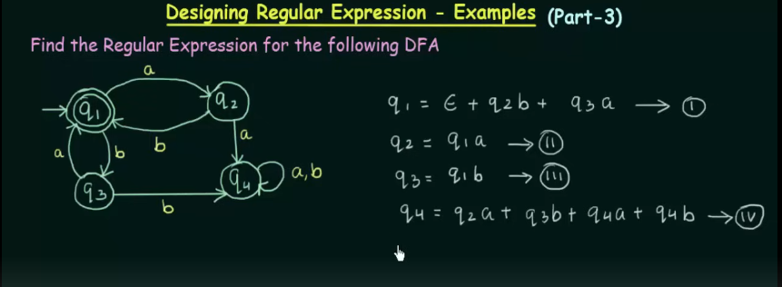

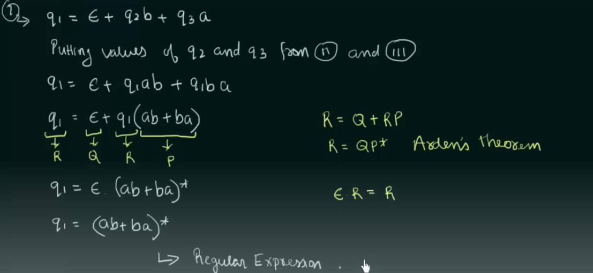

---


### Finite Automata : 

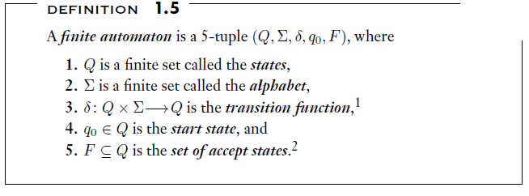

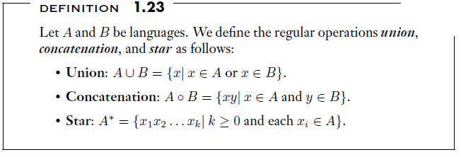

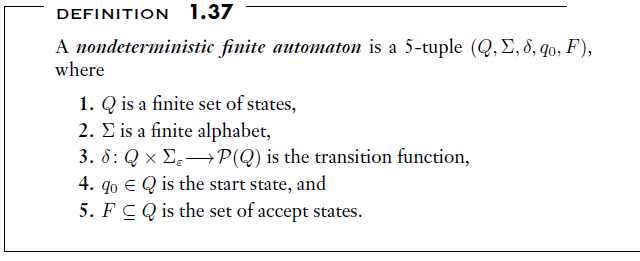 

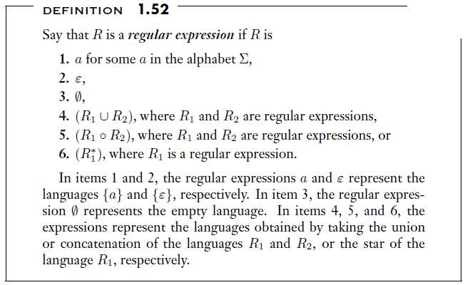

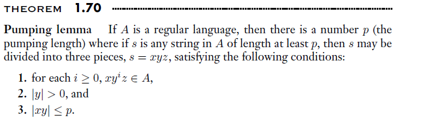

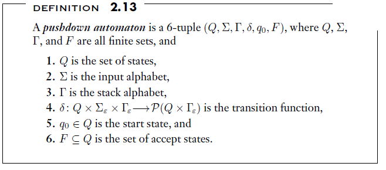


## Questions PDA Related : 

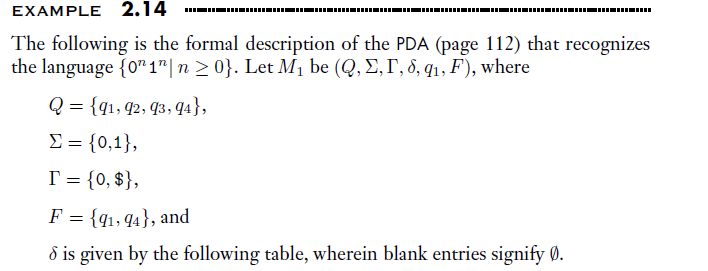

### Solution : 

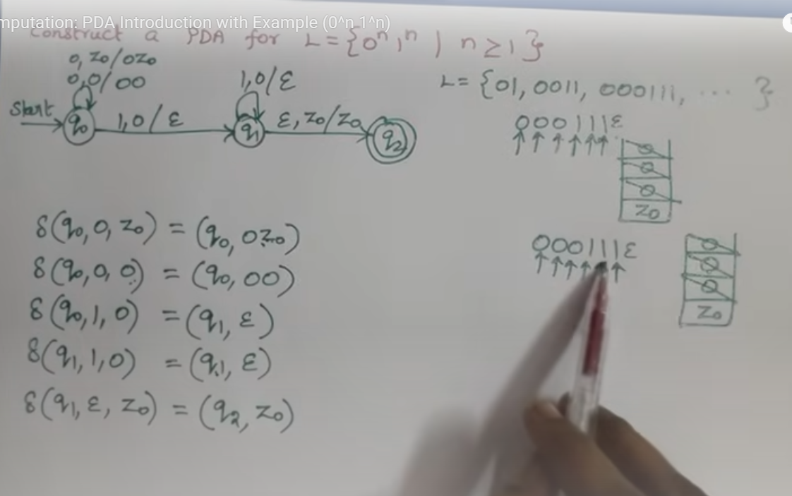

## PDA IDENTIFICATION : 

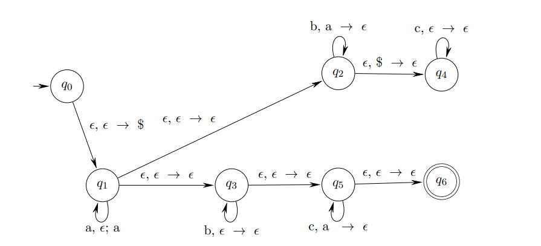 

### Solution : 

### ✅ Question:
**Identify the language that will be recognized by the following PDA (as shown in the diagram).**

---

### 🔍 PDA Analysis:

We'll trace the PDA step-by-step to understand what language it accepts.

---

### 🔄 PDA States Overview:

- `q0` → Initial state  
- `q6` → Final (accepting) state  
- Stack symbol `$` is used as a bottom marker

---

### 🧠 Key Transitions:

#### From `q0` to `q1`:
- Push `$` onto the stack.

#### Loop at `q1`:  
- Reads **`a`**, pushes **`a`** onto the stack.

#### From `q1 → q3` → `q5`:
- Transitions to process **`b`**s and **`c`**s.

#### In `q3`:
- On **`b`**, pop `a` (matching `b` with an earlier `a`).

#### In `q5`:
- On **`c`**, pop `a` (matching `c` with an earlier `a`).

#### From `q5 → q6`:  
- Accepts if all `a`s are matched and stack reaches bottom `$`.

---

### ✅ Final Observations:

- The PDA accepts strings that:
  - Begin with **some number of `a`s**,  
  - Followed by **some number of `b`s**,  
  - Followed by **some number of `c`s**,  
  - Where the **total number of `b`s and `c`s equals the number of `a`s**.

---

### 📘 Language Accepted by the PDA:

**L = { aⁿ bⁱ cʲ | n = i + j, n ≥ 0, i ≥ 0, j ≥ 0 }**

This means:
- The number of `a`s must equal the total number of `b`s and `c`s combined.
- The order must be: `a`s → `b`s → `c`s

---

### ✅ Example Strings in L:
- `ε` (empty string) ✅
- `abc` ✅ (1 `a`, 1 `b`, 1 `c` → total `b + c = 2` ❌ → Not accepted!)
- `aab` ✅ (`n=2`, `i=2`, `j=0`)
- `aaabc` ✅ (`n=3`, `i=1`, `j=2`)
- `aaa` ❌ (no `b` or `c`, so not matched)

---

### ✅ Final Answer:
**L = { aⁿ bⁱ cʲ | n = i + j, n ≥ 0, i ≥ 0, j ≥ 0 }**


### ✅ Proof: If A₁ and A₂ are regular languages, then A₁ ∪ A₂ is also regular

---

### 🧠 What We Know:
- A language is **regular** if it can be recognized by a **finite automaton**.
- A₁ and A₂ are both regular, so there exist DFAs (or NFAs) that recognize them.

---

### 🎯 Goal:
Prove that **A₁ ∪ A₂** is regular.

---

### 🧾 Proof Idea (Using Closure Property):

Regular languages are **closed under union**, which means:
> If A₁ and A₂ are regular, then so is A₁ ∪ A₂.

---

### 👣 Step-by-Step Proof (using NFA Construction):

Let:
- M₁ = (Q₁, Σ, δ₁, q₁, F₁) be the NFA for A₁
- M₂ = (Q₂, Σ, δ₂, q₂, F₂) be the NFA for A₂

We construct a new NFA **M** such that:

#### NFA M = (Q, Σ, δ, q₀, F) where:
- Q = Q₁ ∪ Q₂ ∪ {q₀}  
  (new start state `q₀`, plus all states from M₁ and M₂)
- Σ = input alphabet (same for both)
- δ:
  - δ(q₀, ε) = {q₁, q₂}  
    (ε-transition from the new start state to both M₁ and M₂)
  - δ behaves like δ₁ on Q₁ and like δ₂ on Q₂
- F = F₁ ∪ F₂  
  (accept if either M₁ or M₂ accepts)

---

### ✅ Why It Works:
- The new NFA M **nondeterministically chooses** to run either M₁ or M₂.
- If either machine accepts the input, M accepts it.
- Hence, **M accepts A₁ ∪ A₂**.

---

### 📌 Conclusion:
Since we've constructed an NFA for A₁ ∪ A₂, and NFAs recognize regular languages,  
→ **A₁ ∪ A₂ is regular**.

---

### (c) ✅ Statement: *Every regular language is context-free.*

---

### ✅ Claim: TRUE

---

### 🧠 Reasoning:

- **Regular languages** are the simplest class of languages, recognized by **finite automata**.
- **Context-free languages (CFLs)** are recognized by **pushdown automata (PDAs)**, which are more powerful than finite automata.
- Therefore, everything that a finite automaton (FA) can recognize, a pushdown automaton (PDA) can also recognize by simply **ignoring its stack**.

---

### 📌 Formal Proof Outline:

Let `L` be a regular language.  
Then there exists a **DFA** or **NFA** `M = (Q, Σ, δ, q₀, F)` that accepts `L`.

We can construct a **PDA** `P` that simulates this FA:

#### PDA P = (Q, Σ, Γ, δ', q₀, Z₀, F)
Where:
- `Q`, `Σ`, `q₀`, and `F` are the same as in the FA
- `Γ` (stack alphabet) can be anything (e.g., `{Z₀}` as a dummy)
- `δ'` transitions exactly like the FA but **ignores the stack**

This PDA **simulates the FA** by:
- Reading input symbols
- Changing state as per δ
- Never using the stack (or using it in a dummy way)

Thus, this PDA accepts the same language `L`.

---

### ✅ Conclusion:

> Every regular language can be recognized by a PDA (with or without using the stack),  
> so **every regular language is context-free**.

✔️ **Hence, the statement is TRUE.**


## 1 (a) Major Categories of Issues Addressed in the Theory of Computation

The **Theory of Computation** deals with the fundamental capabilities and limitations of computers. It is generally divided into **three major categories**:

---

#### 1. **Automata Theory**
- **Definition**: Studies abstract machines (automata) and the problems they can solve.
- **Examples**: Finite Automata, Pushdown Automata, Turing Machines.
- **Focus**: Models of computation, recognizing patterns and designing compilers.

**Significance**:
- Helps understand the working of language recognizers and parsers.
- Forms the foundation for designing programming languages and lexical analyzers.

---

#### 2. **Computability Theory**
- **Definition**: Deals with the question of what problems can be solved using algorithms.
- **Concepts**: Decidability, Turing machines, Halting problem.
- **Focus**: Determines whether a given problem is solvable or not.

**Significance**:
- Clarifies the limits of algorithmic computation.
- Prevents time and resource waste on unsolvable problems.

---

#### 3. **Complexity Theory**
- **Definition**: Studies the resources (time and space) needed to solve computational problems.
- **Classes**: P, NP, NP-Complete, NP-Hard.
- **Focus**: Efficiency of algorithms and classification of problems based on difficulty.

**Significance**:
- Helps in analyzing the performance of algorithms.
- Critical in fields like cryptography, optimization, and AI.

---

### Why Are These Categories Significant?

- **Foundation of Computer Science**: They define the theoretical limits of what computers can and cannot do.
- **Algorithm Design**: Provide tools to evaluate the feasibility and efficiency of algorithms.
- **Understanding Limitations**: Helps in distinguishing between solvable and unsolvable or intractable problems.
- **Practical Applications**: Useful in compiler construction, language processing, artificial intelligence, and software verification.

---

## (b) Formal Definitions: Alphabet, String, Language, Family of Languages

---

#### 1. **Alphabet (Σ)**

- **Definition**: A finite, non-empty set of symbols.
- **Notation**: Usually denoted by the Greek letter Σ (sigma).
- **Example**:  
  - Σ = {0, 1} → binary alphabet  
  - Σ = {a, b, c} → alphabet of lowercase letters

---

#### 2. **String**

- **Definition**: A finite sequence of symbols from an alphabet.
- **Notation**: If `w` is a string over alphabet Σ, then `w ∈ Σ*`.
- **Special Strings**:
  - **Empty string**: Denoted by ε (epsilon), has length 0.
- **Example**:  
  - For Σ = {0, 1}, possible strings: `0`, `10`, `1101`

---

#### 3. **Language**

- **Definition**: A set of strings formed from an alphabet.
- **Notation**: `L ⊆ Σ*`, where `Σ*` is the set of all possible strings over Σ.
- **Example**:  
  - Let Σ = {a, b}  
    Then L = {ε, a, ab, aab, abb} is a language over Σ.

---

#### 4. **Family of Languages**

- **Definition**: A group or collection of languages that share common characteristics, usually defined by a particular type of automaton or grammar.
- **Examples**:
  - **Regular Languages** → Recognized by Finite Automata
  - **Context-Free Languages** → Recognized by Pushdown Automata
  - **Recursive Languages** → Decidable by Turing Machines
  - **Recursively Enumerable Languages** → Recognized by Turing Machines (may not halt)

---

## (c) Proving: If L₁ and L₂ are regular, then L₁ \ L₂ is also regular

---

#### Given:
- L₁ and L₂ are **regular languages** over the same alphabet Σ.
- We want to prove that **L₁ \ L₂** is **regular**.

---

### Step-by-Step Proof:

#### 1. **Understanding Set Difference:**

The **difference** of two languages is defined as:

#### L₁ \ L₂ = { w ∈ Σ* | w ∈ L₁ and w ∉ L₂ }


This means the set of strings that are in L₁ but not in L₂.

---

#### 2. **Regular Languages are Closed Under Complement and Intersection**

Regular languages are closed under:
- **Complement**: If L is regular, then Σ* \ L is also regular.
- **Intersection**: If L₁ and L₂ are regular, then L₁ ∩ L₂ is also regular.

---

#### 3. **Rewriting L₁ \ L₂ Using Set Operations:**

We can express the difference as:

#### L₁ \ L₂ = L₁ ∩ (complement of L₂) = L₁ ∩ (Σ* \ L₂)


#### 4. **Use of Closure Properties:**

Since:
- L₂ is regular ⇒ its **complement** is regular
- L₁ is regular and complement of L₂ is regular ⇒ their **intersection** is regular

Therefore:
#### L₁ \ L₂ = L₁ ∩ (Σ* \ L₂) is regular


### ✅ Conclusion:

Since regular languages are closed under complement and intersection,  
**L₁ \ L₂ is regular** if both **L₁** and **L₂** are regular.

**Hence Proved.**

---

### (d) Comparison: NFA vs. DFA

---

| Feature | **DFA (Deterministic Finite Automaton)** | **NFA (Nondeterministic Finite Automaton)** |
|--------|-------------------------------------------|---------------------------------------------|
| **Definition** | Exactly one transition for each symbol from a state. | Can have zero, one, or multiple transitions for a symbol, including ε-transitions (no input). |
| **Transition Function** | δ: Q × Σ → Q | δ: Q × Σ → 2^Q |
| **Determinism** | Completely deterministic – no ambiguity in moves. | Nondeterministic – multiple choices possible. |
| **ε-transitions** | Not allowed. | Allowed. |
| **Computation** | Only one path of execution for each input string. | May have multiple paths (computation branches). |
| **Acceptance** | Input is accepted if a single path ends in an accepting state. | Accepted if **at least one path** leads to an accepting state. |
| **Ease of Construction** | More complex to construct in some cases. | Easier and more intuitive to construct. |
| **Speed of Simulation** | Faster (O(n), where n = input length). | May be slower (due to backtracking or parallelism simulation). |
| **Expressive Power** | Equal to NFA. | Equal to DFA. |
| **Conversion** | Not required. | Can be converted to equivalent DFA using **subset construction** (powerset method). |
| **Implementation** | Easier to implement in code/hardware. | More theoretical and useful for design/simplification. |

---

### ✅ Key Point:

> **DFA and NFA recognize the same class of languages: Regular Languages.**  
> That is, for every NFA, there exists an equivalent DFA that accepts the same language.

---

### Summary:

- NFAs are **easier to design** but **harder to simulate**.
- DFAs are **harder to design** but **easier to simulate**.
- **Both have the same computational power**.

---

### 2(a) Construct an NFA to recognize the language consisting of all strings over {0,1} containing a 0 in the third position from the end.

---

#### 💡 Language Definition:

Let L = { w ∈ {0,1}* | the third symbol from the end is 0 }

We want an NFA that **accepts** any string where:
- There are **at least 3 symbols**
- And the **third last** one is `0`

That means:
If w = `xabc` where `a`, `b`, `c ∈ {0,1}`, then:
- `a` must be `0`
- The rest `x` can be any string of any length (including empty)

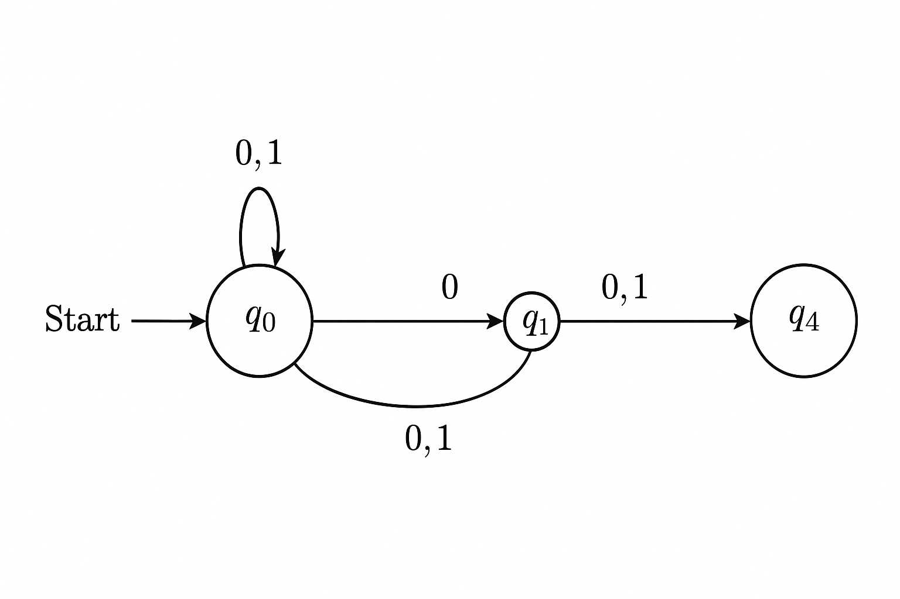

#### 🧾 Transition Table Summary:

Let the NFA states be:

- `q0`: Start state, loops on `0` and `1`
- `q1`: On ε-transition from q0 — guess start of last 3 symbols
- `q2`: Reads `0` (third from end)
- `q3`: Reads any symbol (second from end)
- `q4`: Reads any symbol (last character) → **Final accepting state**

| Current | Input | Next    |
|---------|-------|---------|
| q0      | 0,1   | q0      |
| q0      | ε     | q1      |
| q1      | 0     | q2      |
| q2      | 0,1   | q3      |
| q3      | 0,1   | q4 (✔)  |

- `q4` is the accepting state.

---

#### ✅ Verbal Description:

The NFA accepts any string over `{0,1}` **whose third symbol from the end is `0`**.

Examples of accepted strings:
- `000`
- `1010`
- `11010`
- `10011`

Rejected examples:
- `001` → 3rd from end = `0`, ✔
- `011` → 3rd from end = `0`, ✔
- `111` → 3rd from end = `1`, ❌

---


### 2(b) Verbal Description of the Language Recognized by the DFA (Figure 1)

---

#### ✅ Description:

The DFA recognizes the language:

> **L = { w ∈ {0,1}* | w contains the substring `0010` }**

---

#### 🔍 Reasoning:

- The DFA transitions through the following states:
  - `q0` → Start state.
  - `q0 → q1` on input `0`
  - `q1 → q2` on input `0`
  - `q2 → q3` on input `1`
  - `q3 → q4` on input `0`

- Once the sequence `0010` is matched, the DFA enters the accepting state `q4`, which is **final** and **loops on both `0` and `1`**, meaning any extra symbols are accepted.

---

#### 🧪 Examples of Accepted Strings:
- `0010`
- `10010`
- `000010`
- `0010111`
- `1100100`

#### ❌ Examples of Rejected Strings:
- `0`
- `10`
- `011`
- `1101`
- `1110001`

---

#### 💡 Conclusion:

The DFA accepts all strings over `{0,1}` that **contain the substring `0010`** anywhere within them.

---

### 3(a) Suppose L₁ and L₂ are regular languages. Prove that L₁ ⋅ L₂ is also regular.

---

#### ✅ Statement:

If **L₁** and **L₂** are regular languages, then their **concatenation**  
L₁ ⋅ L₂ = { xy | x ∈ L₁ and y ∈ L₂ } is also a **regular language**.

---

#### 🧠 Proof Using Closure Properties:

Regular languages are **closed under concatenation**.  
This means:  
If L₁ and L₂ are regular, then L₁ ⋅ L₂ is also regular.

---

#### 🔧 Proof Sketch Using Automata:

Let:
- M₁ = (Q₁, Σ, δ₁, q₁₀, F₁) be a DFA/NFA that accepts L₁  
- M₂ = (Q₂, Σ, δ₂, q₂₀, F₂) be a DFA/NFA that accepts L₂  

We can construct an **NFA** M that accepts L₁ ⋅ L₂ as follows:

1. **States** of M = Q₁ ∪ Q₂  
2. **Start state** = q₁₀ (start of M₁)  
3. **Accepting states** = F₂ (accepting states of M₂)  
4. Add **ε-transitions** from each accepting state of M₁ (F₁) to the start state of M₂ (q₂₀)

This NFA first simulates M₁, and once M₁ accepts, it jumps to M₂ using an ε-move and continues to process the rest of the input.

---

#### 📌 Therefore:

Since we have constructed an NFA that accepts L₁ ⋅ L₂, and NFAs recognize regular languages,  
**L₁ ⋅ L₂ is regular**.

✅ **Q.E.D.**

### 🔍 Visual Representation of the Concatenation L₁ ⋅ L₂

Assume we have two NFAs:

#### 🌀 NFA for L₁:

 --> (q₁₀) --a--> (q₁₁) --b--> ((q₁₂))

- Start state: `q₁₀`
- Accepting state: `q₁₂`
- Accepts: "ab"

#### 🌀 NFA for L₂:

 --> (q₂₀) --c--> ((q₂₁))

- Start state: `q₂₀`
- Accepting state: `q₂₁`
- Accepts: "c"

---

### 🔗 Construction of NFA for L = L₁ ⋅ L₂

To construct the concatenation:

1. Take all states from both L₁ and L₂.
2. Add **ε-transition** from final state of L₁ (`q₁₂`) to start state of L₂ (`q₂₀`).

#### ✅ Combined NFA for L₁ ⋅ L₂:

 --> (q₁₀) --a--> (q₁₁) --b--> (q₁₂) --ε--> (q₂₀) --c--> ((q₂₁))


- Start state: `q₁₀`
- Accepting state: `q₂₁`
- Accepts: "abc"

---

### 🎯 Final Notes:

- The ε-transition allows the automaton to **seamlessly switch** from processing L₁ to L₂.
- This construction **does not require** the input to pause — it's handled by the NFA structure.
- Hence, L₁ ⋅ L₂ is regular.

✅ **This visual example proves that the concatenation of two regular languages results in another regular language.**

### 3(b) Convert the Regular Expression (ab ∪ a)\* to an Equivalent NFA

---

#### 📌 Given:

- Regular Expression: **(ab ∪ a)\***
- Alphabet: **Σ = {a, b}**

---

### 🔄 Step-by-Step Breakdown:

Let’s break down the regular expression:

1. **Sub-expression 1:** `ab` → a followed by b
2. **Sub-expression 2:** `a` → just a
3. **Union:** `ab ∪ a`
4. **Kleene Star:** `(ab ∪ a)*` → zero or more occurrences of either `ab` or `a`

---

### 🛠️ NFA Construction Strategy

We construct NFAs for basic parts, then combine:

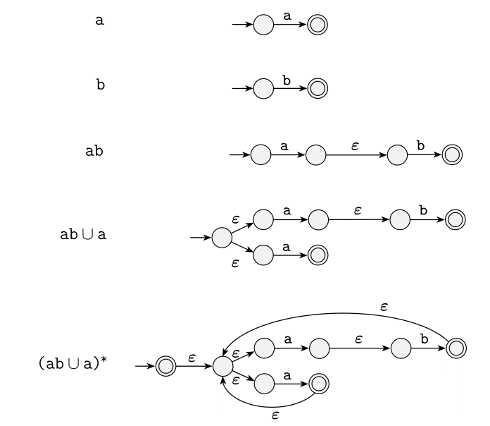


---

### 💡 Conclusion:

This NFA accepts all strings formed by zero or more repetitions of either `a` or `ab`.  
Examples of strings accepted:
- ε
- a
- ab
- aa
- aba
- abab
- ababa
- etc.

✅ **Thus, the NFA correctly accepts the language described by the regular expression (ab ∪ a)\***

---

### 4(a) DFA Description

**Language L = { w ∣ w has exactly two a's and at least two b's }**

#### Verbal Description:

This DFA accepts all strings over the alphabet **Σ = {a, b}** such that:

- The string contains **exactly two occurrences of 'a'**, and  
- The string contains **at least two occurrences of 'b'** (i.e., two or more b's).

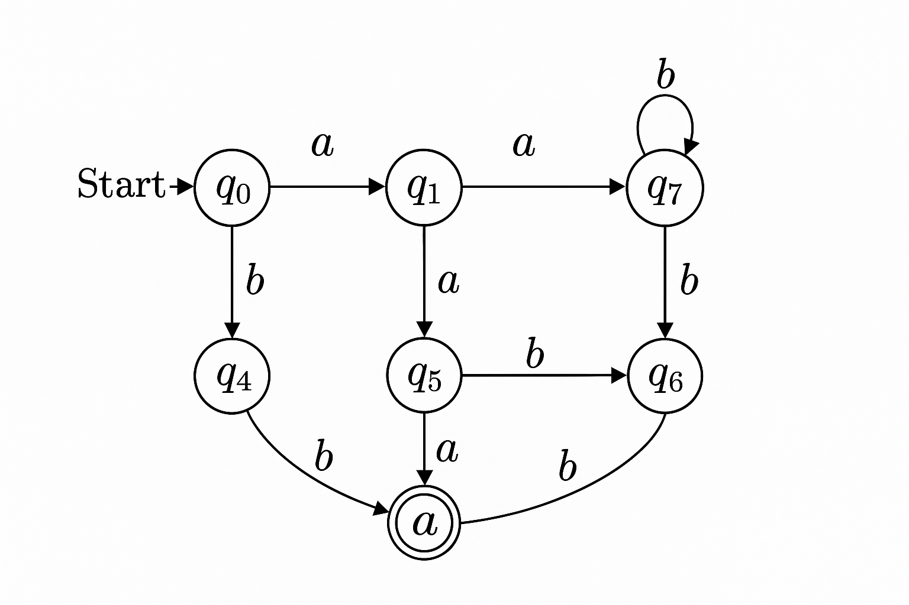

#### Explanation of DFA Behavior:

- The DFA uses **states to count** the number of a’s (up to exactly two) and the number of b’s (up to two, but allows more).
- Once two a’s are seen, **no further a's are allowed**; otherwise, the input is rejected.
- Once two or more b’s are seen, the DFA allows **any number of additional b’s**, remaining in an accepting state.
- The accepting state is reached **only** if the input has **exactly two 'a's and at least two 'b's**.

---

### 4(b) Prove that L = { aⁿbⁿ | n ≥ 0 } is **not regular** using the **Pumping Lemma**

---

#### 📌 Given:
- **Language**: L = { aⁿbⁿ | n ≥ 0 }
- **Alphabet**: Σ = { a, b }

---

### 🧠 Pumping Lemma Statement for Regular Languages

If **L is regular**, then there exists a **pumping length `p`** such that any string **s ∈ L** with **|s| ≥ p** can be split into three parts:  
**s = xyz**, satisfying:

1. |y| > 0  
2. |xy| ≤ p  
3. For all **i ≥ 0**, the string **xyⁱz ∈ L**

---

### 🚫 Assume L is Regular (for contradiction)

Let’s choose a string **s = aᵖbᵖ ∈ L**, where **p** is the pumping length.

- Clearly, **|s| = 2p ≥ p**
- By the lemma, we must split **s = xyz** such that:
  - **|xy| ≤ p** → so **x** and **y** consist of **only a’s**
  - **|y| > 0** → so **y** contains **at least one a**

Let:
- **x = aᵏ**
- **y = aᵐ**, where **m ≥ 1**
- **z = a^(p−k−m) bᵖ**

So the full string is: **xyz = aᵖbᵖ**

---

### 🧪 Now Pump: Choose i = 2  
New string: **xy²z = aᵏ (aᵐ)² a^(p−k−m) bᵖ = a^(p + m) bᵖ**

This means the number of **a’s > p**, but the number of **b’s = p**

➡️ So the pumped string is **not in L**  
Because it is **not of the form aⁿbⁿ** — the number of a’s and b’s are no longer equal.

---

### ❌ Contradiction

This contradicts the pumping lemma → Hence, **L is not regular**.

---

### ✅ Conclusion

**L = { aⁿbⁿ | n ≥ 0 } is NOT regular**, as it **fails** the conditions of the **Pumping Lemma**.

---

### 5(a) Prove that C = { aⁿbⁿcⁿ | n ≥ 0 } is **not a context-free language** using the **Pumping Lemma for CFLs**

---

### 📌 Given:
**Language:**  
C = { aⁿbⁿcⁿ | n ≥ 0 }  
This means strings that have:
- equal number of **a**’s, **b**’s, and **c**’s, in order.

---

### 🧠 Pumping Lemma for Context-Free Languages (CFL)

If **C** is context-free, then there exists a constant **p (pumping length)** such that any string **s ∈ C** with **|s| ≥ p** can be written as:

**s = uvwxy**, with:

1. **|vwx| ≤ p**  
2. **vx ≠ ε** (either **v** or **x** or both are non-empty)  
3. For all **i ≥ 0**, the string **uvⁱw xⁱy ∈ C**

---

### 🚫 Assume C is context-free (for contradiction)

Let’s choose a string:  
**s = aᵖbᵖcᵖ ∈ C**  
This string has equal numbers of a’s, b’s, and c’s.

From the lemma: **s = uvwxy**, where **|vwx| ≤ p**

So, **vwx** must fall **within** or at most **overlap two** of the three symbol blocks (aᵖ, bᵖ, cᵖ), but **cannot span all three** (since |vwx| ≤ p and each block is of length p).

---

### 🔍 Case Analysis

We'll look at possible placements of **vwx**:

#### Case 1: vwx lies entirely in the **a**’s
- Pumping **v** and **x** increases or decreases the number of **a**’s only.
- The number of a’s ≠ number of b’s and c’s → invalid string ∉ C

#### Case 2: vwx lies entirely in the **b**’s
- Pumping affects only **b**’s → again, number of b’s ≠ a’s or c’s → invalid

#### Case 3: vwx lies entirely in the **c**’s
- Pumping affects only **c**’s → same issue → string is not in C

#### Case 4: vwx spans **a’s and b’s**
- Pumping changes number of a’s and b’s but not c’s → a ≠ b ≠ c → not in C

#### Case 5: vwx spans **b’s and c’s**
- Again, pumping disturbs the balance between b’s and c’s → string ∉ C

✅ In **every case**, pumping causes the number of a’s, b’s, and c’s to become **unequal**. So, **uvⁱw xⁱy ∉ C** for some i ≠ 1.

---

### ❌ Contradiction

This contradicts the pumping lemma for context-free languages.

---

### ✅ Conclusion

**C = { aⁿbⁿcⁿ | n ≥ 0 } is not context-free**, because it **violates the pumping lemma for CFLs**.

---

### 5(b) Context-Free Grammar (CFG) for:

**Language A** = { aⁱ bʲ cᵏ | i = j **or** j = k, where i, j, k ≥ 0 }

---

We will construct a CFG **G** that generates all strings in A, which is the **union** of two simpler languages:

---

### 🧩 Let’s break down the language:

- Let **L₁ = { aⁱ bⁱ cᵏ | i, k ≥ 0 }** — where **i = j**
- Let **L₂ = { aⁱ bʲ cʲ | i ≥ 0, j ≥ 0 }** — where **j = k**

Then:  
**A = L₁ ∪ L₂**

We can define separate CFGs for **L₁** and **L₂**, then combine them using a new start symbol.

---

### ✅ Grammar for L₁: (i = j)

This handles strings where the number of **a**'s = number of **b**'s.

```text
S₁ → AB
A → aAb | ε        // generates equal number of a's and b's
B → cB | ε         // generates any number of c's

```
#### Grammar for L₂: (j = k)
#### This handles strings where the number of b's = number of c's.

```

S₂ → AC
A → aA | ε         // generates any number of a's
C → bCc | ε        // generates equal number of b's and c's

```
#### Final Combined Grammar: Let the start symbol be S.

```
S → S₁ | S₂

S₁ → AB
A → aAb | ε
B → cB | ε

S₂ → AC
A → aA | ε
C → bCc | ε

```
---

### 6(a) Church-Turing Thesis

The **Church-Turing Thesis** is a foundational principle in theoretical computer science and computability theory.

---

### 📜 **Statement:**

> "A function on the natural numbers is **computable** by a human using a well-defined procedure (algorithm), if and only if it is computable by a **Turing Machine**."

---

### 🧠 **Interpretation:**

- It equates the intuitive idea of **"what can be computed"** with **"what a Turing Machine can compute."**
- In simpler terms, **anything that can be computed algorithmically** can also be computed by a **Turing Machine**.

---

### 💡 **Significance:**

- It provides a **formal model of computation**.
- All models of computation (λ-calculus, recursive functions, etc.) that capture the intuitive notion of an algorithm **are equivalent** to Turing Machines.
- Helps define the boundaries of **what is computable and what is not**.

---

### ⚠️ Note:

The Church-Turing Thesis is **not a theorem** — it cannot be proven mathematically — rather, it is a **hypothesis** based on overwhelming empirical evidence.

---

### (6c) Description of the Turing Machine for L = {ww | w ∈ {0,1}*}

#### Language:
L = {ww | w ∈ {0,1}*}  
This language consists of all strings where the first half is exactly the same as the second half.

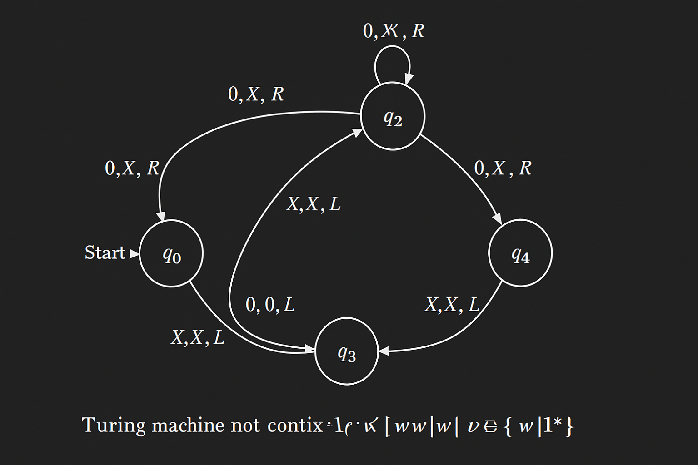

#### Strategy:
A Turing machine that accepts this language performs the following operations:

1. **Mark the first unmarked symbol** (either `0` or `1`) from the left half.
2. **Search for its corresponding match** in the second half of the string by moving to the rightmost unmarked part.
3. **If a match is found**, mark both symbols and return to the leftmost unmarked symbol.
4. **Repeat** until all symbols are matched.
5. If the number of symbols is odd, or any mismatch occurs — **reject** the input.
6. If all symbols are successfully matched — **accept** the input.

#### Symbol Legend:
- `X`: marked `0` from the first half
- `Y`: marked `1` from the first half
- `A`: marked `0` from the second half
- `B`: marked `1` from the second half
- `□`: blank symbol (end of tape)

#### Informal Description of Key Transitions:
- `q0`: Start state — scans for the first unmarked symbol (`0` or `1`).
- `q1`: Marks `0` as `X`, transitions to a state to find the matching `0` in the second half.
- `q2`: Marks `1` as `Y`, transitions to find matching `1`.
- `q3`, `q4`: Move to the end of the tape to find unmarked symbols for matching.
- `q5`, `q6`: Verify matches (`0`→`A`, `1`→`B`), then return to the left to continue.
- `q_accept`: If all pairs are matched, accept the input.
- `q_reject`: If mismatch or unbalanced input, reject.

#### Notes:
This machine assumes the string is stored on a tape with delimiters or blank symbols to detect boundaries.
Since the language `{ww}` is **not context-free**, a Turing Machine is required (not a PDA).

---

