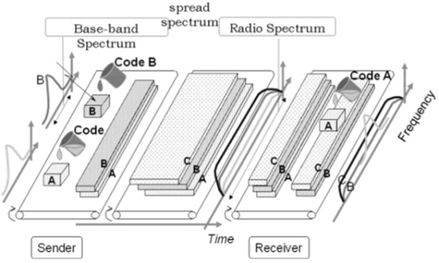

## 1. Core Concepts

### **OSI Layers with Real-World Tasks**

| **Layer**           | **Function**                              | **Explained Real-World Tasks**                                                                                                                                                                                                                                                                                                                              |
| ------------------- | ----------------------------------------- | ----------------------------------------------------------------------------------------------------------------------------------------------------------------------------------------------------------------------------------------------------------------------------------------------------------------------------------------------------------- |
| **7. Application**  | End-user services                         | - **Sending an email (SMTP, IMAP, POP3):** Protocols handle sending, receiving, storing emails.   - **Web browsing (HTTP/HTTPS):** Browser requests pages; HTTPS adds encryption.   - **Video conferencing (Zoom/Teams):** Exchange of voice, video, and chat.   - **Online shopping apps:** APIs process payments, show catalogs, confirm orders. |
| **6. Presentation** | Data translation, encryption, compression | - **SSL/TLS encryption:** Protects sensitive banking data.   - **JPEG compression:** Reduces file size for faster transfer.   - **ASCII ↔ Unicode conversion:** Ensures multilingual characters display correctly.   - **MP4/MP3 streaming:** Formats allow efficient media playback.                                                              |
| **5. Session**      | Manage sessions                           | - **Website login:** Tokens keep you logged in until logout.   - **Netflix streaming session:** Maintains active stream until stopped.   - **Multiplayer games:** Keeps players connected until game ends.   - **Remote login (SSH):** Opens secure session to remote server.                                                                      |
| **4. Transport**    | Reliable end-to-end delivery              | - **TCP downloads (FTP):** Ensures all packets arrive, retransmits if lost.   - **UDP gaming/VoIP:** Prioritizes speed over reliability.   - **Streaming flow control:** TCP/QUIC adjust rates to reduce buffering.   - **WhatsApp receipts:** TCP acknowledgment confirms delivery.                                                               |
| **3. Network**      | Routing & addressing                      | - **Routers forwarding IP packets:** Decide best delivery path.   - **GPS apps:** Use IP packets to fetch live traffic updates.   - **Mobile networks:** Assign IPs so devices can communicate.   - **VPN tunneling:** Securely encapsulates IP packets.                                                                                           |
| **2. Data Link**    | Framing, MAC addressing, error detection  | - **Wi-Fi MAC addresses:** Router identifies each device uniquely.   - **Ethernet LAN:** Data frames exchanged over cables.   - **Switch forwarding:** Delivers frames only to target device.   - **CRC check:** Detects errors in corrupted frames.                                                                                               |
| **1. Physical**     | Transmission of raw bits                  | - **Ethernet cables:** Send bits as electrical pulses.   - **Fiber optics:** Use light for high-speed ISP communication.   - **Bluetooth headphones:** Wireless audio via radio waves.   - **5G signals:** Phones connect through radio frequencies.                                                                                               |

---

## Chapter 0 & 1 Previous Year Questions:

---

### **1(a) Why are protocols needed?**

Protocols are **rules and conventions** that govern data communication between devices. Without protocols, devices made by different manufacturers or running on different systems could not communicate effectively.
They are needed because they:

* Define **how data is formatted, transmitted, and received**.
* Ensure **reliability** (error detection, correction).
* Allow **interoperability** between heterogeneous systems.
* Provide **synchronization** and manage flow of data.

👉 Example: In email communication, SMTP is used for sending, POP/IMAP for receiving — ensuring messages are delivered correctly across different platforms.

---

### **Network Criteria of Data Communication:**

For communication to be effective, a network must meet three main criteria:

1. **Performance**

   * Measured in terms of **throughput**, **response time**, and **delay**.
   * Example: Fast download speed on the Internet.

2. **Reliability**

   * Ability of a network to carry data **accurately and consistently**.
   * Includes **error rate** and **downtime**.
   * Example: Voice call not dropping frequently.

3. **Security**

   * Protection of data from **unauthorized access or alteration**.
   * Example: Use of encryption in online banking.

---

### **1(b) Compare the Telephone Network and the Internet**

**Introduction:**
Both the telephone network and the Internet are global communication systems. They connect millions of users worldwide, but they differ in design and services offered.

---

**Similarities:**

1. Both provide **end-to-end communication** between users.
2. Both rely on a **hierarchical structure** of switching/routing.
3. Both use **unique addresses/numbers** to identify users (telephone numbers, IP addresses).
4. Both require **protocols and standards** to ensure interoperability.

---

**Differences:**

| Feature                     | Telephone Network                                                            | Internet                                                              |
| --------------------------- | ---------------------------------------------------------------------------- | --------------------------------------------------------------------- |
| **Type of Service**         | Provides **circuit-switched** service (dedicated path for the entire call).  | Provides **packet-switched** service (data split into packets).       |
| **Nature of Communication** | Designed mainly for **voice** communication.                                 | Designed for **data** (supports voice, video, multimedia).            |
| **Resource Usage**          | Resources are reserved for the duration of the call (inefficient if silent). | Resources are shared dynamically among packets (efficient use).       |
| **Addressing**              | Uses **phone numbers**.                                                      | Uses **IP addresses & domain names**.                                 |
| **Flexibility**             | Relatively rigid, limited to voice and simple services.                      | Very flexible, supports diverse applications (web, email, streaming). |

---

### **1(c) Describe how information gets passed from one layer to the next in the Internet model**

**Introduction:**
The Internet model (TCP/IP) uses a **layered architecture** where each layer provides services to the layer above and uses services from the layer below. Data moves step by step through these layers during communication.

---

**Process:**

1. **Encapsulation (Sender side):**

   * At the sender, data starts at the **Application Layer** (e.g., email text).
   * Each layer **adds its own header** (control information) to the data.
   * For example:

     * Transport layer adds **TCP/UDP header** (port number, reliability info).
     * Network layer adds **IP header** (source & destination IP).
     * Data link layer adds **MAC header + trailer** (physical addressing, error check).
   * This wrapping process is called **encapsulation**.

2. **Transmission (Physical Layer):**

   * The fully formed frame is converted into **bits and signals** (electrical, optical, or radio) and sent through the physical medium.

3. **Decapsulation (Receiver side):**

   * At the receiver, the reverse happens.
   * Each layer **removes its header** and passes the remaining data up.
   * Physical → Data Link → Network → Transport → Application.

---

**Example (Email):**

* Sender writes an email in Gmail (Application).
* Transport adds TCP (port = 25 for SMTP).
* Network adds IP (source = your PC, destination = mail server).
* Data Link adds MAC (router’s MAC).
* Physical layer sends it as signals.
* At the receiver’s end, all headers are removed step by step until the email text is shown.

---

✅ **Summary:**
Information is passed between layers by **encapsulation at the sender** and **decapsulation at the receiver**, ensuring modular, reliable communication.

---

---

## Chapter 2: 

## **Physical Layer & Transmission Concepts**

### **1. Spectrum**

* The **range of frequencies** a signal can occupy.
* Measured in **Hertz (Hz)**.
* Example: Visible light spectrum (400–700 THz), Wi-Fi uses 2.4 GHz & 5 GHz bands.
* Spectrum allocation is regulated (e.g., by ITU, FCC).

---

### **2. Bandwidth**

* The **width of the frequency band** a channel or signal occupies.
* Formula:

  $$
  \text{Bandwidth} = f_{max} - f_{min}
  $$
* Higher bandwidth = more data can be transmitted.
* Example: A 20 MHz Wi-Fi channel can carry more data than a 5 MHz LTE channel.

---

### **3. Impairments**

Factors that **distort or degrade signals** during transmission:

* **Attenuation:** Signal strength decreases over distance.
* **Noise:** Unwanted signals (thermal, crosstalk, etc.).
* **Distortion:** Signal shape changes (e.g., different frequencies arrive at different times).
* **Interference:** Overlap from other transmissions.
* **Delay/Latency:** Time taken for data to travel.

---

### **4. Channel Capacity**

* The **maximum data rate** that can be transmitted over a channel **without error**.
* Influenced by **bandwidth, noise, and signal power**.
* Two famous formulas:

  * **Nyquist Theorem (no noise):**

    $$
    C = 2B \log_2 M
    $$

    $B$ = bandwidth, $M$ = number of signal levels.
  * **Shannon Capacity (with noise):**

    $$
    C = B \log_2 (1 + \text{SNR})
    $$

    $SNR$ = Signal-to-Noise Ratio.
* Example: Increasing SNR or bandwidth increases channel capacity.

---

👉 **Tips**

* **Spectrum = “Where?”** (frequency range).
* **Bandwidth = “How wide?”** (capacity to carry signals).
* **Impairments = “What goes wrong?”** (noise, attenuation, distortion).
* **Channel Capacity = “How much?”** (max data rate possible).

---

### 6th Batch Questions:

---

### **1(a) Define Data Communication with its Fundamental Characteristics**

**Definition:**
Data communication is the **exchange of digital or analog data between devices** via a **transmission medium** such as copper wire, fiber optic cable, or wireless channels. It allows computers, phones, and other devices to **share information quickly and accurately**.

---

**Fundamental Characteristics of Data Communication:**

1. **Accuracy**

   * Data should be delivered **exactly as sent** without errors.
   * Example: Sending a text message without missing or altered characters.

2. **Timeliness (Speed/Latency)**

   * Data should reach the receiver **within a required time**.
   * Example: Video calls require low delay for smooth conversation.

3. **Jitter (Consistency of Delay)**

   * Variation in arrival time of data packets should be minimal, especially for real-time communication.
   * Example: Audio in VoIP calls should not skip or lag.

4. **Delivery**

   * Data must reach the **intended recipient**, not someone else.
   * Ensured through **addressing and routing mechanisms**.

5. **Reliability**

   * The system should **detect and correct errors**, retransmit lost data if necessary.
   * Example: File transfer via FTP confirms all packets are received correctly.

6. **Capacity/Bandwidth**

   * The **amount of data** that can be transmitted in a given time.
   * Example: A 100 Mbps Internet link can transfer more data per second than a 10 Mbps link.

---

✅ **Summary:**
Data communication is the **accurate, timely, and reliable transfer of data** over a medium, characterized by **accuracy, speed, consistency, delivery, reliability, and bandwidth**.

---

### **1(b) Different Kinds of Data Flow Direction**

**Introduction:**
Data flow direction defines **how data moves between two devices** in a communication system. There are **three main types**:

---

1. **Simplex**

   * **Definition:** Data flows in **only one direction**; the receiver cannot send data back.
   * **Example:** Keyboard → Computer, TV broadcast.
   * **Characteristics:**

     * One-way communication
     * Sender and receiver roles are fixed

---

2. **Half-Duplex**

   * **Definition:** Data can flow in **both directions**, but **only one direction at a time**.
   * **Example:** Walkie-talkies, CB radios.
   * **Characteristics:**

     * Devices take turns to send/receive
     * Direction switches as needed

---

3. **Full-Duplex**

   * **Definition:** Data can flow **simultaneously in both directions**.
   * **Example:** Telephone conversation, modern Ethernet.
   * **Characteristics:**

     * Both devices can send and receive at the same time
     * Requires separate channels or advanced signal processing

---

**Summary Table:**

| Type        | Direction            | Example        | Notes                         |
| ----------- | -------------------- | -------------- | ----------------------------- |
| Simplex     | One-way              | Keyboard → PC  | Receiver cannot reply         |
| Half-Duplex | Both, one at a time  | Walkie-talkie  | Devices take turns            |
| Full-Duplex | Both, simultaneously | Telephone call | Fast, efficient communication |

---

### **1(c) Cyclic Redundancy Check (CRC) with Encoder and Decoder**

**Introduction:**
Cyclic Redundancy Check (CRC) is a **widely used error-detecting technique** in digital networks. It ensures **reliable data transmission** by detecting changes (errors) in the transmitted message.

---

### **1. Principle of CRC**

* Treats the data as a **polynomial** in binary.
* Uses a **generator polynomial** $G(x)$ to create a **redundancy bit pattern** called the **CRC**.
* The transmitted frame = **original data + CRC bits**.
* Receiver checks the received data using the same generator polynomial.

---

### **2. CRC Encoder**

**Steps:**

1. Append $r$ zeros to the data, where $r$ = degree of generator polynomial $G(x)$.
2. Divide the augmented data by $G(x)$ using **binary modulo-2 division**.
3. The **remainder** is the CRC bits.
4. Append the CRC to the original data for transmission.

**Example (simplified):**

* Data: `1101`
* Generator: `1011`
* Append 3 zeros → `1101000`
* Divide by 1011 → remainder = `011`
* Transmit `1101011`

---

### **3. CRC Decoder**

**Steps:**

1. Receiver receives **data + CRC**.
2. Divide received frame by the **same generator polynomial $G(x)$**.
3. **Check remainder:**

   * **Remainder = 0:** No error detected.
   * **Remainder ≠ 0:** Error detected, request retransmission.

**Example (continuing above):**

* Received: `1101011`
* Divide by 1011 → remainder = `0` → no error.

---

### **4. Key Advantages of CRC**

* Detects **single-bit and burst errors** efficiently.
* Easy to implement with **shift registers** in hardware.
* Very reliable for network communication protocols (Ethernet, USB).

---

✅ **Summary:**

* **Encoder:** Adds CRC bits to data using polynomial division.
* **Decoder:** Checks received data with same polynomial; detects errors if remainder ≠ 0.
* CRC is **simple, reliable, and widely used** in digital communications.

---

### **1(d) Two Types of Packet-Switched Networks**

**Introduction:**
A **packet-switched network** divides data into **small packets** and sends them independently across the network. This allows **efficient use of network resources** and supports multiple users.

There are **two main types**:

---

### **1. Datagram (Connectionless) Packet-Switched Network**

**Description:**

* Each packet is treated **independently**.
* Packets may take **different paths** to reach the destination.
* No dedicated path is established beforehand.

**Characteristics:**

* Packets can **arrive out of order**; reassembly is done at the receiver.
* Flexible and robust; if one path fails, packets can use another path.

**Example:**

* The **Internet (IP network)** uses datagram approach.

---

### **2. Virtual Circuit (Connection-Oriented) Packet-Switched Network**

**Description:**

* A **predefined path (virtual circuit)** is established before any packets are sent.
* All packets follow this **same path** to the destination.

**Characteristics:**

* Packets arrive in **order**, easier for sequencing.
* Requires setup and teardown of virtual circuit.
* More predictable performance than datagram networks.

**Example:**

* **Frame Relay**, **X.25**, and **MPLS networks** use virtual circuits.

---

### **Summary Table (Quick Revision):**

| Type                                  | Path Establishment | Order of Arrival        | Example           |
| ------------------------------------- | ------------------ | ----------------------- | ----------------- |
| Datagram (Connectionless)             | No dedicated path  | May arrive out of order | Internet (IP)     |
| Virtual Circuit (Connection-Oriented) | Predefined path    | Arrive in order         | Frame Relay, X.25 |

---

 **Hacks**

* Think: **Datagram = flexible, no setup; Virtual Circuit = reliable, ordered, requires setup**.

---

## Previous year Questions on Chapter 2: 

---

### **2(a) What are the responsibilities of the transport layer in the Internet model?**

**Introduction:**
The **Transport Layer** in the Internet (TCP/IP) model lies between the Application Layer and the Network Layer. Its main role is to provide **end-to-end communication** between processes running on different hosts.

---

**Key Responsibilities:**

1. **Process-to-Process Delivery:**

   * While the Network Layer delivers data from one host to another (host-to-host), the Transport Layer ensures data reaches the **correct application process** using **port numbers**.
   * Example: Web traffic (port 80/443) vs. email traffic (port 25).

2. **Segmentation and Reassembly:**

   * Breaks large application data into smaller units called **segments** (TCP) or **datagrams** (UDP).
   * At the receiver, reassembles them in the correct order.

3. **Connection Control:**

   * **Connection-oriented service (TCP):** Establishes, maintains, and terminates connections (e.g., three-way handshake).
   * **Connectionless service (UDP):** Sends data without prior setup.

4. **Flow Control:**

   * Prevents the sender from overwhelming the receiver.
   * Example: TCP uses a **sliding window protocol**.

5. **Error Control:**

   * Ensures reliability by detecting lost, duplicated, or corrupted segments.
   * TCP provides **retransmission** and **acknowledgment**.

6. **Congestion Control:**

   * Adjusts the rate of data transmission to avoid network congestion.
   * Example: TCP’s **slow start** and **congestion avoidance**.

---

**Summary:**
The Transport Layer is like a **traffic manager**—it makes sure data gets from the right program on one device to the right program on another, reliably, in order, and without overwhelming the network.

Great — let’s make your notes clean and exam-ready.

---

### **2(b) Describe the types of transmission impairment with appropriate figure**

**Introduction:**
When data signals travel through a communication medium, they get distorted. These distortions are called **transmission impairments**, and they affect the accuracy and quality of data communication.

---

**Types of Transmission Impairments:**

1. **Attenuation (Loss of Signal Strength):**

   * The signal becomes weaker as it travels farther through the medium.
   * Too much attenuation makes the signal unreadable.
   * **Example:** Voice over long copper wires sounds faint without amplification.
   * **Remedy:** Use amplifiers or repeaters to boost the signal.

2. **Distortion (Change in Signal Shape):**

   * Occurs when different frequency components of a signal travel at different speeds (phase shifts).
   * The original signal shape gets altered.
   * **Example:** In telephone lines, high-frequency components of voice may lag, making the voice unclear.
   * **Remedy:** Use equalizers to balance frequencies.

3. **Noise (Unwanted Signals Mixed with Data):**

   * Random or regular disturbances that interfere with the signal.
   * Types of noise:

     * **Thermal noise** – due to heat in electronic devices.
     * **Induced noise** – from power lines, motors, or lightning.
     * **Crosstalk** – leakage from adjacent wires.
     * **Impulse noise** – sudden spikes from lightning or switching.
   * **Remedy:** Shielding, filtering, error detection & correction.

---

**Summary:**
Transmission impairments—**attenuation, distortion, and noise**—reduce communication quality. Communication systems must use amplifiers, equalizers, and error-control techniques to overcome them.

Alright, here’s the **text part** you can pair with your figure later:

---

### **2(c) Draw and describe the Modulation of a digital signal for transmission on a bandpass channel**

**Introduction:**
A bandpass channel (like radio, satellite, or telephone) does not pass low-frequency (baseband) signals directly. Therefore, digital signals must be converted into a suitable form using **digital-to-analog modulation techniques**.

---

**Types of Digital-to-Analog Modulation:**

[Images not added]

1. **Amplitude Shift Keying (ASK):**

   * The amplitude of the carrier wave is varied according to the digital data (0 or 1).
   * Example: In optical fiber, light ON = 1, OFF = 0.
   * **Advantage:** Simple.
   * **Disadvantage:** Sensitive to noise.

2. **Frequency Shift Keying (FSK):**

   * The frequency of the carrier wave is changed to represent binary 0s and 1s.
   * Example: Early modems for data transmission.
   * **Advantage:** Less noise-sensitive than ASK.

3. **Phase Shift Keying (PSK):**

   * The **phase** of the carrier wave is shifted to represent digital data.
   * Example: BPSK (Binary Phase Shift Keying) shifts 0° for bit 0, 180° for bit 1.
   * **Advantage:** More robust against noise.

4. **Quadrature Amplitude Modulation (QAM):**

   * A combination of **ASK and PSK**, using both amplitude and phase changes.
   * Example: Widely used in modern broadband and Wi-Fi systems.
   * **Advantage:** Higher data rates.

---

**Summary:**
Digital signals cannot be directly transmitted over a bandpass channel. Using **ASK, FSK, PSK, or QAM**, the digital data is mapped onto a carrier wave’s amplitude, frequency, or phase, making transmission possible and efficient.

---

### **2(d) What does the Nyquist theorem have to do with communications?**

**Introduction:**
In data communication, the **Nyquist theorem** gives the theoretical maximum data rate that can be transmitted over a noiseless channel of a given bandwidth. It shows the relationship between **bandwidth**, **signal levels**, and **data rate**.

---

**Nyquist Theorem Statement:**
For a noiseless channel with bandwidth $B$ Hz, the maximum data rate is:

$$
\text{Maximum Data Rate} = 2B \log_2(M) \quad \text{bits per second}
$$

Where:

* $B$ = bandwidth of the channel (in Hz)
* $M$ = number of distinct signal levels (symbols) used

---

**Explanation in Communication:**

1. **Dependence on Bandwidth:**

   * The higher the bandwidth of a channel, the more data it can carry.
   * Example: Fiber optics with high bandwidth → supports very high-speed Internet.

2. **Dependence on Signal Levels (M):**

   * If we increase the number of signal levels, more bits can be sent per signal change.
   * Example: Binary (M=2) → 1 bit per symbol; QPSK (M=4) → 2 bits per symbol.

3. **Noiseless Assumption:**

   * Nyquist theorem assumes a noiseless channel.
   * In real-world communication, noise exists, so **Shannon’s theorem** is more accurate, but Nyquist still gives the baseline.

---

**Real-World Example:**

* A telephone line with bandwidth 3 kHz using binary signals (M=2):

  $$
  \text{Max Data Rate} = 2 \times 3000 \times \log_2(2) = 6000 \text{ bps}
  $$
* By using 4 levels (M=4), we can double the data rate:

  $$
  2 \times 3000 \times \log_2(4) = 12,000 \text{ bps}
  $$

---

✅ **Summary:**
The Nyquist theorem tells us the **upper limit** of data rate for a noiseless channel. It shows that increasing **bandwidth** or **signal levels** increases communication speed, but in practice, noise limits performance.

---

### **2(a) Describe the following with appropriate figure(s)**

---

#### **i) Types of Connection**

In networking, connections describe how devices communicate. The main types are:

1. **Point-to-Point Connection**

   * Direct link between **two devices**.
   * Simple and reliable, used for dedicated communication.
   * **Example:** A leased line between two offices.
   * *Figure idea:* Two computers connected by a single line.

2. **Multipoint (or Multi-access) Connection**

   * A single communication channel shared by **more than two devices**.
   * Can be **bus, star, or ring topology**.
   * **Example:** Ethernet LAN where multiple computers share a cable.
   * *Figure idea:* Multiple devices connected along the same bus.

---

#### **ii) LAN with a Switch**

* A **Local Area Network (LAN)** connects computers in a **small geographic area** (office, building).
* **Switch-based LAN:**

  * Switch acts as a **central device** to forward frames only to the destination port using **MAC addresses**.
  * Reduces collisions compared to a hub.
  * Supports **full-duplex communication** (simultaneous send/receive).
* **Example:** Office network with PCs, printers, and a switch.
* *Figure idea:* Switch in the center with multiple computers connected; arrows showing frame forwarding.

---

#### **iii) Switched WAN**

* A **Wide Area Network (WAN)** connects computers across **large geographic areas** (cities, countries).
* **Switched WAN:**

  * Uses **switching nodes** (like routers) to dynamically route data between endpoints.
  * Can be **circuit-switched** or **packet-switched**.
  * More flexible than dedicated lines.
* **Example:** The Internet is a global packet-switched WAN; Frame Relay and MPLS networks are examples of switched WANs.
* *Figure idea:* Multiple cities connected via routers/switches; paths show dynamic routing.

---

✅ **Summary for Exam:**

* **Types of connection:** point-to-point vs. multipoint.
* **LAN with switch:** small area, switch forwards frames efficiently.
* **Switched WAN:** large area, uses routers/switches to dynamically deliver data.
---

### (b) Draw the comparative diagrams of TCP/IP protocol suite and OSI model.

---

### **2(c) Different Forms of Data Transmission Media in Computer Networks**

**Introduction:**
Data in computer networks can be transmitted over different **media**, which act as physical paths between devices. These media are broadly classified into **guided (wired)** and **unguided (wireless)**.

---

### **1. Guided Media (Wired Transmission)**

1. **Twisted Pair Cable**

   * Consists of **two insulated copper wires twisted together** to reduce interference.
   * Types:

     * **Unshielded Twisted Pair (UTP)** – common in LANs.
     * **Shielded Twisted Pair (STP)** – has extra shielding against noise.
   * **Example:** Ethernet cables (Cat5, Cat6).

2. **Coaxial Cable**

   * Single copper conductor with **insulation, metallic shield, and outer cover**.
   * Less susceptible to noise than twisted pair; supports higher bandwidth.
   * **Example:** Cable TV networks, older broadband Internet.

3. **Fiber Optic Cable**

   * Uses **light pulses in glass or plastic fibers** to transmit data.
   * Very high bandwidth, long-distance, and immune to electromagnetic interference.
   * **Example:** High-speed Internet backbone, undersea communication cables.

---

### **2. Unguided Media (Wireless Transmission)**

1. **Radio Waves**

   * Transmit signals **through the air** over short or long distances.
   * Examples: Wi-Fi, AM/FM radio, cordless phones.

2. **Microwave**

   * High-frequency waves, usually **line-of-sight**.
   * Used for point-to-point links and satellite communication.
   * Example: Satellite TV, long-distance terrestrial links.

3. **Infrared**

   * Light-based transmission over **short distances**, requires line-of-sight.
   * Example: TV remote controls, short-range device communication.

4. **Millimeter Waves / 5G**

   * Very high-frequency radio waves for **high-speed mobile networks**.
   * Example: 5G mobile communication, radar systems.

---

**Summary:**

* **Guided media**: signal travels through cables (Twisted Pair, Coaxial, Fiber).
* **Unguided media**: signal travels through air/space (Radio, Microwave, Infrared, Millimeter waves).
* Choice depends on **distance, bandwidth, cost, and noise immunity**.

---

---

### Problem 2(D): 

### **Problem Context:**

* Baseband transmission: full bandwidth of the medium is used to transmit digital data.
* **Key principle:** Required bandwidth is **proportional to bit rate** ($B \propto n$).
* Table shows how **harmonics affect bandwidth**: using more harmonics increases the required bandwidth.

---

### **1. Required bandwidth for 1 Mbps**

From the table:

* For 100 kbps, first harmonic → 50 kHz
* So, proportionality:

$$
B = \frac{\text{Bit rate}}{2} \quad \text{(for first harmonic only)}
$$

* Given: $n = 1\text{ Mbps} = 1000 \text{ kbps}$

$$
B = \frac{1000 \text{ kbps}}{2} = 500 \text{ kHz}
$$

✅ **Answer:** Required bandwidth = **500 kHz** (for first harmonic, baseband).

> Note: Using more harmonics (3,5) would require 3× or 5× the first harmonic bandwidth.

---

### **2. Maximum bit rate of a low-pass channel**

* Given: **channel bandwidth** $B = 100 \text{ kHz}$
* Using first harmonic only:

$$
n_{\text{max}} = 2B
$$

$$
n_{\text{max}} = 2 \times 100 \text{ kHz} = 200 \text{ kbps}
$$

✅ **Answer:** Maximum bit rate = **200 kbps**

> If you include higher harmonics, the effective maximum bit rate decreases because higher harmonics need more bandwidth.

---

### **Summary / Rule of Thumb:**

1. **Required bandwidth:** $B = \frac{n}{2}$ (first harmonic)
2. **Maximum bit rate for given bandwidth:** $n_{\text{max}} = 2B$

---

## 3. Digital & Analog Techniques 

### 3.1 [Read This First : line coding schemes: NRZ, RZ, Manchester,Differential Manchester, AMI. ](https://www.geeksforgeeks.org/digital-logic/difference-between-unipolar-polar-and-bipolar-line-coding-schemes/)

In data communication, both data and the signals that represent it can be either **digital or analog**. **Line coding** is the process of converting **digital data into digital signals**. This technique transforms a sequence of bits into a digital signal that can be transmitted over a communication channel. The process is a two-way street: at the sender's end, digital data is **encoded** into a digital signal; at the receiver's end, the digital data is **recreated by decoding** the incoming digital signal.

***

### **Categories of Line Coding Schemes**

Line coding schemes can be broadly categorized into five main types:

* **Unipolar**: Signals are either entirely above or entirely below the horizontal axis (e.g., Non-Return-to-Zero or NRZ).
* **Polar**: Signals use both positive and negative voltage levels (e.g., NRZ-L, NRZ-I, Return-to-Zero or RZ, and Biphase schemes like Manchester and Differential Manchester).
* **Bipolar**: Signals use three voltage levels—positive, negative, and zero—with the zero level often representing a specific bit and the positive and negative levels alternating for another bit (e.g., Alternate Mark Inversion or AMI and Pseudoternary).
* **Multilevel**: These schemes use more than two voltage levels to represent more than one bit per signal element.
* **Multitransition**: These schemes use transitions to represent data.

***

### **Key Characteristics of Line Coding Techniques**

Before diving into the differences between these schemes, it's crucial to understand the characteristics that make a good line coding technique:

* **Self-synchronization**: The receiver and sender clocks must be synchronized to correctly interpret the bit stream.
* **Error-detecting capability**: The scheme should have a built-in ability to detect errors in the received signal.
* **Immunity to noise and interference**: A robust scheme is resistant to noise and external interference.
* **Low complexity**: The encoding and decoding processes should be simple and easy to implement.
* **No low-frequency component (DC-component)**: Low-frequency signals cannot be transmitted over long distances, so the ideal scheme should have a zero average voltage.
* **Less baseline wandering**: The average voltage of the signal should not drift over time.

***

#### **Non-Return-to-Zero (NRZ)**

**Non-Return-to-Zero (NRZ)** is a unipolar line coding scheme where a positive voltage represents a bit `1` and a zero voltage represents a bit `0`. The signal level does not return to zero in the middle of a bit interval, which is why it's called NRZ. This can lead to issues with synchronization and baseline wandering, especially with long strings of `1`s or `0`s.

          
  **For example: For Data =10110**

  

But this scheme uses more power as compared to polar scheme to send one bit per unit line resistance. Moreover for continuous set of zeros or ones there will be self-synchronization and base line wandering problem.

---

#### **Return to Zero (RZ)**

**Return to Zero (RZ)** is a line coding scheme that addresses the synchronization problems of NRZ by having the signal return to a zero voltage level in the middle of each bit. This creates a transition that the receiver can use for synchronization. In a common RZ variant, a positive voltage (+V) is used for the first half of a bit `1` and a negative voltage (-V) for the first half of a bit `0`, with both returning to zero for the second half of the bit.

The main **disadvantage** of RZ is that it requires a greater bandwidth compared to NRZ because it uses a transition in every bit. It is also more complex due to its three voltage levels. For these reasons, it has been largely replaced by more efficient schemes like Manchester.

---

#### **Biphase (Manchester and Differential Manchester)**

The **Biphase** family of schemes solves the issues of RZ while maintaining its benefits.

* **Manchester Encoding**: This scheme combines aspects of RZ and NRZ-L. The bit duration is divided into two halves. The voltage level remains constant during the first half and transitions to the opposite level in the second half. This mid-bit transition provides a reliable synchronization mechanism. In one common convention, a transition from low to high (`-V` to `+V`) represents a bit `1`, and a high-to-low (`+V` to `-V`) transition represents a bit `0`. 

* **Differential Manchester Encoding**: This scheme combines elements of RZ and NRZ-I. A transition always occurs in the middle of each bit for synchronization. However, the bit's value is determined by whether a transition occurs at the beginning of the bit. If the next bit is a `0`, a transition occurs at the start; if it's a `1`, there is no transition. This makes it more robust to polarity inversions. 

The primary advantages of both Manchester and Differential Manchester are that they **eliminate baseline wandering** and have **no DC component** because each bit has both a positive and negative voltage contribution. The main **limitation** is that their minimum bandwidth is twice that of NRZ.

---

### **Bipolar Schemes**

**Bipolar schemes** use three voltage levels: positive, negative, and zero. The voltage level for one data element is always zero, while the other element alternates between positive and negative voltages. This provides the benefits of transitions without a significant increase in bandwidth.

 **Alternate Mark Inversion (AMI)**: 

  

In AMI, a neutral zero voltage represents a binary `0`, while binary `1`s are represented by alternating positive and negative voltages. This prevents a long string of `1`s from causing a DC component. 

---
### 3.2 [Digital Modulation Techniques](https://www.tutorialspoint.com/principles_of_communication/principles_of_communication_digital_modulation_techniques.htm)

### 3.3 [GFG: Digital Modulation Techniques ](https://www.geeksforgeeks.org/electronics-engineering/digital-modulation-techniques/)

### 3.4 [PCM and Delta Modulation](https://www.geeksforgeeks.org/computer-networks/difference-between-pulse-code-modulation-pcm-and-delta-modulation-dm/)

### 3.5 Calculative Examples of 3.4 will be added below

--- 

## 4 Multiplexing & Spread Spectrum

### 4.1 [Types of Multiplexing in Data Communications](https://www.geeksforgeeks.org/computer-networks/types-of-multiplexing-in-data-communications/)

### **Multiplexing in Communication Systems**

**Multiplexing** is a method that combines multiple signals or data streams into a single signal over a shared communication medium. It is the process of sharing a single medium or its bandwidth, allowing multiple signals from various sources to be transmitted over a single physical line. This process enhances the **efficient use of resources** and significantly increases the amount of data that can be sent over a network.

***

### **Uses of Multiplexing**

Multiplexing is used in various communication systems to improve network efficiency and capacity:

* **Efficient Utilization of Resources**: It maximizes the use of available bandwidth by allowing multiple signals to share the same channel.
* **Telecommunications**: In telephone networks, it enables simultaneous phone calls over a single line.
* **Internet and Data Networks**: It's used to transmit data from multiple users over a single network line, improving speed and efficiency.
* **Satellite Communications**: It helps efficiently utilize the limited bandwidth on satellite transponders.

***

### **Types of Multiplexing**

There are several types of multiplexing techniques, each designed for different communication needs.

#### **Frequency Division Multiplexing (FDM)**

**Frequency Division Multiplexing (FDM)** divides the bandwidth of a single physical medium into a number of smaller, independent frequency channels. Each signal is transmitted on a different frequency. FDM is commonly used in **radio and television transmission**. To prevent **inter-channel cross-talk**, FDM uses **guard bands**, which are unused strips of bandwidth placed between each channel.

#### **Time Division Multiplexing (TDM)**

**Time Division Multiplexing (TDM)** divides the shared medium's time instead of its frequency. Each connection occupies a portion of time on the link, and all signals share the same frequency but at different times. There are two main types of TDM:

1.  **Synchronous TDM**: 

In this type, a time slot is always allocated to an input frame in the output frame, regardless of whether there is data to send. This can be inefficient if a slot remains empty, wasting bandwidth.
2.  **Statistical (or Asynchronous) TDM**: 

This is a more efficient type where the output frame only collects data from input frames that have data to send. This fully utilizes the channel capacity, but it requires addressing information to be included with each data slot.

### **Advantages and Disadvantages of Multiplexing**

#### **Advantages**

* **Efficient Use of Bandwidth**: Allows more than one signal to be sent over a single channel.
* **Increased Data Transmission**: Significantly boosts the total amount of data that can be sent at one time.
* **Scalability**: Allows networks to easily expand without major infrastructure changes.
* **Flexibility**: Different multiplexing types can be chosen based on specific communication needs.

#### **Disadvantages**

* **Synchronization Issues**: Ensuring that multiple data streams remain synchronized can be challenging and may lead to errors.
* **Latency**: Combining and separating signals can introduce delays.
* **Signal Degradation**: Over long distances, multiplexed signals can degrade, requiring repeaters or signal boosters.
* **Resource Management**: Managing and allocating resources for multiplexed systems can be complex.

### 4.1.1 **Comparison**

---

### **Comparison of FDM, TDM, and Statistical TDM**

| Aspect                 | **FDM (Frequency Division Multiplexing)**           | **TDM (Time Division Multiplexing)**                                    | **Statistical TDM (STDM)**                                   |
| ---------------------- | --------------------------------------------------- | ----------------------------------------------------------------------- | ------------------------------------------------------------ |
| **Basic Idea**         | Each user gets a separate frequency band.           | Each user gets a fixed time slot in rotation.                           | Time slots are assigned dynamically based on demand.         |
| **Efficiency**         | Less efficient (unused frequency bands are wasted). | More efficient than FDM, but unused slots are wasted if a user is idle. | Most efficient: slots allocated only when users have data.   |
| **Complexity**         | Simpler hardware (filters, modulators).             | Moderate complexity (precise timing needed).                            | Higher complexity (needs buffering + slot assignment logic). |
| **Delay**              | Low (continuous channel).                           | Small fixed delay (waiting for slot).                                   | Variable delay (depends on demand and buffer).               |
| **Standards/Examples** | FM radio, Cable TV, DSL.                            | T1 (1.544 Mbps, 24 channels), E1 (2.048 Mbps, 32 channels).             | Packet-based networks (e.g., X.25, Frame Relay, ATM).        |
| **Best Use**           | Analog signals, continuous streams.                 | Digital telephony, synchronous data streams.                            | Data networks with bursty traffic.                           |

---

👉 Quick Hacks:

* **FDM = Frequencies split**
* **TDM = Time split (fixed turns)**
* **STDM = Smart time split (only when needed)**

---

### 4.2.1 [Frequency-Hopping Spread Spectrum in Wireless Networks](https://www.geeksforgeeks.org/ethical-hacking/frequency-hopping-spread-spectrum-in-wireless-networks/)

### **Frequency-Hopping Spread Spectrum (FHSS)**

**Frequency-Hopping Spread Spectrum (FHSS)** is a method used in wireless networks to make communication more resilient to noise and interference. It achieves this by rapidly switching the carrier frequency of the transmitted signal according to a **pseudo-random sequence**.  Instead of transmitting data on a single frequency, the signal "hops" from one frequency to another.

At the sender's side, data is transmitted in short bursts at a specific carrier frequency. The receiver, which is synchronized with the sender's hopping sequence, follows the same pattern to "listen" for the signal on the correct frequency at the right time. This ensures that even if one frequency is experiencing interference, the data can be successfully transmitted on a different, clearer frequency.

This technique contrasts with other spread spectrum methods like Direct-Sequence Spread Spectrum (DSSS), which spreads the signal's energy across a wide frequency band simultaneously.

### **Key Characteristics and Advantages**

  * **Pseudo-Random Hopping Sequence**: The core of FHSS is a pseudo-random number generator (PRNG) that creates a unique hopping sequence. This sequence is known to both the sender and the receiver and changes over time, making the transmission pattern difficult to predict or intercept.
  * **Robustness against Interference**: Because the signal only occupies a single frequency for a short period, it is very resistant to narrow-band interference and jamming. Even if some frequencies are blocked, the data can still get through on the other frequencies in the sequence.
  * **Higher Processing Gain**: FHSS generally has a higher processing gain compared to DSSS, which contributes to better signal-to-noise ratio performance.
  * **Synchronization**: The sender and receiver must be perfectly synchronized in their hopping sequence and timing. This is achieved by using a shared PRNG and a synchronized clock.

### **Challenges and Limitations**

Despite its benefits, FHSS has some drawbacks:

  * **Complexity**: The mathematical formulas and synchronization required for FHSS can be complex to implement, particularly in military or real-world scenarios where flexibility is needed.
  * **Interference between Channels**: If hopping sequences are not carefully designed, two or more systems could hop to the same frequency at the same time, causing a collision and data loss.
  * **Vulnerability to Environmental Factors**: The timing of frequency changes can be affected by factors like temperature, which may impact synchronization.

**Conclusion**: FHSS is a valuable technique for ensuring reliable wireless communication in noisy environments. By using a pseudo-random hopping sequence, it makes communication more resistant to interference and improves overall signal quality, although it does come with certain implementation complexities. This method is notably used in technologies like **Bluetooth**.

### 4.2.2 [Direct Sequence Spread Spectrum in Wireless Networks](https://www.geeksforgeeks.org/ethical-hacking/direct-sequence-spread-spectrum-in-wireless-networks/)

**Direct Sequence Spread Spectrum (DSSS)** is a technique used in wireless communication to spread a signal over a wide frequency band. It's like whispering a message loudly so it's heard over a large crowd, making it hard for any single person to understand but easy for a friend who knows the secret code. DSSS achieves this by multiplying the data signal with a special, high-rate pseudo-noise (PN) code. This process makes the signal appear as low-power, wideband noise, which is difficult for eavesdroppers to intercept or for outside interference to disrupt. It's a key technology in **Wi-Fi (802.11b)**, **GPS**, and **CDMA** cellular networks.

***

### How DSSS Works

1.  **Signal Spreading**: The original data signal is combined with a **pseudo-noise (PN) code**—a unique, high-rate binary sequence. This multiplication process expands the data's bandwidth, spreading its energy over a much wider frequency range. 
2.  **Transmission**: The spread signal is then transmitted. Because its power is distributed across a broad spectrum, its power spectral density is very low, making it difficult to detect or jam.
3.  **Despreading**: At the receiver, the same unique PN code is used to multiply the incoming signal. This process "despreads" the signal, recovering the original data while pushing any interfering signals further into the background noise.
4.  **Synchronization**: The receiver and transmitter must be perfectly synchronized so the receiver can apply the correct PN code at the right time.

***

### Key Components and Technical Aspects

* **Pseudo-noise (PN) Code**: A key component of DSSS. It's a long sequence of `1`s and `0`s that looks random but is actually deterministic and known to both the sender and receiver. The PN code's rate, called the **chip rate**, is much higher than the data rate, which is what causes the signal to spread.
* **Modulation Techniques**: DSSS often uses modulation methods like **Binary Phase Shift Keying (BPSK)** and **Quadrature Phase Shift Keying (QPSK)** to encode the data onto the carrier signal after it's been spread.
* **Correlation**: The despreading process at the receiver is based on correlation, which is a mathematical operation that detects a specific pattern (the PN code) within the received signal.

***

### Advantages and Disadvantages

#### **Advantages**

* **Interference and Jamming Resistance**: The signal's wide bandwidth makes it highly resistant to both narrow-band interference and intentional jamming.
* **Secure Communication**: The use of a specific PN code makes it difficult for unauthorized users to intercept or decode the signal.
* **Multipath Mitigation**: DSSS can effectively mitigate multipath fading, as the receiver can use correlation to combine delayed versions of the signal.
* **CDMA Compatibility**: DSSS is the foundation of **Code Division Multiple Access (CDMA)**, which allows multiple users to share the same frequency band by using different, orthogonal PN codes.

#### **Challenges and Limitations**

* **Bandwidth Requirements**: DSSS needs a significant amount of bandwidth to be effective.
* **Near-Far Problem**: In CDMA, if a nearby user's signal is much stronger than a distant user's, the distant signal can be drowned out, a problem that requires careful power control.
* **Synchronization Complexity**: Maintaining precise synchronization between the transmitter and receiver is critical and can be technically challenging.

### 4.2.3 [Code Division Multiple Access](https://www.geeksforgeeks.org/computer-networks/cdma-full-form/)

**Code Division Multiple Access (CDMA)** is a type of multiplexing that allows multiple signals to occupy a single transmission channel simultaneously. Unlike time-division or frequency-division methods, which separate users by time slots or frequency channels, CDMA enables all users to share the entire bandwidth for the entire duration of their transmission. This is accomplished by assigning a unique **spreading code** to each user.

### How CDMA Works

The core principle of CDMA is based on **spread spectrum technology**, specifically **Direct Sequence Spread Spectrum (DS-CDMA)**. Each user's data is first encoded with a unique, high-rate pseudo-noise (PN) code. This process spreads the data signal over a much wider bandwidth, making it appear as noise to other users.

  * **Encoding and Transmission**: At the sender's end, the user's data is multiplied by their unique spreading code. This creates a wideband signal that is then transmitted.
  * **Mixing of Signals**: In the air, the signals of all concurrent users are mixed together on the same carrier frequency.
  * **Decoding and Despreading**: At the receiver's end, the same spreading code used by the sender is applied to the combined signal. This process "despreads" the desired signal, recovering the original data. Signals from other users, which have different spreading codes, are not despread and are instead filtered out as noise.

CDMA's capacity is "soft," meaning it can handle more users than its theoretical limit, but with a gradual degradation in service quality as more users are added.

### Advantages and Disadvantages

#### **Advantages**

  * **Enhanced Security**: The unique spreading codes make it very difficult for unauthorized users to intercept or decode a signal.
  * **Efficient Bandwidth Use**: All users can share the same frequency band, leading to a more efficient use of the available spectrum.
  * **Soft Handoffs**: CDMA allows for a smooth transition (soft handoff) between cell towers without dropping a call, as the mobile device can communicate with two base stations at the same time.
  * **Robustness**: It's resistant to multipath fading and interference, as it can combine delayed versions of the signal (using a **rake receiver**) to improve reception.

#### **Disadvantages**

  * **Near-Far Problem**: This is a major challenge where a user close to the base station can transmit with high power, drowning out the signals of users who are farther away. This requires a complex and tight **power control** mechanism to ensure all signals arrive at the base station with roughly equal power.
  * **Time Synchronization**: The system requires very precise time synchronization between all base stations and mobile devices to function correctly. This is often achieved using GPS.
  * **Complexity**: The encoding and decoding processes, as well as the power control mechanisms, are more complex to implement than those in simpler systems like TDMA or FDMA.

---

## 5. Data Link Layer

### 5.1 [Error Detection in Computer Networks](https://www.geeksforgeeks.org/computer-networks/error-detection-in-computer-networks/)

### 5.2 **[Hamming Code in Computer Network](https://www.geeksforgeeks.org/computer-networks/hamming-code-in-computer-network/)**

### 5.3 **Linear block codes**

---

### **Linear Block Codes (LBC) in Data Communication**

**Definition:**
Linear block codes are **error control codes** where a block of $k$ information bits is encoded into a larger block of $n$ bits (called a *codeword*). The extra $(n-k)$ bits are **redundant parity bits**, added for error detection/correction.

---

### **Key Features**

* **Block structure:** Groups of $k$ bits processed together.
* **Linearity:** Any **linear combination** of valid codewords is also a valid codeword.
* **Error handling:** Can **detect** and sometimes **correct** errors depending on code design.
* **Notation:** Represented as $(n, k)$ code.

  * $n$ = length of codeword
  * $k$ = number of message bits
  * Redundancy = $n - k$

---

### **Encoding & Decoding**

* Encoding uses a **generator matrix (G):**

  $$

  \mathbf{c} = \mathbf{m} \cdot G

  $$

  ($\mathbf{m}$: message vector, $\mathbf{c}$: codeword).

* Decoding uses a **parity-check matrix (H):**

  $$
  H \cdot \mathbf{c}^T = 0
  $$

  If result ≠ 0, error is detected.

---

### **Standards / Examples**

* **Hamming Codes** → single-error correction, double-error detection.
* **Cyclic Redundancy Check (CRC)** → widely used in Ethernet, 4G/5G.
* **Reed-Solomon Codes** → CDs, DVDs, QR codes.

---

👉 **Hacks :**

* **Linear** = algebra rules apply.
* **Block** = fixed-size groups.
* **Code** = adds redundancy to fight errors.

---

### 5.4 Practice simple error detection/correction problems will be added later

### 5.5.1 [Flow Control](https://www.geeksforgeeks.org/computer-networks/flow-control-in-data-link-layer/)

### 5.5.2 [Error Control in Data Link Layer](https://www.geeksforgeeks.org/computer-networks/error-control-in-data-link-layer/)

### 5.5.3.1 [Stop and Wait ARQ](https://www.geeksforgeeks.org/computer-networks/stop-and-wait-arq/)

### 5.5.3.2 Sliding window

### 5.5.3.1 [Selective Repeat](https://www.geeksforgeeks.org/computer-networks/sliding-window-protocol-set-3-selective-repeat/)

### 5.5.2 [HDLC frame format.](https://www.geeksforgeeks.org/computer-networks/basic-frame-structure-of-hdlc/)