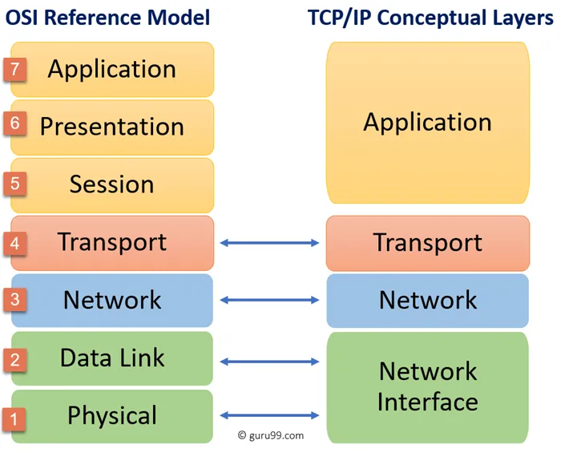

## Chapter 2: 

Sure! Here are the easy and descriptive answers to your **Data Communication and Networking** questions:

---

### **1. List the layers of the Internet model.**

The Internet model (also called the **TCP/IP model**) has **five layers**:

1. **Physical Layer**
2. **Data Link Layer**
3. **Network Layer**
4. **Transport Layer**
5. **Application Layer**

---

### **2. Which layers in the Internet model are the network support layers?**

The **network support layers** are the layers that help in **moving data from one device to another** through the network.
These are:

1. **Physical Layer**
2. **Data Link Layer**
3. **Network Layer**

These layers are responsible for handling hardware, signals, routing, and data transmission.

---

### **3. Which layer in the Internet model is the user support layer?**

The **Application Layer** is the **user support layer**.

It provides services directly to the user (like web browsing, email, file transfer).
This is where applications like **Google Chrome, Gmail, or FTP** operate.

---

### **4. What is the difference between network layer delivery and transport layer delivery?**

| **Aspect**              | **Network Layer Delivery**                            | **Transport Layer Delivery**                               |
| ----------------------- | ----------------------------------------------------- | ---------------------------------------------------------- |
| **Type of Delivery**    | Host-to-Host                                          | Process-to-Process                                         |
| **Main Responsibility** | Delivers data to the correct **destination computer** | Delivers data to the correct **application/process**       |
| **Address Used**        | IP Address (e.g., 192.168.1.1)                        | Port Number (e.g., 80 for HTTP, 25 for Email)              |
| **Example**             | Sending data from your PC to a web server             | Sending data to the browser (not email app) on that server |
| **Protocol Example**    | IP (Internet Protocol)                                | TCP (Transmission Control Protocol), UDP                   |

Here are the easy and descriptive answers to your next **Data Communication and Networking** questions:

---

### **5. What is a peer-to-peer process?**

A **peer-to-peer process** means **communication between the same layers on different devices** (computers).

🔹 For example:
When the **Transport Layer** of one computer sends data, it communicates directly with the **Transport Layer** of the other computer.

✅ **In short**:
Each layer communicates only with its **peer** on the other side.

---

### **6. How does information get passed from one layer to the next in the Internet model?**

In the Internet model:

* Data **moves downward** from the top layer (Application Layer) to the bottom (Physical Layer) **when sending**.
* Data **moves upward** from the bottom layer to the top **when receiving**.

At each layer:

* A **header** is added to the data (if needed).
* When data is received, each layer **removes its own header** before passing it to the upper layer.

🔽 **Sending:** Application → Transport → Network → Data Link → Physical
🔼 **Receiving:** Physical → Data Link → Network → Transport → Application

---

### **7. What are headers and trailers, and how do they get added and removed?**

| **Item**    | **What It Is**                                           | **When It Is Used**                                         |
| ----------- | -------------------------------------------------------- | ----------------------------------------------------------- |
| **Header**  | Extra information added **at the beginning** of the data | Added by each layer (except Physical) when sending          |
| **Trailer** | Extra information added **at the end** of the data       | Usually added by **Data Link Layer** (e.g., error checking) |

✅ **How They Work:**

* **When sending:**
  Each layer adds a **header** (and maybe trailer) to help the next layer understand the data.

* **When receiving:**
  Each layer removes its **own header/trailer**, then sends the remaining data to the upper layer.

📦 **Think of it like packing a gift**:
Each layer wraps the gift (data) with its own box (header/trailer). At the destination, each layer unwraps its box.

---

---

### **8. What are the concerns of the physical layer in the Internet model?**

The **Physical Layer** is the **lowest layer** of the Internet model.
It is concerned with **transmitting raw bits** (0s and 1s) over a physical medium.

🔧 **Main concerns:**

1. **Type of medium** – Cable, fiber optics, wireless, etc.
2. **Signals** – How bits are converted into electrical or optical signals.
3. **Data rate** – Speed of transmission (e.g., 100 Mbps, 1 Gbps).
4. **Bit synchronization** – Making sure the sender and receiver agree on timing.
5. **Physical connectors and devices** – Plugs, pins, hardware, etc.

✅ In simple words:
The physical layer is responsible for **how data physically travels through wires or air** from one device to another.

---

### **9. What are the responsibilities of the data link layer in the Internet model?**

The **Data Link Layer** is responsible for **node-to-node delivery**.
This means it helps send data **from one device to the next device** on the same network.

🛠️ **Key responsibilities:**

1. **Framing** – Dividing data into frames (chunks).
2. **Physical addressing** – Using MAC addresses to identify devices.
3. **Error detection and correction** – Checking if the data was changed during transmission.
4. **Flow control** – Controlling the speed of data transfer.
5. **Access control** – Deciding which device gets to use the channel (especially in shared networks like Wi-Fi or Ethernet).

✅ In simple words:
The data link layer ensures **safe and orderly data transfer between two connected devices**.

---

### **10. What are the responsibilities of the network layer in the Internet model?**

The **Network Layer** is responsible for **host-to-host delivery**.
It makes sure data goes from the **source device to the destination device**, even if they are far apart.

🌐 **Key responsibilities:**

1. **Logical addressing** – Assigning IP addresses to devices.
2. **Routing** – Choosing the best path for data to travel across networks.
3. **Packet forwarding** – Sending the packet from one router to another until it reaches its destination.
4. **Fragmentation** – Breaking large packets into smaller ones if needed.

✅ In simple words:
The network layer **finds the best route** to send data **between devices across networks**.

---

Here are the simple and clear answers to your next **Data Communication and Networking** questions:

---

### **11. What are the responsibilities of the transport layer in the Internet model?**

The **Transport Layer** is responsible for **process-to-process delivery**.
It ensures data is delivered **from the program (application) on one device to the correct program on another device**.

🛠️ **Main responsibilities:**

1. **Segmentation and reassembly** – Dividing data into small pieces (segments) and combining them again at the receiver.
2. **Port addressing** – Using port numbers to identify the source and destination applications.
3. **Connection control** – Establishing, maintaining, and ending connections (TCP).
4. **Flow control** – Preventing the sender from overwhelming the receiver.
5. **Error control** – Making sure data arrives correctly (retransmitting lost or damaged data).

✅ In short:
The transport layer makes sure that data goes **reliably** and **in order** between apps on different devices.

---

### **12. What is the difference between a port address, a logical address, and a physical address?**

Here’s a simple comparison in a table:

| **Type of Address**  | **Used By**     | **Purpose**                                     | **Example**                         |
| -------------------- | --------------- | ----------------------------------------------- | ----------------------------------- |
| **Port Address**     | Transport Layer | Identifies **specific application** on a device | Port 80 (HTTP), Port 25 (Email)     |
| **Logical Address**  | Network Layer   | Identifies a **device on a network**            | IP address: 192.168.1.5             |
| **Physical Address** | Data Link Layer | Identifies a **device on a local network**      | MAC address: A1\:B2\:C3\:D4\:E5\:F6 |

✅ **In easy words**:

* **Port Address** = Door number in a house (which app to talk to).
* **Logical Address** = House address (which device on the internet).
* **Physical Address** = Name tag on the device (used inside the local network).

---

Here are the easy and exam-friendly answers for your next **Data Communication and Networking** questions:

---

### **13. Name some services provided by the application layer in the Internet model.**

The **Application Layer** is the **topmost layer** of the Internet model.
It provides **services directly to the users or their applications**.

🛠️ **Services provided:**

1. **Email Services** – via **SMTP, POP3, IMAP**
2. **File Transfer** – via **FTP** (File Transfer Protocol)
3. **Web Browsing** – via **HTTP/HTTPS**
4. **Remote Login** – via **Telnet, SSH**
5. **Name Resolution** – via **DNS** (converts domain names to IPs)
6. **Chat and Messaging** – via various application protocols
7. **Network Management** – via **SNMP**

✅ In simple words:
The application layer provides the **tools and protocols** that allow users to **communicate, browse, send files, or use the internet**.

---

### **14. How do the layers of the Internet model correlate to the layers of the OSI model?**

The **OSI model has 7 layers**, while the **Internet (TCP/IP) model has 5 layers**.
Some layers in the Internet model **combine multiple OSI layers**.

Here’s a simple comparison table:

| **OSI Model (7 Layers)** | **Internet Model (5 Layers)** |
| ------------------------ | ----------------------------- |
| 7. Application           |                               |
| 6. Presentation          | →  **Application Layer**      |
| 5. Session               |                               |
| 4. Transport             | →  **Transport Layer**        |
| 3. Network               | →  **Network Layer**          |
| 2. Data Link             | →  **Data Link Layer**        |
| 1. Physical              | →  **Physical Layer**         |

✅ **Summary**:

* The **Application Layer** in the Internet model combines **Application**, **Presentation**, and **Session** layers of OSI.
* The **other layers** mostly match one-to-one.

### **15. How are OSI and ISO related to each other?**

✅ **Easy and descriptive answer:**

* **ISO** stands for **International Organization for Standardization**.

* It is a global body that **creates and publishes standards** for many things, including **computer networking**.

* **OSI** stands for **Open Systems Interconnection**.

* It is a **networking model** developed by ISO in the late 1970s to help different computer systems **communicate with each other**.

---

### ✅ Summary:

| **Term** | **Full Form**                                  | **Role**                                            |
| -------- | ---------------------------------------------- | --------------------------------------------------- |
| **ISO**  | International Organization for Standardization | The **organization** that **created** the OSI model |
| **OSI**  | Open Systems Interconnection                   | The **networking model** designed by ISO            |

🔗 **Relationship:**
The **OSI model** is a **standard developed by ISO** to ensure that computers and networks from different manufacturers can work together.

Here’s a **simple and descriptive explanation** of a **sine wave** and its fundamental properties — perfect for your **Data Communication and Networking exam**.

---

## ✅ **What is a Sine Wave?**

A **sine wave** is a **smooth, periodic (repeating)** wave that represents a **continuous signal**.
It is the most **basic form of an analog signal**.

📈 It looks like a **smooth up-and-down curve**, just like waves in the ocean.

In data communication, **sine waves are used to represent and carry analog signals** (such as voice, radio, or TV signals).

---

### 🔁 **Mathematical form:**

$$
y(t) = A \cdot \sin(2\pi f t + \phi)
$$

Where:

* **A** = Amplitude
* **f** = Frequency (in Hz)
* **t** = Time
* **φ** (phi) = Phase shift

---

## ✅ **Fundamental Properties of a Sine Wave**

| **Property**     | **Meaning**                      | **Explanation (Simple)**                                                                |
| ---------------- | -------------------------------- | --------------------------------------------------------------------------------------- |
| **1. Amplitude** | Height of the wave               | Shows the **strength** or **loudness** of the signal. More amplitude = stronger signal. |
| **2. Frequency** | Number of cycles per second (Hz) | How **fast** the wave repeats in one second. Higher frequency = more cycles per second. |
| **3. Period**    | Time for one complete cycle      | Period = 1 / Frequency. If frequency is 2 Hz, period is 0.5 seconds.                    |
| **4. Phase**     | Position of the wave             | It tells how much the wave is **shifted left or right** from the origin.                |

---

### ✅ Example:

If a sine wave has:

* Amplitude = 5V
* Frequency = 50 Hz
* Phase = 0°

Then it completes **50 cycles every second**, reaches a maximum of **+5V**, a minimum of **–5V**, and starts from 0 with **no shift**.

---

